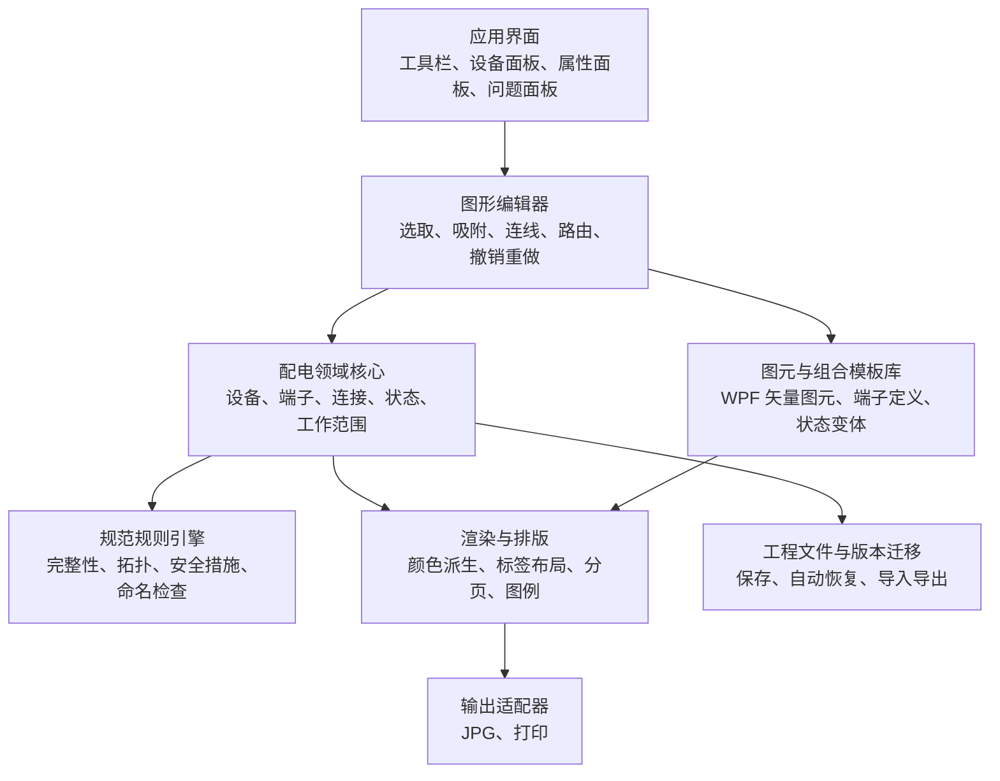

# 10kV 配电工作票附图绘制软件架构建议

> 文档状态：架构建议稿（当前阶段不涉及代码实现）  
> 编制日期：2026-08-10  
> 分析依据：`README.md`、`docs/` 目录现有文档，以及 `reference/工作票及现场勘察附图绘制要求-汇总V7 (1).docx`

## 1. 结论摘要

建议将本软件定位为面向配电工作票的**结构化单线图编辑器**，而不是通用 CAD。用户编辑的对象应是“设备、端子、连接、运行状态、带电状态、接地措施和工作范围”等专业语义，线条、颜色和图元仅是这些语义的可视化结果。

整体上建议采用以下方案：

- 产品形态：Windows 离线桌面应用。
- 软件结构：单体应用内的分层、模块化架构；第一阶段不拆微服务，不建设协同后端。
- 核心模型：基于“设备—端子—连接”的电气拓扑图模型，将电气拓扑、设备状态、安全措施和画布布局分开保存。
- 绘图方式：第一版采用 WPF 原生矢量渲染，以便获得清晰打印、稳定缩放、可选中图元和可测试输出。
- 规则能力：颜色、线型和图元形态由设备语义及人工设置的状态派生；第一阶段不做潮流计算或电气仿真。
- 数据文件：采用带版本号的本地结构化工程文件；JPG 只作为导出物，不能作为可编辑源数据。
- MVP 目标：完成六类设备的拖放、移动、属性编辑、状态修改，以及工程保存、JPG 导出和打印闭环。

## 2. 当前材料与需求基线

### 2.1 当前项目状态

截至本次分析：

- `README.md` 为空文件。
- `docs/requirements.md` 已定义第一阶段 MVP 范围；`docs/drawing-rule.md`、`docs/ring-cabinet-design.md` 和 `docs/equipment-model.md` 已形成设计基线。
- 仓库中尚无代码、技术栈约束或既有数据格式。
- 可确认的业务要求主要来自 reference 目录中的 V7 规范文件。该文件包含各专业绘图要求、配电图元表，以及 12 类配电典型现场附图。

因此，配电专业图面表达以规范文件的明确表述为依据，第一阶段交付边界以 `docs/requirements.md` 为准；对安装方式、系统集成、审批流程等尚未给出的内容，只提出建议，不视为已确认需求。

### 2.2 已确认的配电工作票附图要求

工作票附图至少应满足：

1. 绘制施工检修线路或设备所需停电部分，以及与之相关的带电部分的单线图。
2. 标明设备电压等级、线路名称和设备双重名称。
3. 绘制工作接地线的装设位置及编号；接地刀闸标注调度编号。
4. 标出保留的带电部位，包括交叉、邻近、跨越、同杆塔带电线路和邻近带电设备。
5. 带电部分用红色表示；停电部分用黑色或蓝色表示；文字及接地点用黑色或蓝色表示。
6. 工作范围内的停电检修设备应全部绘出；与其电气连接的设备应画到明显断开点，并在明显断开点外保留少部分线路或设备。
7. 改造造成电气连接变化时，应表达变化后的连接关系。
8. 工作地线编号须与工作票和现场编号一致，设备双重名称须完整。
9. 设备应使用统一的配电专业图元，并与标准票保持一致。

这些要求意味着软件必须保存专业语义，不能只保存任意线段和文字。否则系统无法可靠检查名称、状态、接地点、明显断开点及带电范围。

### 2.3 现场勘察附图的差异

规范还定义了现场勘察附图，与工作票附图存在以下差异：

- 勘察图需要覆盖工作全范围的接线方式，并标明线路名称、站号和杆号。
- 除保留带电部位外，还需表达可能影响作业的构筑物、易燃易爆设施、通信设施和交通设施等周边环境。
- 勘察图只需明确接地线位置，不填写具体地线编号。
- 勘察图可以手工绘制，也可在一次系统接线图上标注。
- 更换类工作在勘察记录中应体现原设备；新增类项目应体现新设备。

建议数据模型从一开始保留 `工作票附图` 与 `现场勘察附图` 两种文档类型，但第一阶段产品验收以工作票附图为主。现场勘察的环境图层和“改造前/改造后”表达可以在后续阶段完善。

### 2.4 规范中的配电设备与典型场景

配电图元表涉及的主要对象包括：

- 开关类：配电站内断路器、负荷开关、隔离开关、熔断式负荷开关、接地刀闸、柱上断路器、柱上负荷开关、柱上隔离开关、跌落式熔断器、三工位断路器。
- 变换及补偿类：配电变压器、配电站用变、电压互感器、电抗器、电力电容器、可调电容器、配电电容器。
- 导电与连接类：母线、封闭母线、电缆、架空线路、站内电缆头、低压电缆分支箱。
- 站房及载体类：用户站、架空变台、水泥杆，以及典型图中出现的环网柜、箱式站、土建站和低压柜。
- 状态类：拉开、合入、运行位置、检修位置、接地位置、在运、拆除等。

规范给出的配电典型场景有：更换环网柜、更换整套变压器、更换箱式站高压柜、更换箱式站、更换土建站高压柜、电缆搭火、电缆挑火、更换土建站低压柜、土建站更换高压柜且低压不停电、更换土建站内变压器/插接母线/低压柜且低压不停电、更换架空变台且低压不停电、更换箱式站高压柜或变压器且低压不停电。

## 3. 项目目标与边界建议

### 3.1 产品目标

1. **规范一致**：让图元、颜色、状态、名称和安全措施符合配电专业要求。
2. **绘制高效**：通过设备模板、自动吸附、智能连线和组合设备，显著减少重复绘图。
3. **结果可校验**：在导出前发现遗漏、状态冲突、编号重复、未画到明显断开点等问题。
4. **输出可靠**：彩色打印清晰，缩放不失真，页面内容不越界，导出结果与编辑画布一致。
5. **数据可演进**：工程文件可升级、可追踪，后续能够接入工作票系统、设备台账或 GIS/PMS 数据。

### 3.2 第一阶段产品边界

第一阶段应覆盖：

- 普通环网柜、一二次融合环网柜、电缆、水泥杆、架空线路和柱上设备。
- 从设备库拖放、移动、属性编辑，以及适用设备的状态修改。
- 通过端子边界人工定义工作范围，人工添加、编号并显示工作地线。
- 工程保存并重新打开、JPG 导出和 Windows 打印。
- 开关状态独立保存，并根据人工设置的状态呈现对应图元和颜色。

第一阶段明确不实现：

- CAD DWG 兼容。
- 自动计算潮流。
- 电气仿真。
- 自动停电分析和自动生成工作地线。
- 数据库。
- 云同步。
- 多用户协作。

## 4. 软件整体架构建议

### 4.1 架构原则

- **语义模型是唯一事实源**：画布只负责编辑和显示，不能把 WPF 渲染对象或像素坐标当作业务数据。
- **拓扑与布局分离**：同一电气连接关系可以采用不同版式，不因拖动图元而改变电气关系。
- **状态与样式分离**：带电、停电和设备位置是业务状态；红色、黑色、虚线和具体图形是渲染结果。
- **组合优于复制**：环网柜、箱式站、间隔等应由可配置组合模板生成，内部设备仍然可查询、可校验。
- **校验与编辑解耦**：规则引擎读取领域模型并产生问题，不直接操纵画布。
- **安全结论由人工确认**：规则检查只发现缺项和引用冲突，不自动推导停电范围、带电传播或工作地线。

### 4.2 推荐的模块化单体架构

各模块职责如下：

| 模块 | 主要职责 | 不应承担的职责 |
| --- | --- | --- |
| 应用界面 | 命令入口、属性编辑、问题导航、文档管理 | 不直接修改渲染对象或持久化文件 |
| 图形编辑器 | 放置、选择、框选、移动、缩放、吸附、连线、撤销重做 | 不判断专业规则是否正确 |
| 配电领域核心 | 管理设备、端子、电气连接、运行状态、安全状态和业务约束 | 不依赖具体 UI 框架 |
| 图元与模板库 | 定义标准图形、端子位置、状态变体和组合设备模板 | 不保存某张图的实例数据 |
| 规则引擎 | 对领域模型执行可重复校验，返回错误、警告和定位对象 | 不自动悄悄修改用户数据 |
| 渲染与排版 | 将模型稳定渲染为 WPF 矢量场景，处理标签、颜色、线型、页面边界 | 不作为数据源反向解析业务模型 |
| 工程文件与迁移 | 序列化、文件校验、版本升级、自动恢复 | 不保存仅对本次渲染有效的临时对象 |
| 输出适配器 | JPG、打印及输出前检查 | 不绕过统一渲染结果另画一份图 |

### 4.3 技术形态建议

第一版采用 `.NET 10 + WPF + C#` 的 Windows 桌面路线：

- 使用模块化单体和 MVVM，不拆分微服务。
- 使用 WPF 原生矢量场景实现编辑、JPG 和打印共享渲染语义。
- 领域核心、应用命令和工程文件不依赖 WPF 类型，避免界面对象进入业务数据。
- MVP 使用本地工程文件，不引入数据库或服务端存储。
- 在正式开发前，以目标 Windows、打印机和高 DPI 环境完成短期原型验证。

具体技术栈、项目结构和渲染对象选择以 `docs/implementation-plan.md` 为准。

### 4.4 关键数据流

#### 绘制与编辑

1. 用户从设备面板或组合模板创建领域对象。
2. 编辑器创建命令并提交到领域核心。
3. 领域核心更新拓扑或布局数据，并产生变更事件。
4. 渲染模块根据最新语义模型生成 WPF 矢量场景。
5. 规则引擎增量检查受影响对象，问题面板同步更新。

#### 导出与打印

1. 先执行完整规则检查。
2. 存在阻断级错误时禁止正式导出；警告项要求用户确认并记录原因。
3. 渲染模块按页面规格生成固定尺寸矢量场景。
4. 输出适配器基于同一场景生成 JPG 或打印内容。
5. 工程文件记录导出时间、规则版本和确认状态，便于追溯。

### 4.5 文件格式与版本管理

建议工程文件包含：

- `formatVersion`：工程文件格式版本。
- 文档元数据：文档类型、标题、工作票号、编制人、时间、页面设置。
- 领域对象：设备、端子、连接、接地措施、工作范围、环境对象、文字标注。
- 布局数据：对象位置、尺寸、连接线折点、标签锚点、分组边界。
- 规则状态：规则集版本、人工确认项，不保存可重新计算的普通检查结果。
- 可选缩略图：用于文件预览，不作为编辑数据。

工程文件必须支持确定性序列化和版本迁移。删除字段或改变枚举含义时需要迁移器，不能要求用户重新绘图。正式文件建议采用“结构化数据 + 可选资源”的压缩包封装；MVP 内部也可先使用单一 JSON 文件验证模型。

### 4.6 规则引擎建议

规则分为四级：

- 阻断错误：可能造成安全表达错误或无法正确输出，例如未确认带电状态、工作地线无编号、连接悬空、同一设备状态互相冲突。
- 普通错误：规范必填项缺失，例如设备无双重名称、线路无电压等级。
- 警告：可能不完整但需专业人员判断，例如工作范围未延伸至明显断开点以外、附近带电设备未标注。
- 提示：排版或可读性建议，例如标签重叠、字号过小。

每条规则应具备稳定编号、适用文档类型、严重级别、检查说明、定位对象和修复建议。规则集自身也要有版本，以便解释历史图纸为何在当时可以通过检查。

## 5. 设备模型设计建议

### 5.1 四类数据必须分开

| 数据层 | 表达内容 | 示例 |
| --- | --- | --- |
| 电气拓扑 | 哪些端子通过设备或线路导通 | 负荷开关进线端连接母线，出线端连接电缆 |
| 设备与安全状态 | 设备位置、在运/拆除、带电/停电、工作/非工作、接地 | 开关拉开、线路停电、S01 接地线已装设 |
| 业务组织 | 设备属于哪个站、柜、间隔、线路或工作区域 | 负 2 间隔属于纪 3701 环网柜 |
| 画布表现 | 坐标、方向、尺寸、折点、标签位置 | 图元在第 1 页坐标位置，标签位于右侧 |

如果把这四类信息混在一个图形对象中，后续会出现拖动设备改变连接、换图元丢失状态、颜色无法解释等问题。

### 5.2 核心实体

#### 图纸文档（DrawingDocument）

建议字段：文档标识、文档类型、票号、标题、页面规格、默认电压等级、默认停电颜色、设备集合、连接集合、安全措施集合、标注集合、规则集版本和审阅状态。

#### 设备实例（Device）

建议字段：

- 稳定唯一标识。
- 设备类型及图元定义版本。
- 显示名称、线路名称、调度编号、资产编号、站号/杆号等标识字段。
- 电压等级及额定容量等必要参数。
- 运行位置或开合状态。
- 所属站房、柜体、间隔、线路或组合设备。
- 端子列表。
- 布局引用，而不是直接把图形路径作为设备本体。

“设备双重名称”不建议只用一个自由文本字段。应至少保存名称组成项和最终显示文本，并由项目确认具体命名规则后实现校验。

#### 端子（Terminal/Port）

端子是拓扑连接的最小边界。建议包含端子标识、角色、允许连接类型、电压等级和图元上的默认锚点。例如开关有进线端与出线端；环网柜三工位机构由多台独立 SwitchDevice、固定节点和 SwitchAssembly 共同表达，不把组合位置压缩成单台设备状态。

#### 连接（Connection）

连接只引用两端或多端的端子，不用画布线段是否相交来判断电气连接。连接应区分电缆、架空线路、母线、封闭母线、低压线路和临时电缆等类型，并保存名称、电压等级、在运状态及线路属性。

连接线的折点属于布局数据。用户移动折点不应改变连接的电气含义；只有执行“断开连接”命令才改变拓扑。

架空系统以 `Pole` 为基础对象。柱上开关和电缆终端通过 `PoleAttachment` 表达安装关系，不能作为悬空设备存在。`CableTermination` 分别提供电缆侧和架空侧端子，作为电缆与架空线路的转换点。架空线路仍使用 `Connection`，保存线路型号、可选长度和经过杆塔顺序；图面省略后续线路时，通过 `IsContinued`、人工设置的 `ContinuationState` 及文字说明表达，不自动推导图外线路状态。

#### 工作地线（GroundingPoint）

工作地线和接地刀闸应采用不同对象：

- `GroundingPoint` 包含位置说明、连接端子、编号和备注，由用户人工添加。
- 接地刀闸是正式设备，保存调度编号及拉开/合入状态。
- 现场勘察附图可显示工作接地线位置但隐藏具体编号；工作票附图必须显示并校验编号。
- 工作地线不得根据工作范围、停电状态或拓扑自动生成。

#### 工作范围（WorkScope）

工作范围不应只是一个矩形框。`WorkScope` 由 `StartBoundary`、`EndBoundary`、`Description` 和关联的 `GroundingPoints` 构成。每个 `BoundaryPoint` 必须引用明确的 `Device`、`Terminal` 和侧别，用两个电气边界点表达工作范围。软件不根据边界自动判断停电或带电，边界内外的电气状态仍由用户人工确认。

#### 标注与环境对象（Annotation / EnvironmentObject）

文字说明、引线、交叉/邻近/跨越关系、构筑物、易燃易爆设施、通信设施和交通设施等，不属于电气导通拓扑，但需要独立结构化保存，以服务勘察图及完整性检查。

### 5.3 设备状态应采用相互独立的维度

不要用单一 `status` 字段同时表达所有含义。建议至少拆分为：

| 状态维度 | 推荐值示例 | 用途 |
| --- | --- | --- |
| 操作位置 | 合入、拉开、接地、运行位置、检修位置 | 决定设备图元及内部导通关系 |
| 电气状态 | 带电、停电、未知、冲突 | 决定颜色并触发安全检查 |

第一阶段的带电、停电和工作范围外状态均由用户人工指定，不根据电源点、开关位置、WorkScope 或连接关系自动传播。未设置状态不能直接渲染成普通停电黑色，以免产生误判；正式导出前，工作范围及边界相关设备的电气状态必须已由用户确认。

### 5.4 设备内部导通模型

开关设备不能仅靠图标表达开合状态。每个设备类型应定义“不同操作位置下，哪些端子内部导通”。例如：

- 断路器/负荷开关/隔离开关：合入时两端导通，拉开时两端断开。
- 接地刀闸：合入时设备端连接大地端，拉开时断开。
- 三工位机构：各 SwitchDevice 分别保存 Open/Closed；SwitchAssembly 根据成员状态、接地结构和联锁规则判定允许组合、运行方式及有效接地，不重复保存组合状态。
- 熔断器：正常时可导通；熔断、拆除等状态应按业务需要单独定义，不能误用开关拉开状态。
- 母线：多个端子属于同一导电节点，但视觉上可由多个线段组成。

该内部导通模型用于准确保存和显示设备语义；第一阶段不据此自动计算带电传播、停电范围或接地保护范围。

### 5.5 组合设备与模板

环网柜、箱式站、土建站和低压分支箱等采用“容器 + 间隔 + 内部设备”的组合模型：

- 容器负责名称、边界、整体布局和模板版本。
- 间隔负责回路组织和端口对外暴露。
- 内部开关、母线、接地刀闸和电缆头仍是独立设备，可设置状态并参与拓扑校验。
- 组合模板负责快速创建，不把整个柜体固化为不可编辑的一张图片。

普通负荷开关型环网柜由普通负荷开关间隔组成。一二次融合环网柜包含断路器间隔、一个 PT 特殊间隔和一个关联 DTU。PT 不是独立柜体；PT 间隔固定包含隔离刀闸、PT 和接地刀闸。DTU 是独立布局柜体但不是一次设备，必须跟随 PT 位于同一侧，用户不能独立设置其位置。模板实例化后允许在受控范围内调整普通间隔数量，但应保留模板来源和版本。

### 5.6 图元库

每个图元定义至少应包含：

- 图元唯一编码、设备类型、版本和适用专业。
- 标准 WPF 矢量几何；权威源为 SVG 时应在受控流程中转换并审核。
- 默认尺寸、固定方向规则和文字锚点。
- 端子数量、端子语义及端子锚点。
- 各操作位置对应的视觉变体。
- 可用的连接方向和吸附规则。
- 打印最小尺寸及线宽。

规范 Word 文档中的图元可作为核对依据，但其中大量图元为低分辨率图片。正式开发前应取得权威的可编辑矢量图元或由配电专业人员审核重绘结果，不能直接把截图作为生产图元库。

### 5.7 关键模型约束

至少应实现以下不变量：

- 一个端子不得被不允许的多条连接占用。
- 相连端子的电压等级必须兼容；跨电压等级只能通过变压器等允许设备。
- SwitchAssembly 必须拒绝其联锁规则明确禁止的状态组合；运行方式和有效接地结论只能由成员 SwitchState 与结构规则计算。
- 工作接地线编号在同一工作票内唯一且非空。
- 工作票中的接地刀闸必须有调度编号。
- 连接和设备不存在孤立引用；删除设备必须明确处理其连接。
- 设备双重名称、电压等级、线路名称按对象适用性完成必填校验。
- 正式导出时，安全相关对象不得处于未知或冲突状态。
- WorkScope 的起止边界必须分别引用有效 Device、Terminal 和 Side；规则引擎只校验引用与人工确认状态，不自动计算工作范围或停电路径。

## 6. 第一阶段 MVP 开发计划

### 6.1 MVP 成功标准

使用软件能够独立完成一张由 MVP 设备组成的 10kV 配电工作票附图，并满足以下闭环：

1. 六类 MVP 设备均可从设备库拖放到画布并移动。
2. 设备属性可编辑，适用设备的状态可独立修改。
3. 电缆和架空线路通过端子或合法连接点建立关系。
4. 工作范围可由两个端子边界人工定义，工作地线可人工添加、编号并显示。
5. 保存后可无损重新打开继续编辑。
6. JPG 和打印与画布使用同一绘制语义。
7. 两类端到端金标准场景通过配电专业人员复核。

### 6.2 MVP 设备范围

首批只把以下六类设备作为 MVP 必交付对象：

- 普通负荷开关型环网柜：3、4、5、6 间隔。
- 一二次融合环网柜：4、6 间隔。
- 电缆。
- 水泥杆。
- 架空线路。
- 柱上设备：柱上断路器、柱上负荷开关、柱上隔离开关、跌落式熔断器。

PT 间隔和 DTU 是一二次融合环网柜的组合构成，不作为设备库中的独立 MVP 设备。PT 只能是一二次融合环网柜内部特殊间隔，DTU 只作为随 PT 同侧布局的独立柜框；其他规范图元和典型场景不因出现在参考资料中而自动进入第一阶段。

### 6.3 推荐里程碑

以下周期按 2～3 名开发、1 名兼职配电专家和 1 名兼职测试人员估算，总计约 8～10 周。人员条件变化时应以验收结果为准，不机械追求周数。

| 里程碑 | 主要工作 | 可验证产物 |
| --- | --- | --- |
| M0：WPF 骨架与技术验证（1 周） | 确认目标 Windows、票面尺寸、六类设备图元及两类验收场景；创建最小 WPF 项目骨架并验证 JPG/打印 | 已确认的范围、图元清单、金标准图纸和可运行技术骨架 |
| M1：领域与文件内核（1～2 周） | 实现设备—端子—连接、状态、工作范围、工作地线、布局和工程文件模型 | 两类环网柜结构及代表性连接可校验；保存往返语义不变 |
| M2：基础编辑器（2 周） | 设备库拖放、选择、移动、属性编辑、端子连接和撤销重做 | 可从空白图绘制六类设备组成的代表性单线图 |
| M3：设备模板与状态（1～2 周） | 两类环网柜模板、柱上设备、电缆和架空线路编辑、开关独立状态 | 六类设备和适用状态均可编辑、正确显示 |
| M4：输出闭环（1 周） | 本地工程保存、JPG、打印预览和实机打印 | 保存重开一致；JPG 和打印与画布一致 |
| M5：试点验收与加固（1～2 周） | 使用两类真实脱敏案例进行专业复核；修复编辑、输出和恢复问题 | 两类场景覆盖全部设备、操作和输出，连续使用无数据丢失 |

### 6.4 首批验收场景

建议选择以下两类作为金标准回归案例：

1. 普通环网柜经电缆连接至水泥杆上的电缆终端，再连接架空线路和柱上设备。
2. 一二次融合环网柜经电缆连接至水泥杆上的电缆终端，再连接架空线路和柱上设备。

两类场景均应覆盖拖放、移动、属性编辑、状态修改、人工工作范围、人工工作地线、保存重开、JPG 和打印。一二次融合环网柜场景还应覆盖 PT 在左侧或右侧时 DTU 的固定跟随关系。变压器、箱式站等其他规范场景放到 MVP 后续迭代。

### 6.5 测试策略

- 领域模型测试：六类设备构造、端子连接、环网柜结构和设备状态独立等不变量。
- 编辑命令测试：拖放、移动、属性和状态命令执行及撤销后模型一致。
- 文件测试：保存—打开往返一致、异常文件拒绝、版本迁移、自动恢复。
- 渲染快照测试：关键图元和典型图纸生成稳定 WPF 矢量场景，避免无意改变符号或颜色。
- 打印测试：A4/A3、横向/纵向、彩色与灰度提示、最小字号、线宽和页面边界。
- 专业验收：由配电人员逐项检查设备图元、开关状态、线路连接、颜色和文字标注。

### 6.6 MVP 完成定义

只有同时满足以下条件，MVP 才算完成：

- 两类首批验收场景均能从可编辑工程文件生成，不依赖粘贴整张图片。
- 六类设备均支持拖放、移动和属性编辑，适用设备支持独立状态修改。
- 核心图元、开关状态、颜色规则和 JPG 通过配电专业人员确认。
- 工程文件损坏、应用异常退出后有明确提示或可恢复副本，不发生静默数据丢失。
- 在目标打印机上完成实物验证。
- 已形成用户操作说明、图元清单和已知限制。

## 7. 主要风险与应对

| 风险 | 影响 | 建议应对 |
| --- | --- | --- |
| PT、DTU 组合规则被按两个独立设备实现 | 柜体布局和一次拓扑错误 | PT 固定为一二次融合柜内部间隔，DTU 只跟随 PT 布局且不参与拓扑 |
| Word 规范中的图元为图片且清晰度不一 | 图元不统一、打印失真 | 获取权威矢量源；无法获取时重绘并逐个专业审核 |
| 人工状态漏填或误填 | 可能造成图面状态错误 | 状态字段使用明确枚举，保存和输出前提示缺失状态，由专业人员复核 |
| 拓扑模型与画布线条不同步 | 校验结果失真 | 连接只能通过端子命令创建；禁止以视觉相交自动认定电气连接 |
| 规范中的其他设备被误纳入 MVP | 延期且核心体验不稳定 | 只以需求基线的六类设备和两类金标准场景验收，新增范围先变更文档 |
| 不同单位的命名、颜色或模板规则存在差异 | 难以跨单位使用 | 把差异收敛到有版本的规则集和模板包，不把单位规则写死在编辑器中 |

## 8. 开发前需要确认的问题

以下问题会实质影响架构或 MVP 范围，应在 M0 阶段确定：

1. 目标 Windows 版本、系统架构、安装权限和离线部署要求是什么？
2. 第一阶段只交付工作票附图，还是必须同时完整交付现场勘察附图？
3. 设备“双重名称”的组成、格式和校验规则是什么？不同单位是否存在差异？
4. 正式输出的纸张规格、页眉页脚、票号位置、签字栏及 JPG 分辨率是什么？
5. 黑色与蓝色是否允许用户按单位规则选择，还是正式输出只允许其中一种？
6. 首批柱上设备是否按规范列出的四类全部交付？
7. 是否有权威的矢量图元库和组合柜模板？谁负责最终专业审核？
8. 人工电气状态的必填范围、默认值和复核流程是什么？
9. 是否有两类脱敏真实案例及对应的正确附图，可作为自动回归和专业验收的金标准？

## 9. 建议的下一步

在开始编码前，建议完成三项准备：

1. 由配电专业人员确认首批权威图元、两类环网柜模板、PT/DTU 组合图元及两类金标准图纸。
2. 明确第 8 节尚未确定的 Windows、打印、颜色和 JPG 参数。
3. 进入 M0，仅创建最小 WPF 技术验证和后续项目骨架；在 M0 通过前不开展完整功能编码。

上述确认完成后冻结第一版工程文件 V1 和领域接口，再进入 MVP 实现。
