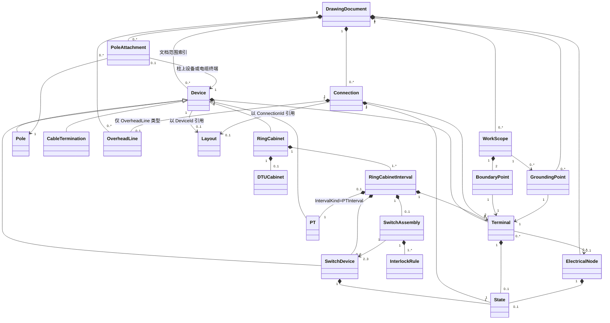
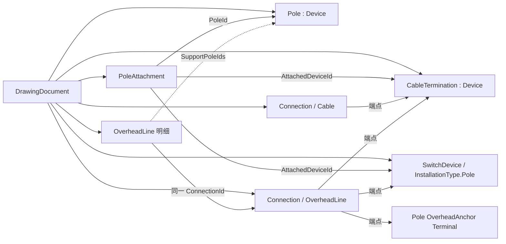

# 10kV 配电附图 MVP 设备模型设计

> 文档状态：M2-C 架空线路 Layout 与 Rendering 设计<br>
> 编制日期：2026-08-11<br>
> 依据：`docs/requirements.md`、`docs/architecture.md`、`docs/ring-cabinet-design.md`、`docs/drawing-rule.md`、`docs/implementation-plan.md`

## 1. 目的与范围

本文统一定义第一阶段 MVP 的设备、端子、连接、节点、状态、工作范围、工作地线和布局模型，作为后续领域对象、工程文件和画布渲染的共同语义基线。

本文只覆盖以下已确认对象：

1. 普通负荷开关环网柜预置模板。
2. 一二次融合环网柜预置模板。
3. 电缆。
4. 水泥杆。
5. 架空线路。
6. 柱上设备：柱上断路器、柱上负荷开关、柱上隔离开关、跌落式熔断器。

两种环网柜菜单项是预置创建模板，不是两个互斥的 RingCabinet 领域类型；同一 RingCabinet 还支持两类普通电气间隔的混合配置，混合配置不新增设备库类别。环网柜内部的负荷开关、隔离刀闸、断路器、接地刀闸和 PT，是 RingCabinet 间隔的组成对象。PT 只作为环网柜有序间隔列表中的 `PTInterval`；DTU 是与 PT 固定关联的独立布局柜体，不是一次设备。

本模型明确不包含：

- 配电变压器、箱式站、把三工位机构建成单一三值 Device 的模型、站内其他开关设备及规范中的其他图元。由多个独立 SwitchDevice 组成的 `SwitchAssembly` 属于当前环网柜模型。
- 现场勘察环境对象和独立自由标注模型。
- 人工保存的生命周期、在运/拆除、运行/检修位置等状态维度。本文新增的 OperationalState 是由开关组合计算的只读运行方式，不属于人工保存字段。
- 潮流计算、电气仿真、自动带电传播和自动联动操作。机械联锁只校验目标状态组合，不自动操作其他开关。

本文中的英文名称是领域概念名称，不代表已经创建代码类型。本项目统一使用 `Device` 表达设备实例，其他文档不得再以 `Equipment` 建立第二套基础设备对象。

## 2. 建模原则

1. **语义对象是事实源。** 图元、颜色和 WPF 渲染对象不进入设备模型。
2. **拓扑与布局分离。** 端子和连接决定电气关系；坐标、尺寸和折点只决定画面位置。
3. **连接必须落到端子。** 线条相交、端点坐标重合或图元接触均不自动构成电气连接。
4. **状态按对象独立保存。** 环网柜不能用柜体状态覆盖间隔内单台开关状态。
5. **操作状态与电气状态分离。** `拉开/合入` 决定开关图元及内部导通定义；`带电/停电` 决定颜色。
6. **组合对象保持内部语义。** 环网柜不是一张不可拆分的图片，间隔、开关、端子和内部节点均可单独识别。
7. **只建模当前需求。** 不通过通用扩展字典、插件类型或预留空对象提前实现后续设备。
8. **安全措施由人工定义。** 工作范围和工作地线保存结构化关联，但不根据拓扑自动推导停电范围或生成接地点。
9. **开关事实与组合结论分离。** 单台 `SwitchDevice` 的 `SwitchState` 是保存事实；`SwitchAssembly` 的运行方式、有效接地和联锁违规是根据成员状态与结构规则计算的派生结果。
10. **间隔类型独立。** RingCabinet 只拥有和排序间隔；每个 RingCabinetInterval 的 IntervalKind 独立决定其 SwitchAssembly、成员设备和内部拓扑，柜体分类不得覆盖间隔配置。

## 3. MVP 对象分类

产品设备库中的对象与领域基础模型映射如下：

| MVP 对象 | 领域模型 | 说明 |
| --- | --- | --- |
| 环网柜 | `Device` → `RingCabinet` | 由有序 IntervalDefinition 创建，可形成纯负荷开关、纯一二次融合或混合间隔配置 |
| 电缆 | `Connection` | 两个端子之间的电缆连接，不再建立重复的电缆 Device |
| 水泥杆 | `Device` → `Pole` | 架空系统基础对象；当前 PoleType 为水泥杆，仅在显式电气连接点按需拥有端子 |
| 架空线路 | `Connection` + `OverheadLine` 明细 | Connection 保存两个端点和通用属性；明细保存线路型号、经过杆塔和延续语义 |
| 柱上设备 | `Device` → `SwitchDevice` | 安装于水泥杆，类型限定为规范已列出的四种柱上设备 |
| 电缆终端 | `Device` → `CableTermination` | 安装于杆塔，连接电缆侧和架空侧，是两个系统的转换点 |
| 工作范围 | `WorkScope` | 由两个端子边界和描述定义，不是普通矩形图元 |
| 工作地线 | `GroundingPoint` | 人工关联到端子，保存编号和备注 |

电缆和架空线路虽然在界面中可从设备库拖放或创建，但在领域拓扑中均以 `Connection` 作为连接事实。架空线路另有一对一 OverheadLine 明细，但仍不得同时保存为 Device。

## 4. 总体对象关系



`DrawingDocument` 是文档聚合根，直接保存或索引 `Devices`、`Connections`、`Terminals`、`ElectricalNodes`、`WorkScopes` 和 `GroundingPoints`。`Layout` 与这些语义对象分开保存；任何图形对象都不得反向成为领域事实源。

图中的 RingCabinetInterval 是统一的柜内间隔组成对象。LoadSwitchInterval 包含 2 台开关，IntegratedFeederInterval 包含 3 台开关；PTInterval 是同一间隔列表中的特殊类型，其内部模型留在 PT 实现阶段完成。普通电气间隔数量由模板或显式配置校验，不再由 CabinetKind 推导。

`SwitchAssembly` 不是 Device，不拥有 Terminal，也不复制成员开关的 SwitchState。它只保存组合身份、成员角色引用和接地结构等组合事实，并应用固定联锁规则计算运行方式。

## 5. Device 基础模型

### 5.1 Device 定义

`Device` 表示具有独立身份和业务属性、可由画布布局引用的设备实例。第一阶段由环网柜、杆塔、开关设备、电缆终端和 PT 使用该基础模型。

| 字段 | 必填 | 说明 |
| --- | --- | --- |
| DeviceId | 是 | 在工程内稳定唯一；保存、重开后不改变 |
| DeviceType | 是 | 仅允许 `RingCabinet`、`Switch`、`Pole`、`CableTermination`、`PT` |
| DisplayName | 条件必填 | 环网柜和开关设备必填；水泥杆可由 PoleNumber 独立形成图面标注 |
| VoltageLevel | 条件必填 | 导电设备固定为 10kV；水泥杆不适用 |
| TerminalIds | 否 | 本设备拥有的端子标识集合；环网柜外部端子由间隔拥有 |
| State | 条件必填 | 仅有状态能力的设备保存适用状态 |
| ParentRef | 否 | 仅内部设备使用，指向所属 RingCabinetInterval；PT 也指向 IntervalKind=PTInterval 的间隔 |

`DeviceType` 是基础结构分类，不等同于设备库菜单。内部开关通过 `SwitchKind` 和安装位置进一步限定，不新增任意 DeviceType。设备位置、尺寸、标签锚点和图元引用均由独立 Layout/渲染配置按 DeviceId 关联，不作为 Device 的电气属性保存。

`ParentRef` 表达柜内设备的组合所有权。杆塔附属关系只以 PoleAttachment 为事实源，附属 Device 不重复保存 PoleId 或 AttachmentId。

### 5.2 Device 所有权

- 图纸文档直接拥有顶层环网柜、杆塔，以及通过杆塔附属关系索引的柱上设备和电缆终端。
- 环网柜聚合拥有统一的有序间隔列表；普通电气间隔拥有各自的柜内开关设备，PTInterval 后续拥有隔离刀闸、PT 和接地刀闸。存在 PTInterval 时，环网柜另拥有一个关联 DTUCabinet 布局对象。
- 柜内开关仍具有全工程唯一 DeviceId，但不得脱离所属间隔独立存在。
- 柱上设备和电缆终端具有独立 DeviceId，并通过 `PoleAttachment` 关联到一根杆塔，不得作为悬空设备存在。
- 一个对象只能有一个语义所有者；不得同时在顶层设备集合和环网柜内部重复保存同一开关实例。

### 5.3 SwitchDevice 统一模型

柜内开关和柱上开关统一使用 `SwitchDevice`，通过开关类型和安装位置表达差异。

| 字段 | 必填 | 说明 |
| --- | --- | --- |
| DeviceId | 是 | 继承 Device 的稳定标识 |
| SwitchKind | 是 | 仅允许 `LoadSwitch`、`IsolationSwitch`、`CircuitBreaker`、`GroundSwitch`、`DropoutFuse` |
| InstallationType | 是 | 使用现有 `SwitchInstallationType`，取值为 `CabinetInterval` 或 `Pole` |
| ParentIntervalId | 条件必填 | 柜内开关必填，柱上设备不得设置；统一指向所属 RingCabinetInterval |
| TerminalIds | 是 | 固定两个，角色由 SwitchKind 和安装位置确定 |
| SwitchState | 是 | `Open` 或 `Closed`，每台设备独立保存 |
| DispatchNumber | 否 | 需要在图面标注调度编号时使用 |

允许组合仅限：

| 安装位置 | 允许的 SwitchKind |
| --- | --- |
| `LoadSwitchInterval` | `LoadSwitch`（负荷开关）、`GroundSwitch`（接地刀闸） |
| `IntegratedFeederInterval` | `IsolationSwitch`（隔离刀闸）、`CircuitBreaker`（断路器）、`GroundSwitch`（接地刀闸） |
| PT 间隔 | `IsolationSwitch`（隔离刀闸）、`GroundSwitch`（接地刀闸） |
| 水泥杆 | `LoadSwitch`（柱上负荷开关）、`IsolationSwitch`（柱上隔离开关）、`CircuitBreaker`（柱上断路器）、`DropoutFuse`（跌落式熔断器） |

表中的“柱上”表示安装语境，不建立另一套基础开关类。例如柱上断路器仍是 `SwitchKind = CircuitBreaker`、`InstallationType = Pole` 的 SwitchDevice。

LoadSwitchInterval 和 IntegratedFeederInterval 内的 `SwitchDevice` 必须属于本间隔唯一的 `SwitchAssembly`。状态变更仍以单台设备为目标，但提交前由所属组合校验目标状态集合；规则不得通过隐式修改其他设备来“修正”非法组合。PTInterval 的组合归属在其实现阶段另行确认。

## 6. Terminal 基础模型

### 6.1 Terminal 定义

`Terminal` 是外部连接和内部拓扑的最小连接边界。端子属于设备或环网柜间隔，不能脱离所属对象独立存在。

| 字段 | 必填 | 说明 |
| --- | --- | --- |
| TerminalId | 是 | 工程内稳定唯一 |
| OwnerType | 是 | 使用现有 `TopologyOwnerType`：顶层设备为 `Device`，环网柜间隔等内部组成对象为 `InternalAggregate` |
| OwnerId | 是 | 所属设备或间隔标识 |
| Role | 是 | 端子在所属对象中的稳定语义角色 |
| VoltageLevel | 条件必填 | 回路、母线和线路端子固定为 10kV；接地侧端子不适用 |
| Exposure | 是 | `Internal` 或 `External`；外部 Connection 只能连接 External 端子 |
| AllowedConnectionTypes | 是 | External 端子声明允许现有 `ConnectionType.Cable`、`ConnectionType.OverheadLine` 中的哪一种或两种；Internal 端子必须为空集合 |
| ConnectionPolicy | 是 | `Single` 或 `Junction` |
| ElectricalNodeId | 否 | 端子所属的显式内部电气节点 |
| ElectricalState | 条件必填 | 端子需要独立表达带电/停电颜色时保存；不适用时不创建该状态 |
| AnchorKey | 是 | 图元上的逻辑锚点名称；实际坐标由图元和布局计算 |

### 6.2 端子角色

当前 MVP 使用以下端子角色，不增加通用自由角色：

| 所属对象 | 端子角色 |
| --- | --- |
| 负荷开关 | 母线侧、回路侧 |
| 隔离刀闸 | 母线侧、断路器侧 |
| 断路器 | 隔离侧或线路侧、回路侧或线路侧 |
| 接地刀闸 | 设备侧、接地侧 |
| 普通间隔 | 对外回路 |
| 柱上开关设备 | 线路侧 A、线路侧 B |
| 杆塔 | 架空线路锚点 |
| 电缆终端 | 电缆侧、架空侧 |
| PT | 上游侧、接地侧 |

杆塔的“架空线路锚点”表示该杆位上的导线连接或延续点，不表示杆塔本体导电。只有连接到同一 Junction 端子或同一显式电气节点的线路才视为导通。

### 6.3 端子占用规则

- `Single` 端子最多连接一条外部 Connection，适用于间隔对外回路端子和柱上设备普通线路端子。
- `Junction` 端子允许多条架空线路连接，适用于水泥杆上的显式架空线路连接锚点。
- 柜内 Internal 端子不允许用户从画布直接连线，其连接由环网柜模板固定生成。
- Connection 不得直接连接 DeviceId、IntervalId 或屏幕坐标，必须引用 TerminalId。
- 删除拥有端子的对象前，必须先删除或明确处理引用这些端子的外部连接。

## 7. ElectricalNode 辅助拓扑模型

`ElectricalNode` 不是设备类型，也不在设备库显示。它用于表达多个内部端子属于同一导电节点，避免用线条相交推断连接。

| 字段 | 必填 | 说明 |
| --- | --- | --- |
| NodeId | 是 | 工程内稳定唯一 |
| NodeKind | 是 | 仅允许主母线、回路节点、中间节点、大地节点 |
| OwnerType | 是 | 使用现有 `TopologyOwnerType`，取值为 `Device` 或 `InternalAggregate` |
| OwnerId | 是 | 所属 Device 或内部聚合对象；本设计允许 CableTermination 和 Pole 拥有节点 |
| TerminalIds | 是 | 接入本节点的端子集合 |
| ElectricalState | 条件必填 | 可见导电节点使用人工设置的带电/停电状态；大地节点不适用 |

节点只表达同一电位连接关系，不执行潮流、短路或自动带电传播计算。

## 8. Connection 基础模型

### 8.1 Connection 定义

`Connection` 表示两个外部端子之间的电气连接事实。当前 MVP 只允许现有 `ConnectionType.Cable` 和 `ConnectionType.OverheadLine`。Connection 只负责连接类型、端点和通用电气属性；架空线路专属属性由与其一对一关联的 `OverheadLine` 保存，显示折点由 Layout 保存。

| 字段 | 必填 | 说明 |
| --- | --- | --- |
| ConnectionId | 是 | 工程内稳定唯一 |
| ConnectionType | 是 | 使用现有枚举，仅允许 `Cable` 或 `OverheadLine` |
| StartTerminalId | 是 | 起点 External 端子 |
| EndTerminalId | 是 | 终点 External 端子 |
| DisplayName | 是 | 线路或电缆的图面名称 |
| VoltageLevel | 是 | 当前 MVP 固定为 10kV |
| ElectricalState | 是 | 人工设置的 `Energized` 或 `Deenergized` |

Connection 不是 Device，不拥有 SwitchState，也不以另一条 Connection 作为端点。`ConnectionLayout` 以 ConnectionId 为键保存 Route；Route 不进入 Connection 或 OverheadLine 的电气语义对象。

### 8.2 通用连接规则

- 起点和终点必须存在，且不能引用同一个 TerminalId。
- 两端必须允许当前 ConnectionType，且电压等级一致。
- 连接只能改变端子之间的拓扑，不改变端子所属设备或设备类型。
- 线条相交但未共享端子时不导通。
- 移动设备或水泥杆只更新显示路线，不改变 StartTerminalId、EndTerminalId。
- 只有显式重连或断开操作可以改变连接端点。
- Connection 不能以另一条 Connection 作为端点；分支必须通过 Junction 端子表达。

### 8.3 电缆模型

电缆是 `ConnectionType = Cable` 的连接实例：

- 必须正好连接两个允许电缆接入的 External 端子。
- 不关联 OverheadLine 明细或 SupportPoleIds。
- 典型场景连接环网柜间隔对外端子与 CableTermination 的电缆侧端子；不得直接以坐标接到杆塔或架空线路。
- 电缆名称、电气状态和路线独立保存。
- MVP 不增加电缆型号、截面、长度、敷设方式等未确认字段。

### 8.4 架空线路模型

`OverheadLine` 是 `ConnectionType = OverheadLine` 的类型专属明细对象。它不继承、不替代 Connection，也不重复保存 StartTerminalId、EndTerminalId、DisplayName、VoltageLevel 或 ElectricalState。两者通过相同 ConnectionId 建立一对一组合；删除任一对象必须在同一聚合操作中处理另一对象。

| 字段 | 必填 | 说明 |
| --- | --- | --- |
| ConnectionId | 是 | 同时作为 OverheadLine 标识；必须引用且只能引用 `ConnectionType=OverheadLine` 的 Connection |
| LineModel | 是 | 人工录入或从后续确认的受控列表选择线路型号 |
| LengthMeters | 否 | 实际线路长度，单位米；填写时必须大于 0，不根据画布距离计算 |
| SupportPoleIds | 是 | 按 StartTerminalId 至 EndTerminalId 的物理经过顺序引用 Pole，可包含一个或多个杆位 |
| IsContinued | 是 | 是否在图面边界省略仍然存在的后续线路 |
| ContinuationTerminalId | 条件必填 | IsContinued 为 true 时必填，必须等于当前 Connection 的一个端点，并定位继续符号所在端 |
| ContinuationState | 条件必填 | IsContinued 为 true 时必填，当前只允许 `Energized` 或 `Unknown` |
| ContinuationDescription | 否 | 图外去向、线路名称或安全提示；不保存自由图元坐标 |

架空线路规则如下：

- 两端必须是允许 OverheadLine 的 External Terminal，可属于 CableTermination 架空侧、柱上 SwitchDevice 线路侧或 Pole 架空锚点。
- 一条 OverheadLine 可以跨越多根水泥杆。SupportPoleIds 是物理支撑顺序，不是多端连接，也不因中间杆位而把一条 Connection 自动拆段。
- 当柱上开关、电缆终端或显式分支点中断导电路径时，必须在相应 Terminal 处分成两条或多条 Connection；不得把开关前后线路保存成一条跨越设备的 OverheadLine。
- 中间支撑杆不因出现在 SupportPoleIds 中自动获得 Terminal 或 ElectricalNode，也不自动成为工作边界。
- 端点位于某根杆上的锚点或附属设备时，对应端杆应出现在 SupportPoleIds 的首项或末项；附属设备的 PoleAttachment 用于验证这一物理归属。
- 同一根 Pole 可以出现在多条 OverheadLine 的 SupportPoleIds 中；每条线路仍独立保存 Connection、线路属性和人工 ElectricalState。
- IsContinued 为 true 只表示在 ContinuationTerminalId 之后省略了图外线路。ContinuationState 不覆盖当前 Connection.ElectricalState，也不得根据当前线路或开关状态自动推导。
- IsContinued 为 false 时，ContinuationTerminalId、ContinuationState 和 ContinuationDescription 均应为空。
- 移动杆塔只改变布局及显示路线；Connection 端点、SupportPoleIds 顺序和线路语义保持不变。
- MVP 不增加档距、相序、导线根数、回路编号或自动测长等未确认字段。

## 9. State 基础模型

### 9.1 状态维度

`State` 是由所属对象保存的值，不作为具有独立标识的实体。当前 MVP 保存两个互不替代的事实状态维度；组合运行方式是派生值，不作为第三个保存字段。为避免与 `OperationalState` 混淆，Domain 中单台开关状态统一命名为 `SwitchState`。

| 状态维度 | 允许值 | 适用对象 | 作用 |
| --- | --- | --- | --- |
| SwitchState（单设备操作状态） | `Open`、`Closed` | 柜内开关、柱上开关设备 | 选择拉开/合入图元，定义设备两端是否内部导通 |
| ElectricalState | `Energized`、`Deenergized` | 电缆、架空线路、可见电气节点或端子 | 选择带电红色或停电黑色/蓝色 |

中文界面分别显示为：

- `Open`：拉开。
- `Closed`：合入。
- `Energized`：带电。
- `Deenergized`：停电。

状态未设置表示数据尚未完成，不是第三种业务状态，也不得自动按停电状态绘制。

### 9.2 状态适用矩阵

| 对象 | SwitchState | ElectricalState |
| --- | --- | --- |
| 环网柜组合 | 不适用 | 不保存柜体级统一状态 |
| 普通间隔 | 不适用 | 由内部节点分别保存，不保存间隔统一状态 |
| 柜内负荷开关 | 必填 | 由相邻端子或节点表达，不用一个设备颜色覆盖两侧 |
| 柜内隔离刀闸 | 必填 | 由相邻端子或节点表达 |
| 柜内断路器 | 必填 | 由相邻端子或节点表达 |
| 柜内接地刀闸 | 必填 | 由相邻端子或节点表达 |
| 柱上断路器 | 必填 | 由两侧端子及相连线路表达 |
| 柱上负荷开关 | 必填 | 由两侧端子及相连线路表达 |
| 柱上隔离开关 | 必填 | 由两侧端子及相连线路表达 |
| 跌落式熔断器 | 必填 | 由两侧端子及相连线路表达 |
| 电缆 | 不适用 | 必填 |
| 架空线路 | 不适用 | 必填 |
| 水泥杆 | 不适用 | 不适用 |

### 9.3 开关内部导通规则

| SwitchKind | Open | Closed |
| --- | --- | --- |
| 负荷开关 | 两个电气端子不导通 | 两个电气端子导通 |
| 隔离刀闸/柱上隔离开关 | 两个电气端子不导通 | 两个电气端子导通 |
| 断路器/柱上断路器 | 两个电气端子不导通 | 两个电气端子导通 |
| 接地刀闸 | 设备侧与接地侧不导通 | 设备侧与大地节点导通 |
| 柱上负荷开关 | 两个电气端子不导通 | 两个电气端子导通 |
| 跌落式熔断器 | 两个电气端子不导通 | 两个电气端子导通 |

上述导通规则用于表达设备语义和选择正确图元，不授权软件自动计算整张图的带电范围。

### 9.4 状态修改约束

- 每次状态修改只针对一个目标对象和一个状态维度。
- 修改某台柜内开关不得隐式修改同间隔其他开关。
- 修改 SwitchState 不得自动改写任何 ElectricalState。
- 修改线路 ElectricalState 不得自动改变相连开关的 SwitchState。
- 本阶段不实现自动联动动作、潮流、电气仿真或状态自动传播。机械联锁只校验状态变更后的目标组合是否合法。

### 9.5 SwitchAssembly、InterlockRule 与 OperationalState

`SwitchAssembly` 表示同一间隔内多个开关构成的功能单元，不能替代 `SwitchDevice`。

| 字段 | 必填 | 说明 |
| --- | --- | --- |
| AssemblyId | 是 | 工程内稳定唯一 |
| ParentIntervalId | 是 | 所属普通间隔 |
| AssemblyType | 是 | `LoadSwitchThreePosition` 或 `IntegratedFeeder` |
| MemberSwitchIds | 是 | 按角色引用本间隔 2 或 3 台 SwitchDevice |
| RuleSetRef | 是 | 指向与组合类型、接地结构匹配的固定联锁规则集及版本 |

`GroundingStructureKind` 只属于 ParentIntervalId 指向的 IntegratedFeederInterval，SwitchAssembly 不重复保存。聚合必须校验 RuleSetRef 与所属间隔的 GroundingStructureKind 和实际端子—节点拓扑一致。

`InterlockRule` 当前只采用受限规则类型，不引入任意脚本：

- `MutualExclusion`：哪些角色不能同时 Closed。
- `InvalidCombination`：哪些完整状态组合必须拒绝。
- `OperationalStateMapping`：哪些已确认组合对应命名运行方式。
- `EffectiveGrounding`：外部回路端子在何种组合下通过固定节点和已合入开关连接大地节点。

派生 `OperationalState` 当前允许 `Running`、`Disconnected`、`ColdStandby`、`HotStandby`、`Maintenance`、`Grounded`、`Unclassified`。计算结果还应包含 `IsValid`、`IsEffectivelyGrounded` 和违反的规则标识。

`Unclassified` 表示组合尚无已确认的运行方式名称，不自动等同于非法。`OperationalState`、有效接地结论和违规结果均不得持久化，也不得反写任何 SwitchState 或 ElectricalState。

## 10. 环网柜与间隔模型

### 10.1 RingCabinet

`RingCabinet` 是 Device 聚合根，保存柜体公共属性和内部结构，不保存统一开关状态。

| 字段 | 必填 | 说明 |
| --- | --- | --- |
| DeviceId | 是 | 环网柜设备标识 |
| DisplayName | 是 | 柜体名称 |
| VoltageLevel | 是 | 固定 10kV |
| MainBusNodeId | 是 | 本柜唯一主母线节点 |
| Intervals | 是 | 按物理顺序保存的统一 RingCabinetInterval 列表，包含普通电气间隔和可选 PTInterval |
| OrdinaryIntervalCount | 派生 | 由 Intervals 中非 PT 间隔数量计算，不独立保存 |
| CabinetCompositionKind | 派生 | `LoadSwitchOnly`、`IntegratedFeederOnly` 或 `Mixed`；只读且不参与生成间隔 |
| DTUCabinet | 条件必填 | 存在 PTInterval 时必须有且仅有一个；位置由 PT 位置派生，仅保存 Size 和 Label |
| Layout | 是 | 柜体整体位置、尺寸和标签位置 |

原 `CabinetKind=LoadSwitchType/PrimarySecondaryIntegrated` 不再是目标结构事实。柜体组成完全由 Intervals 决定，禁止同时保存一个可与间隔列表冲突的柜型值。若以后确需保存厂家柜体系列或自动化能力，应另设不约束 IntervalKind 的 `CabinetStructureKind`，其枚举值需依据设备资料另行确认。

PT 不是独立柜体或顶层 Device，也不是 RingCabinet 的独立 PT 属性。DTU 不是一次设备，不具有 Terminal、ElectricalNode 或状态；其 `Position` 不单独保存可编辑值，而满足 `DTUPosition = PTPosition`。

### 10.2 RingCabinetInterval

`RingCabinetInterval` 是环网柜内部统一组成对象，不是可脱离柜体独立放置的顶层 Device。每个间隔独立选择一种 IntervalKind，柜体可同时包含不同种类的普通电气间隔。

| 字段 | 必填 | 说明 |
| --- | --- | --- |
| IntervalId | 是 | 工程内稳定唯一 |
| ParentCabinetId | 是 | 所属 RingCabinet |
| Sequence | 是 | 柜内物理顺序；普通电气间隔显示序号排除 PTInterval 后连续计算 |
| DisplayName | 是 | 间隔显示名称 |
| IntervalKind | 是 | `LoadSwitchInterval`、`IntegratedFeederInterval` 或 `PTInterval` |
| SwitchDevices | 条件必填 | 由本间隔类型固定生成；两种普通电气间隔必填，PTInterval 在后续阶段实现 |
| SwitchAssembly | 条件必填 | 两种普通电气间隔各有一个；PTInterval 不得误用现有组合类型 |
| GroundingStructureKind | 条件必填 | 仅 IntegratedFeederInterval 必填，允许三种已确认接地结构 |
| CircuitNodeId | 条件必填 | 两种普通电气间隔必填；PTInterval 使用自己的内部节点定义 |
| IntermediateNodeId | 条件必填 | 仅 IntegratedFeederInterval 需要 |
| ExternalTerminalId | 条件必填 | 两种普通电气间隔各有一个；PTInterval 不产生普通回路端子 |
| Layout | 是 | 间隔相对柜体的位置和标签锚点 |

### 10.3 LoadSwitchInterval 关系

`IntervalKind=LoadSwitchInterval` 时固定包含：

- 1 台负荷开关。
- 1 台接地刀闸。
- 1 个回路节点。
- 1 个对外回路端子。

端子和节点关系：

```text
主母线节点—负荷开关—回路节点—对外回路端子
                         └—接地刀闸—大地节点
```

负荷开关和接地刀闸分别保存 SwitchState，互不覆盖，并属于一个 `AssemblyType=LoadSwitchThreePosition` 的 SwitchAssembly。

| OperationalState | LoadSwitch | GroundSwitch | 规则结果 |
| --- | --- | --- | --- |
| `Running` | `Closed` | `Open` | 合法，回路导通 |
| `Disconnected` | `Open` | `Open` | 合法，断开且未接地 |
| `Grounded` | `Open` | `Closed` | 合法，回路节点有效接地 |
| 非法 | `Closed` | `Closed` | 违反 MutualExclusion，拒绝状态变更 |

运行与接地之间的合法转换必须经过 `Disconnected`。该要求是组合校验规则，不授权模型自动拉开或合入另一台开关。

### 10.4 IntegratedFeederInterval 关系

`IntervalKind=IntegratedFeederInterval` 时固定包含：

- 1 台隔离刀闸。
- 1 台断路器。
- 1 台接地刀闸。
- 1 个 `AssemblyType=IntegratedFeeder` 的 SwitchAssembly。
- 1 个必填 GroundingStructureKind。
- 按接地结构生成的中间节点、回路节点和大地节点。
- 1 个对外回路端子。

三种接地结构的固定拓扑为：

#### 10.4.1 上刀上接地（UpperIsolationUpperGrounding）

```text
主母线—隔离刀闸—中间节点—断路器—回路节点—对外回路端子
                         └—接地刀闸—大地节点
```

| OperationalState | IsolationSwitch | CircuitBreaker | GroundSwitch | 有效接地 |
| --- | --- | --- | --- | --- |
| `ColdStandby` | `Open` | `Open` | `Open` | 否 |
| `HotStandby` | `Closed` | `Open` | `Open` | 否 |
| `Running` | `Closed` | `Closed` | `Open` | 否 |
| `Maintenance` | `Open` | `Closed` | `Closed` | 是 |

隔离刀闸与接地刀闸不得同时合入。由于接地刀闸连接断路器上游中间节点，只有组合合法且 `IsolationSwitch=Open/CircuitBreaker=Closed/GroundSwitch=Closed` 时才判定有效接地；`Open/Open/Closed` 返回 `Unclassified` 且不得判定有效接地。

#### 10.4.2 上刀下接地（UpperIsolationLowerGrounding）

```text
主母线节点—隔离刀闸—中间节点—断路器—回路节点—对外回路端子
                                            └—接地刀闸—大地节点
```

隔离刀闸拉开、断路器拉开、接地刀闸合入时派生 `Grounded`，电缆有效接地，不要求断路器合入。`ColdStandby`、`HotStandby`、`Running` 的已确认组合与上刀上接地相同。组合合法且 `IsolationSwitch=Open/GroundSwitch=Closed` 时即判定有效接地；因此 `Open/Closed/Closed` 的 OperationalState 仍为 `Unclassified`，但 IsEffectivelyGrounded 为 true。

#### 10.4.3 下刀下接地（LowerIsolationLowerGrounding）

```text
主母线节点—断路器—中间节点—隔离刀闸—回路节点—对外回路端子
                                            └—接地刀闸—大地节点
```

断路器拉开、隔离刀闸拉开、接地刀闸合入时派生 `Grounded`，电缆有效接地。该结构虽然与上刀下接地都不要求为接地而合入断路器，但主回路设备顺序不同，必须保存不同结构类型并建立不同节点关系。组合合法且 `IsolationSwitch=Open/GroundSwitch=Closed` 时判定有效接地，CircuitBreaker 不参与该判断。

下刀下接地当前只确认 `Open/Open/Closed → Grounded`；包括 `Closed/Closed/Open` 在内的其他非互斥组合，在取得设备资料前保持 `Unclassified`。三种结构中，隔离刀闸、断路器和接地刀闸始终分别保存 SwitchState；任一状态变化不隐式改变另外两台设备。

三种结构当前共同的硬联锁仅为 IsolationSwitch 与 GroundSwitch 不得同时 Closed。未命中明确 MutualExclusion 或 InvalidCombination 的组合返回 IsValid=true，但这不表示已经确认其运行方式；完整 8 组合状态矩阵和评估顺序以 `docs/ring-cabinet-design.md` 第 6 节为准。

### 10.5 外部连接边界

- 画布只暴露每个普通电气间隔的 ExternalTerminalId，不暴露柜内 Internal 端子。
- 电缆或架空线路通过该端子接入回路节点。
- 移动或重排间隔只改变 Layout；已连接 Connection 的 TerminalId 不变。
- 调整间隔数量涉及创建或删除语义对象，不属于普通移动操作；删除已连接间隔前必须处理其外部连接。

### 10.6 PTInterval 与 DTUCabinet

后续实现的 `IntervalKind=PTInterval` 固定包含一台隔离刀闸、一台 PT 和一台接地刀闸：

```text
主母线—隔离刀闸—PT—接地刀闸—大地节点
```

- 隔离刀闸和接地刀闸分别保存 SwitchState；PT 本体不保存操作状态。
- PTInterval 不产生普通电气间隔对外端子，也不计入普通电气间隔数量。
- PTPosition 只允许 Left 或 Right。
- PT 存在时 DTUCabinet 必须存在并自动位于同侧外部；左侧为 `DTU | PT | 普通间隔`，右侧为 `普通间隔 | PT | DTU`。
- 用户不得单独创建、删除或改变 DTU 的左右位置。

### 10.7 混合间隔关系与创建方式

混合柜仍使用同一个 `RingCabinet` 聚合，不新增 HybridRingCabinet、第二套 Interval 或第二套拓扑对象。示例配置：

```text
[LoadSwitchInterval,
 LoadSwitchInterval,
 IntegratedFeederInterval,
 IntegratedFeederInterval,
 LoadSwitchInterval,
 LoadSwitchInterval]
```

上述六个间隔按顺序分别创建自己的 SwitchAssembly、SwitchDevice、ElectricalNode、Terminal 和 ExternalTerminal，并共同引用本柜 MainBusNode。组合规则按间隔逐一执行：LoadSwitchThreePosition 规则不得作用到 IntegratedFeederInterval，IntegratedFeeder 的 GroundingStructureKind 和联锁规则也不得作用到相邻 LoadSwitchInterval。

目标创建入口接收 `RingCabinetDefinition` 及有序 `IntervalDefinition` 列表。现有纯类型工厂可作为预置配置的兼容入口，但最终必须委托同一聚合创建逻辑，不能继续通过 CabinetKind 决定全部间隔。

## 11. 柱上设备与架空对象关系

### 11.1 Pole

`Pole` 是架空系统的基础对象。基于 phase-1.2 已冻结的 `Device`、`DeviceType.Pole` 和 Terminal 所有者模型，MVP 中 Pole 继续作为顶层 Device，而不另建第二套可放置对象基类。这里的 Device 表示可被文档稳定引用、可拥有拓扑锚点的设备资产；不表示水泥杆杆体是导体。

| 字段 | 必填 | 说明 |
| --- | --- | --- |
| DeviceId | 是 | 继承 Device 的工程内稳定标识 |
| DeviceType | 是 | 固定为 `Pole` |
| PoleNumber | 是 | 图面杆号 |
| PoleType | 是 | 当前固定为 `Cement` |
| DisplayName | 否 | 除杆号外需要显示的名称 |

Pole 不保存 VoltageLevel、SwitchState 或 ElectricalState。杆位 X/Y、图元尺寸和标签位置由以 Pole.DeviceId 为键的 PoleLayout 保存，不进入 Pole。

Pole 是否具有 Terminal 取决于该杆位是否承担显式电气连接角色：

- 仅作为 OverheadLine 中间支撑点时不创建 Terminal；SupportPoleIds 已足以表达机械经过关系。
- 架空线路在该杆位终止、分支或以继续符号省略后续线路，且没有柱上设备或 CableTermination 提供端子时，创建 Pole 所有的 External `OverheadAnchor` Terminal。
- 普通终点锚点使用 Single 连接策略；明确分支锚点使用 Junction 策略。多条线路只有共享同一 Junction Terminal，或各自端子归入同一 Pole 所有的显式 ElectricalNode，才视为导通。
- Pole 所有的 ElectricalNode 沿用可见回路节点语义，只表示该杆位导线等电位；它不使杆体本身导电，也不执行带电传播。
- 同一 Pole 上可以有多个互不导通的锚点。仅因 PoleId 相同或图形重合，不能推导这些锚点互相连接。

### 11.2 PoleAttachment

`PoleAttachment` 是独立的安装关系实体，不是 Device、Terminal、ElectricalNode 或 Connection。它明确表达“某个设备安装在哪根杆塔上”，不能由画布距离反向推导。

| 字段 | 必填 | 说明 |
| --- | --- | --- |
| AttachmentId | 是 | 工程内稳定唯一 |
| PoleId | 是 | 指向现存 Pole |
| AttachedDeviceId | 是 | 指向柱上 SwitchDevice 或 CableTermination |

关系约束如下：

- 一根 Pole 允许通过多个 PoleAttachment 挂接多台设备；Attachment 集合由 DrawingDocument 中指向该 Pole 的关系派生，Pole 不重复保存可冲突的 AttachmentIds。
- 一个柱上 SwitchDevice 或 CableTermination 必须且只能被一个 PoleAttachment 引用，同一设备不能同时挂接两根杆塔。
- PoleAttachment 不表示电气导通。附属设备通过自己的 Terminal 和 Connection 参与拓扑。
- PoleAttachment 参与布局组织，但不保存坐标。以 AttachmentId 或 AttachedDeviceId 为键的 AttachmentLayout 保存设备相对杆塔的位置、标签锚点和层级。
- 移动 Pole 时，渲染层组合 Pole 的绝对布局与 AttachmentLayout 的相对布局得到附属设备新位置；PoleId、AttachedDeviceId 和连接端点不变。
- 将设备换到另一根 Pole 必须执行显式“重新挂接”操作并校验线路支撑顺序，不能通过拖动到另一根杆附近自动改变 PoleId。

### 11.3 柱上 SwitchDevice

柱上断路器、柱上负荷开关、柱上隔离刀闸和跌落式熔断器统一复用现有 `SwitchDevice`。四类对象都具有稳定设备标识、两个线路端子、独立 Open/Closed 状态，以及“Closed 时两端导通、Open 时两端断开”的当前 MVP 语义；复制新的柱上开关基类会造成状态、端子和校验逻辑分叉。

| 字段 | 必填 | 说明 |
| --- | --- | --- |
| DeviceId | 是 | 柱上设备标识 |
| SwitchKind | 是 | 仅允许 `CircuitBreaker`、`LoadSwitch`、`IsolationSwitch`、`DropoutFuse`，分别显示为四类已确认柱上设备 |
| InstallationType | 是 | 固定为 `Pole`，与柜内 `CabinetInterval` 安装语境区分 |
| DisplayName | 是 | 设备名称或图面标注 |
| SwitchState | 是 | `Open` 或 `Closed` |
| LineTerminalA | 是 | 第一线路端子 |
| LineTerminalB | 是 | 第二线路端子 |

- 两个线路端子均为 External，只允许 OverheadLine；是否允许多连接由明确的线路分支设计决定，普通开关端子使用 Single。
- 每台柱上设备必须通过一个 PoleAttachment 安装在 Pole 上，但 PoleAttachment 不成为其 ParentId，也不替代设备自身标识。
- 四类柱上设备不自动组成 SwitchAssembly；当前没有已确认的杆上组合联锁时，各设备独立修改状态。
- 跌落式熔断器本阶段只复用 Open/Closed 两端导通语义，不增加“熔断”“缺相”“拆除”等未经确认状态。若后续专业资料要求这些状态，应扩展状态能力，而不是复制另一套 Device。
- 修改一台柱上设备的 SwitchState 不得修改同杆其他设备、OverheadLine.ElectricalState 或 ContinuationState。

### 11.4 CableTermination

`CableTermination` 是具有电气意义的转换设备，属于 `DeviceType.CableTermination`，但不是 SwitchDevice，也不保存 SwitchState。它作为独立 Device 存在，并必须由一个独立 PoleAttachment 安装到 Pole；CableTermination 不继承 PoleAttachment。

| 字段 | 必填 | 说明 |
| --- | --- | --- |
| DeviceId | 是 | 电缆终端设备标识 |
| CableSideTerminalId | 是 | 只允许 Cable 接入 |
| OverheadSideTerminalId | 是 | 只允许 OverheadLine 接入 |
| InternalNodeId | 是 | 两侧端子所属的固定导通 ElectricalNode |
| DisplayName | 否 | 图面名称或说明 |

两侧端子均为 External、10kV、Single。CableSideTerminal 只允许 Cable，OverheadSideTerminal 只允许 OverheadLine；两者通过 CableTermination 所有的固定 ElectricalNode 表达内部导通，不使用 Connection 表示设备内部接线。

典型关系为：`环网柜间隔 ExternalTerminal—Cable Connection—CableTermination.CableSideTerminal—固定 ElectricalNode—CableTermination.OverheadSideTerminal—OverheadLine Connection—杆塔锚点或柱上设备端子`。Connection 不能直接连接另一条 Connection，也不能以屏幕坐标代替 CableTermination。

### 11.5 典型对象关系



杆塔与附属设备之间是 PoleAttachment 安装关系；线路经过杆塔是 SupportPoleIds 物理支撑关系；线路与设备之间是 Terminal—Connection 电气关系。三种关系不得合并为一个“连接”字段。

### 11.6 聚合、生命周期与布局边界

- DrawingDocument 继续作为跨 Pole、PoleAttachment、Device、Terminal、ElectricalNode、Connection 和 OverheadLine 明细的一致性边界，不新增独立架空系统文档根。
- 创建柱上 SwitchDevice 或 CableTermination 时，应在同一用例中创建其 Terminal、必要 ElectricalNode 和 PoleAttachment，避免保存悬空附属设备。
- 删除 Pole 前必须显式处理其 PoleAttachment、附属设备、Pole 所有锚点和节点、以它为端点或支撑点的 OverheadLine；模型不得静默级联删除电气连接。
- 删除柱上设备或 CableTermination 前必须处理相连 Connection 和 PoleAttachment。
- Pole 的绝对位置、Attachment 的相对位置、Terminal 图元锚点以及 Connection Route 都是独立 Layout 数据。它们影响绘图，不参与导通、联锁或延续状态判断。
- 移动、重排或修改 Route 不得改变 TerminalId、ConnectionId、SupportPoleIds、PoleAttachment 或任何状态事实。

### 11.7 需要进一步确认的问题

1. PoleNumber 的唯一性范围是整张图、同一线路还是仅作为显示文本；MVP 在确认前只要求非空，不自行规定全局唯一。
2. LineModel 的编码格式、受控型号列表，以及 LengthMeters 表示设计长度、现场长度还是台账长度，需要由专业人员确认。
3. ContinuationState 当前沿用已确认的 `Energized`、`Unknown`；是否需要增加明确的 `Deenergized`，应结合工作票图面规则后另行决定。
4. 同杆多回线路是否需要额外的回路归属标识，以及 SupportPoleIds 如何区分同杆不同回路，需要通过真实脱敏样图确认。
5. 同杆设备之间的短接线或引下线是否作为普通 OverheadLine、设备内部节点还是后续独立导线类型，需要取得图元和业务样例后确定。
6. 跌落式熔断器除 Open/Closed 外是否需要“熔断、缺相、拆除”等状态，本阶段不做假设。

### 11.8 本阶段设计边界

M2-A 已确定领域对象、关系和不变量；M2-C 在此基础上补充 Layout 与 Rendering 边界，但仍不实现渲染代码。当前设计不实现 WorkScope、BoundaryPoint、GroundingPoint、拖放、线路自动布线、自动状态传播、工程文件 DTO 或非水泥杆类型。

## 12. WorkScope 与 GroundingPoint

### 12.1 BoundaryPoint

`BoundaryPoint` 表示工作范围的一端，不是画布坐标：

| 字段 | 必填 | 说明 |
| --- | --- | --- |
| DeviceId | 是 | 边界所属设备 |
| TerminalId | 是 | 设备上明确的边界端子 |
| Side | 是 | 端子对应的业务侧别，例如 `LineSide`、`SourceSide` |

DeviceId 必须是 TerminalId 的实际所属设备或其组合所有者，Side 必须与端子角色一致。边界标记的画布位置由端子锚点和布局计算，不保存为拓扑事实。

### 12.2 WorkScope

`WorkScope` 由两个电气边界点定义：

| 字段 | 必填 | 说明 |
| --- | --- | --- |
| WorkScopeId | 是 | 工程内稳定唯一 |
| StartBoundary | 是 | 起始 BoundaryPoint |
| EndBoundary | 是 | 终止 BoundaryPoint |
| Description | 是 | 工作范围文字说明 |
| GroundingPointIds | 否 | 与本工作范围关联的工作地线 |

- 工作范围不是普通矩形框；范围框、引线或高亮只是模型的可视化。
- 软件不得根据两个边界点自动判断停电、带电或工作范围内对象集合。
- 边界两侧和工作范围外对象的 ElectricalState 由用户人工设置并确认。

### 12.3 GroundingPoint

`GroundingPoint` 表示人工添加的工作地线，与设备中的接地刀闸不同：

| 字段 | 必填 | 说明 |
| --- | --- | --- |
| GroundingPointId | 是 | 工程内稳定唯一 |
| Location | 是 | 面向用户的位置说明，例如“3 号杆线路侧” |
| TerminalId | 是 | 工作地线关联的明确端子 |
| Number | 条件必填 | 工作票附图必填且同一文档内唯一；勘察附图不显示具体编号 |
| Note | 否 | 现场条件或其他说明 |

- 工作地线只能由用户人工添加、移动关联或删除。
- 停电范围、开关状态和拓扑变化不得自动创建、删除或重定位 GroundingPoint。
- GroundingPoint 通过 TerminalId 保存语义位置，图形位置属于 Layout。

### 12.4 架空系统的工作边界预留

本阶段不实现 WorkScope、BoundaryPoint 或 GroundingPoint，但架空系统必须保留可引用的端子链：

```text
RingCabinetInterval.ExternalTerminal
→ Cable Connection
→ CableTermination.CableSideTerminal
→ CableTermination.InternalNode
→ CableTermination.OverheadSideTerminal
→ OverheadLine Connection
→ Pole OverheadAnchor 或柱上 SwitchDevice.LineTerminal
```

- BoundaryPoint 和 GroundingPoint 的电气位置都必须引用明确 TerminalId，不得以 PoleId、SupportPoleIds、Connection Route 折点或屏幕坐标替代；BoundaryPoint 可按 12.1 节同时保存用于校验和说明的 DeviceId、Side。
- 环网柜线路侧、电缆终端电缆侧/架空侧、柱上开关两侧和 Pole 显式锚点均可成为候选边界；具体 Side 必须与 Terminal.Role 一致。
- 仅作为中间支撑点且没有 Terminal 的 Pole 不能直接成为工作边界或工作地线位置。
- 如果必须在一条连续 OverheadLine 经过的某根中间 Pole 处定义边界，应先在该杆位建立显式锚点/节点，并把原 Connection 拆成以该 Terminal 为端点的两段；不得把 Connection 内部坐标当作电气边界。
- IsContinued 和 ContinuationState 不自动创建工作范围终点，也不自动推导图外线路带电范围。
- 这些预留只保证未来对象可以引用稳定拓扑，不授权本阶段实现工作范围计算、停电传播或自动工作地线。

## 13. Layout 模型

布局数据服务于拖放和移动，不参与电气拓扑判断。M2-C 只定义架空线路和杆塔的布局语义，不新增 Domain 坐标字段；所有坐标使用毫米文档坐标，WPF 渲染时再转换为 DIP。

### 13.1 设备布局

设备布局至少保存：

- 文档坐标中的 X、Y。
- 图元宽度和高度。
- 标签锚点或标签相对位置。
- 组合对象内部的相对位置；例如间隔相对环网柜。
- `PoleLayout` 以 Pole.DeviceId 为键保存杆塔绝对位置、图元尺寸和标签偏移；Pole 本体不保存这些字段。
- `AttachmentLayout` 以 PoleAttachment.AttachmentId 为键保存附属设备相对杆塔的 X/Y 偏移、尺寸和标签偏移；PoleAttachment 本体不保存坐标。
- 附属设备默认位于杆塔右侧，默认偏移只是 Layout 初始化策略，不是 PoleAttachment 的业务事实；用户调整偏移不改变 PoleId、AttachedDeviceId 或任何端子连接。

当前 MVP 不因模型设计自行增加旋转、自由缩放或自动布局能力。

### 13.2 连接布局

普通 Connection 可由 `ConnectionLayout` 保存零个或多个文档坐标折点。M2-C 的架空线路不使用复杂 Route，而由 `OverheadLineLayout` 采用固定 `Straight` 绘制模式：

- StartTerminalId 和 EndTerminalId 是拓扑事实。
- `OverheadLineLayout` 以 ConnectionId 为键保存绘制模式和线路显示相关布局，不重复保存 Connection 端点、LineModel 或 SupportPoleIds。
- 场景生成器根据两个端子所属对象的 Layout 和符号锚点计算 `LineSegment.Start`、`LineSegment.End`；LineSegment 是场景生成阶段对象，不是 Domain 或持久化拓扑对象。
- M2-C 只生成一个起点到终点的简单实线，不生成弧垂、曲线、三维路径或自动折点。
- `SupportPoleIds` 只表达物理经过顺序，不生成中间 LineSegment、Terminal、ElectricalNode 或 Connection；中间支撑杆不改变起止端子。
- 移动杆塔或附属设备只重新计算端点和场景线段，不修改 ConnectionId、TerminalId 或 SupportPoleIds。

### 13.3 Layout、Symbol 与 Rendering 边界

```text
Domain Object
    ↓
PoleLayout / AttachmentLayout / OverheadLineLayout
    ↓
PoleSymbol / AttachmentSymbol / LineSegment
    ↓
DrawingScene.SceneElement
    ↓
WPF DrawingVisual
```

- `PoleSymbol` 根据 PoleType 选择基础杆塔图形；没有附属关系时只输出杆塔本体。
- `AttachmentSymbol` 根据附属设备的实际 Domain 类型选择图形：柱上断路器、柱上负荷开关、隔离刀闸、跌落式熔断器或 CableTermination。开关图形状态读取 SwitchDevice.SwitchState，CableTermination 不读取 SwitchState。
- 设备杆塔不创建新的 Domain 类型；渲染层将一个 PoleSymbol 与其多个 AttachmentSymbol 按 AttachmentLayout 偏移组合。
- WPF `DrawingScene` 承载 `SceneLine`、`SceneRectangle`、`SceneText` 等场景元素；`DrawingSceneRenderer` 将其绘制到 `DrawingVisual`。Domain 和 Layout 不引用 WPF 类型。
- 线路先绘制，杆塔和附属设备后绘制，文字最后绘制；选择框、端子热点和拖动预览属于交互覆盖层，不进入 JPG 或打印场景。

## 14. 属性编辑边界

MVP 属性面板只编辑当前模型已经定义的字段：

| 对象 | 可编辑业务属性 |
| --- | --- |
| 环网柜 | 柜体名称、有序间隔配置、间隔名称；创建 IntegratedFeederInterval 时明确选择接地结构类型 |
| 柜内开关 | 设备名称或调度编号、SwitchState |
| 电缆 | 显示名称、ElectricalState |
| 水泥杆 | 杆号、显示名称 |
| 架空线路 | Connection 显示名称和 ElectricalState；OverheadLine 的 LineModel、可选 LengthMeters、SupportPoleIds、延续端、延续状态和说明 |
| 柱上设备 | 显示名称、SwitchState；所属 Pole 通过显式重新挂接命令修改 |
| 电缆终端 | 显示名称；所属 Pole 通过显式重新挂接命令修改 |
| 工作范围 | 起始边界、终止边界、说明、关联工作地线 |
| 工作地线 | 位置说明、连接端子、编号、备注 |

图元颜色不是自由属性；颜色由 ElectricalState 和 `docs/drawing-rule.md` 共同决定。图元几何、端子数量和环网柜固定设备组合也不是普通属性编辑项。

## 15. 工程文件保存边界

设备模型保存时至少应完整包含：

- 顶层 Device 及环网柜内部 Device 的稳定标识和属性。
- 环网柜、间隔、内部开关和节点的所有权关系。
- IntegratedFeederInterval 的 GroundingStructureKind，以及 SwitchAssembly 的稳定标识、组合类型、所属间隔、成员开关角色引用和 RuleSetRef。
- Terminal 的所属对象、角色、暴露范围和连接能力。
- Connection 的类型、两个端点和人工 ElectricalState；Route 作为独立 ConnectionLayout 保存。
- OverheadLine 与 Connection 的一对一关系，以及 LineModel、可选 LengthMeters、有序 SupportPoleIds、IsContinued、ContinuationTerminalId、ContinuationState 和 ContinuationDescription。
- Pole 的 PoleNumber、固定 PoleType 和可选 DisplayName；杆位坐标作为独立 PoleLayout 保存。
- PoleAttachment 的 AttachmentId、PoleId 和 AttachedDeviceId；附属设备相对位置作为独立 AttachmentLayout 保存。
- 电缆终端两侧端子、固定 InternalNode 及其 PoleAttachment。
- RingCabinet 存在 PTInterval 时的 PTPosition 和关联 DTUCabinet。
- WorkScope 的两个 BoundaryPoint、Description 和 GroundingPointIds。
- GroundingPoint 的 Location、TerminalId、Number 和 Note。
- 每台开关独立的 SwitchState。
- 设备、间隔、PoleAttachment 和 Connection 的独立 Layout。

不得保存：

- WPF Visual、Geometry、Brush、Transform 或屏幕像素坐标。
- 可从图元定义和 Layout 重新计算的端子实际坐标。
- 同一电缆或架空线路的重复 Device 副本。
- 其他非 MVP 设备的空占位字段。
- 自动潮流、电气仿真或数据库引用。
- 可由 SwitchAssembly、成员 SwitchState 和规则集重新计算的 OperationalState、IsEffectivelyGrounded 与联锁违规结果。

保存后重新打开必须恢复相同的设备所有权、端子引用、连接端点、状态和布局。

## 16. 模型校验规则

### 16.1 基础对象

- 所有 DeviceId、TerminalId、ConnectionId、NodeId 和 IntervalId 在工程内唯一。
- 所有引用目标必须存在，且对象类型符合引用要求。
- DeviceType、SwitchKind、ConnectionType 和状态值只能取本文定义的集合。
- 不允许保存没有所有者的 Terminal 或没有两个有效端点的 Connection。

### 16.2 环网柜

- RingCabinet 的结构以有序 Intervals 为唯一事实源；不得要求同柜所有普通电气间隔具有同一 IntervalKind。
- 纯 LoadSwitch 模板只能有 3、4、5、6 个普通电气间隔；纯 IntegratedFeeder 模板只能有 4、6 个；混合模板按其已确认定义校验，不推导未经确认的任意数量规则。
- 普通电气间隔序号排除 PTInterval 后从 1 开始连续且唯一；所有 IntervalId 必须唯一。
- LoadSwitchInterval 必须且只能包含一台负荷开关和一台接地刀闸。
- IntegratedFeederInterval 必须且只能包含一台隔离刀闸、一台断路器和一台接地刀闸。
- 每台柜内开关必须有独立 SwitchState。
- 每个 LoadSwitchInterval 和 IntegratedFeederInterval 必须有且只有一个 SwitchAssembly，其 MemberSwitchIds 与本间隔 SwitchDevices 完全一致且角色不重复。
- LoadSwitchInterval 的 AssemblyType 必须为 LoadSwitchThreePosition；IntegratedFeederInterval 必须具有明确 GroundingStructureKind，并绑定 IntegratedFeeder 及匹配的 RuleSetRef。SwitchAssembly 不得保存第二份 GroundingStructureKind。
- 每个普通电气间隔必须有且只有一个对外回路端子；PTInterval 不产生该端子。
- 柜内端子、节点和固定设备关系必须符合第 10 节。
- 上刀上接地的接地刀闸必须连接隔离刀闸与断路器之间节点；上刀下接地必须连接断路器下游；下刀下接地必须按断路器—隔离刀闸顺序建立主回路并在隔离刀闸下游接地。
- 同一 RingCabinet 最多包含一个 PTInterval；PT 是否存在不得由其他间隔类型推断。
- PTInterval 必须包含隔离刀闸、PT、接地刀闸及固定内部关系；PTPosition 只能为 Left 或 Right。
- PT 存在时必须关联一个 DTUCabinet；DTU 不得单独存在、包含电气对象或拥有独立左右位置。

### 16.3 电缆和架空线路

- ConnectionType 只能为 Cable 或 OverheadLine。
- 两端端子必须允许相应连接类型，且均为 10kV。
- Cable 不得关联 OverheadLine 明细，也不得保存架空线路专属字段。
- 每个 `ConnectionType=OverheadLine` 的 Connection 必须且只能有一个同 ConnectionId 的 OverheadLine 明细；OverheadLine 不得脱离 Connection 存在或重复保存端点。
- OverheadLine 的 LineModel 必填；LengthMeters 可选，填写时必须大于 0。
- SupportPoleIds 至少包含一个现存 Pole，按 StartTerminalId 至 EndTerminalId 的物理经过顺序保存，同一线路中不得重复引用同一 Pole。
- 当端点属于 Pole 锚点或通过 PoleAttachment 安装的设备时，SupportPoleIds 首末项必须与端点的物理杆位一致。
- SupportPoleIds 中间项不自动创建 Terminal、ElectricalNode、分支或工作边界。
- IsContinued 为 true 时 ContinuationTerminalId 必须等于 Connection 的一个端点，ContinuationState 必须为 Energized 或 Unknown；ContinuationDescription 可选。
- IsContinued 为 false 时 ContinuationTerminalId、ContinuationState 和 ContinuationDescription 必须为空。
- ContinuationState 不得覆盖当前 Connection.ElectricalState，也不得由线路或开关状态自动推导。
- 连接线视觉相交不创建隐含端子、节点或分支。

### 16.4 杆塔和附属设备

- Pole 必须是 `DeviceType.Pole`，PoleType 固定为 Cement，不得保存 VoltageLevel、SwitchState 或 ElectricalState。
- PoleNumber 必填并参与图面标注；对象身份以 DeviceId 为准，当前 MVP 不自行规定杆号唯一性范围。
- 仅作为中间支撑点的 Pole 不要求 Terminal。Pole 架空锚点只允许 OverheadLine，多个锚点不得因属于同一 Pole 自动导通。
- Pole 上的 Junction 连接必须共享同一 Junction Terminal，或通过同一 Pole 所有的显式 ElectricalNode 建立等电位关系。
- 每个柱上 SwitchDevice 和 CableTermination 必须且只能通过一个 PoleAttachment 关联现存 Pole；一根 Pole 可以被多个 PoleAttachment 引用。
- PoleAttachment 的 AttachedDeviceId 只能指向 `InstallationType=Pole` 的 SwitchDevice 或 CableTermination，不得指向 RingCabinet、Pole 或柜内开关。
- 柱上 SwitchKind 只能是已确认的 CircuitBreaker、LoadSwitch、IsolationSwitch、DropoutFuse。
- 每台柱上 SwitchDevice 必须具有两个只允许 OverheadLine 的线路端子和独立 SwitchState；当前不创建杆上 SwitchAssembly。
- CableTermination 必须分别具有只允许 Cable 的电缆侧端子和只允许 OverheadLine 的架空侧端子，两个端子必须连接同一个设备所有的固定 ElectricalNode。
- Pole、PoleAttachment 和附属设备均不得保存绝对或相对画布坐标；相关位置必须存在于对应 Layout。
- 删除水泥杆前必须处理其 PoleAttachment、附属设备、架空线路支撑引用和锚点连接。

### 16.5 状态

- SwitchState 只能为 Open 或 Closed。
- ElectricalState 只能为 Energized 或 Deenergized。
- 不适用状态的对象不得保存该状态字段。
- 修改单台开关后，其他开关状态保持原值。
- SwitchState 和 ElectricalState 不得相互自动覆盖。
- 普通负荷开关与接地刀闸同时 Closed 必须被联锁拒绝。
- IntegratedFeederInterval 的隔离刀闸与接地刀闸同时 Closed 必须被联锁拒绝；本阶段不增加其他未经确认的硬联锁。
- 上刀上接地只有 `IsolationSwitch=Open`、`CircuitBreaker=Closed`、`GroundSwitch=Closed` 才判定外部回路有效接地。
- 上刀下接地和下刀下接地在组合合法、`IsolationSwitch=Open`、`GroundSwitch=Closed` 时判定有效接地，不要求 CircuitBreaker=Closed。
- 命中硬联锁违规时必须返回 OperationalState=Unclassified 和 IsEffectivelyGrounded=false。
- OperationalState、有效接地和违规结果只能计算，不得保存或反向覆盖设备状态。

### 16.6 工作范围和工作地线

- WorkScope 必须具有两个有效且不同的 BoundaryPoint。
- BoundaryPoint 的 Device、Terminal 和 Side 必须一致。
- GroundingPoint 必须引用现存端子；工作票附图中的 Number 必填且唯一。
- 修改工作范围不得自动修改 ElectricalState 或生成 GroundingPoint。

## 17. MVP 验收示例

| 验收场景 | 预期模型结果 |
| --- | --- |
| 创建 3 间隔普通柜 | 生成 1 个主母线节点、3 个间隔、3 台负荷开关、3 台接地刀闸和 3 个对外端子 |
| 普通柜负荷开关与接地刀闸同时合入 | SwitchAssembly 拒绝目标组合，不自动修改任一设备 |
| 创建 6 间隔一二次融合柜 | 生成 6 个间隔，每个间隔含隔离刀闸、断路器、接地刀闸及独立状态 |
| 创建 6 间隔混合柜：L、L、I、I、L、L | 同一 RingCabinet 内生成 4 个 LoadSwitchInterval 和 2 个 IntegratedFeederInterval，各自拥有正确的 SwitchAssembly 和内部对象 |
| 上刀上接地检修组合 | Open/Closed/Closed 派生 Maintenance，且外部回路有效接地 |
| 上刀下接地接地组合 | Open/Open/Closed 派生 Grounded，且不要求断路器合入 |
| 下刀下接地间隔 | 保存独立结构类型，主回路按断路器—隔离刀闸顺序建立 |
| 单独拉开一个断路器 | 只更新目标 Device 的 SwitchState；同间隔另外两台开关状态不变 |
| 环网柜通过电缆连接电缆终端 | Cable 的两个端点分别引用间隔对外端子和 CableTermination 电缆侧端子 |
| 柱上设备通过架空线路连接杆位 | Connection 的端点引用柱上设备端子和 Pole 锚点，OverheadLine 明细保存经过杆位顺序 |
| 电缆经终端转为架空线路 | Cable 和 OverheadLine 分别连接 CableTermination 两侧端子，终端通过 PoleAttachment 安装在杆塔 |
| 标记后续线路 | IsContinued 为 true，选择明确的 ContinuationTerminalId，人工设置 Energized 或 Unknown，并显示继续符号和说明 |
| 移动环网柜 | Device Layout 改变，Cable 端点 TerminalId 不变，路线首段刷新 |
| 移动水泥杆 | 水泥杆和所承载附属设备位置更新，PoleAttachment、线路端点及支撑顺序不变 |
| 定义工作范围 | 两个 BoundaryPoint 分别关联明确端子及侧别，不自动改变任何 ElectricalState |
| 添加工作地线 | 人工创建 GroundingPoint、关联端子并编号，保存重开后关联不变 |
| 保存并重新打开 | Device、Bay、Terminal、Node、Connection、State 和 Layout 语义完全一致 |
| 线条交叉但未连接 | 不生成 Terminal、Node 或 Connection 关系，电气拓扑保持不变 |

## 18. 与其他设计文档的关系

- MVP 交付边界以 `docs/requirements.md` 为准。
- 两类环网柜的间隔数量和内部开关结构以 `docs/ring-cabinet-design.md` 为专业设计依据；PT/DTU 作为一二次融合环网柜组合结构实现，不是独立设备库类别。
- 状态图元、带电/停电颜色和文字显示遵循 `docs/drawing-rule.md`。
- 领域对象、持久化 DTO、ViewModel 和 WPF 渲染对象之间的分层映射遵循 `docs/implementation-plan.md`。
- 如后续增加设备或状态，必须先变更 MVP 需求和本模型文档，不能通过未知类型或自由属性绕过范围管理。
