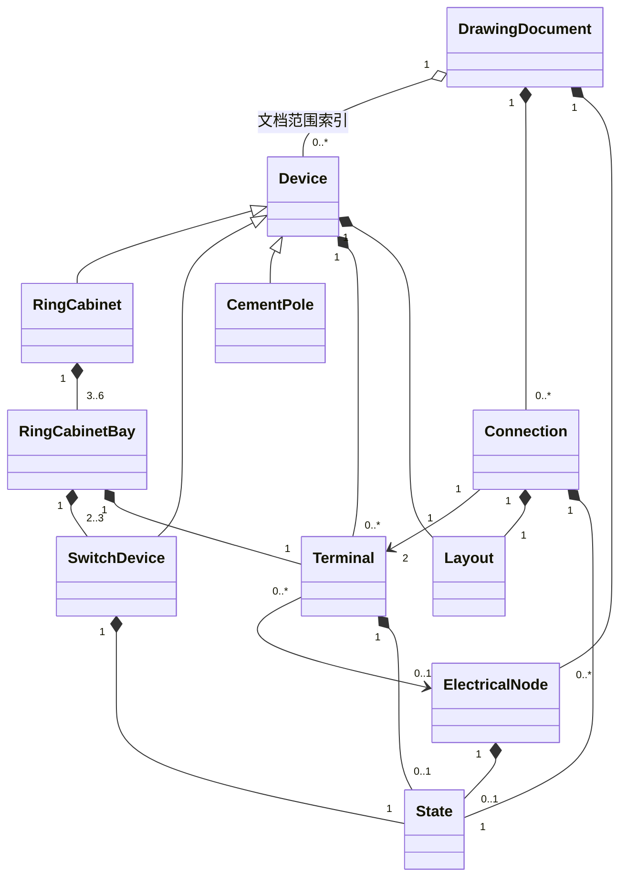

# 10kV 配电附图 MVP 设备模型设计

> 文档状态：MVP 设备模型基线<br>
> 编制日期：2026-08-10<br>
> 依据：`docs/requirements.md`、`docs/architecture.md`、`docs/ring-cabinet-design.md`、`docs/drawing-rule.md`、`docs/implementation-plan.md`

## 1. 目的与范围

本文统一定义第一阶段 MVP 的设备、端子、连接、节点、状态和布局模型，作为后续领域对象、工程文件和画布渲染的共同语义基线。

本文只覆盖以下已确认对象：

1. 普通负荷开关型环网柜。
2. 一二次融合环网柜。
3. 电缆。
4. 水泥杆。
5. 架空线路。
6. 柱上设备：柱上断路器、柱上负荷开关、柱上隔离开关、跌落式熔断器。

环网柜内部的负荷开关、隔离刀闸、断路器和接地刀闸，是上述两类环网柜的组成对象，不是新增的设备库类别。

本模型明确不包含：

- PT 柜和 DTU 柜。其已有设计保留在 `docs/ring-cabinet-design.md`，但不进入当前 MVP 对象模型和验收。
- 配电变压器、箱式站、三工位设备、站内其他开关设备及规范中的其他图元。
- 工作接地线、工作范围、环境对象和独立自由标注模型。
- 生命周期、在运/拆除、运行/检修位置等未列入当前 MVP 的状态维度。
- 潮流计算、电气仿真、自动带电传播和状态联锁控制。

本文中的英文名称是领域概念名称，不代表已经创建代码类型。其他文档中的 `Equipment` 与本文 `Device` 表达同一“设备实例”概念；本模型统一使用 `Device`，避免后续出现两套基础设备对象。

## 2. 建模原则

1. **语义对象是事实源。** 图元、颜色和 WPF 渲染对象不进入设备模型。
2. **拓扑与布局分离。** 端子和连接决定电气关系；坐标、尺寸和折点只决定画面位置。
3. **连接必须落到端子。** 线条相交、端点坐标重合或图元接触均不自动构成电气连接。
4. **状态按对象独立保存。** 环网柜不能用柜体状态覆盖间隔内单台开关状态。
5. **操作状态与电气状态分离。** `拉开/合入` 决定开关图元及内部导通定义；`带电/停电` 决定颜色。
6. **组合对象保持内部语义。** 环网柜不是一张不可拆分的图片，间隔、开关、端子和内部节点均可单独识别。
7. **只建模当前需求。** 不通过通用扩展字典、插件类型或预留空对象提前实现后续设备。

## 3. MVP 对象分类

产品设备库中的对象与领域基础模型映射如下：

| MVP 对象 | 领域模型 | 说明 |
| --- | --- | --- |
| 普通环网柜 | `Device` → `RingCabinet` | 柜型为普通负荷开关型，包含固定数量间隔和内部开关 |
| 一二次融合环网柜 | `Device` → `RingCabinet` | 柜型为一二次融合型，包含固定数量间隔和内部开关 |
| 电缆 | `Connection` | 两个端子之间的电缆连接，不再建立重复的电缆 Device |
| 水泥杆 | `Device` → `CementPole` | 非导电承载设备，可提供架空线路连接锚点并承载柱上设备 |
| 架空线路 | `Connection` | 两个端子之间的架空连接，可引用有序水泥杆列表 |
| 柱上设备 | `Device` → `SwitchDevice` | 安装于水泥杆，类型限定为规范已列出的四种柱上设备 |

电缆和架空线路虽然在界面中可从设备库拖放或创建，但在领域拓扑中均是 `Connection`。同一条线路不得同时保存为 Device 和 Connection。

## 4. 总体对象关系



图中的 `3..6` 表达环网柜组合数量范围；普通柜允许 3、4、5、6 间隔，一二次融合柜只允许 4、6 间隔。每个普通柜间隔包含 2 台开关，一二次融合柜间隔包含 3 台开关。

## 5. Device 基础模型

### 5.1 Device 定义

`Device` 表示具有独立身份、属性和画布位置的设备实例。第一阶段只有环网柜、水泥杆和开关设备使用该基础模型。

| 字段 | 必填 | 说明 |
| --- | --- | --- |
| DeviceId | 是 | 在工程内稳定唯一；保存、重开后不改变 |
| DeviceClass | 是 | 仅允许 `RingCabinet`、`Switch`、`CementPole` |
| DisplayName | 条件必填 | 环网柜和开关设备必填；水泥杆可由 PoleNumber 独立形成图面标注 |
| VoltageLevel | 条件必填 | 导电设备固定为 10kV；水泥杆不适用 |
| TerminalIds | 否 | 本设备拥有的端子标识集合；环网柜外部端子由间隔拥有 |
| State | 条件必填 | 仅有状态能力的设备保存适用状态 |
| ParentRef | 否 | 内部开关指向所属间隔；柱上设备指向所安装水泥杆 |
| Layout | 是 | 设备位置、尺寸及标签锚点，不包含 WPF 类型 |
| SymbolRef | 是 | 指向经确认的专业图元及版本，不保存图元几何副本 |

`DeviceClass` 是基础结构分类，不等同于设备库菜单。内部开关通过 `SwitchKind` 和安装位置进一步限定，不新增任意 DeviceClass。

`ParentRef` 是 ParentBayId 或 HostPoleId 的统一概念表达，持久化时只能有一个有效父引用，不重复保存两份互相可能冲突的父关系。

### 5.2 Device 所有权

- 图纸文档直接拥有顶层环网柜、水泥杆和柱上设备。
- 环网柜聚合拥有普通间隔；普通间隔拥有柜内开关设备。
- 柜内开关仍具有全工程唯一 DeviceId，但不得脱离所属间隔独立存在。
- 柱上设备具有独立 DeviceId，同时必须通过 `HostPoleId` 指向一根水泥杆。
- 一个对象只能有一个语义所有者；不得同时在顶层设备集合和环网柜内部重复保存同一开关实例。

### 5.3 SwitchDevice 统一模型

柜内开关和柱上开关统一使用 `SwitchDevice`，通过开关类型和安装位置表达差异。

| 字段 | 必填 | 说明 |
| --- | --- | --- |
| DeviceId | 是 | 继承 Device 的稳定标识 |
| SwitchKind | 是 | 仅允许 `LoadSwitch`、`Disconnector`、`CircuitBreaker`、`EarthingSwitch`、`DropoutFuse` |
| InstallationKind | 是 | `CabinetBay` 或 `Pole` |
| ParentBayId | 条件必填 | 柜内开关必填，柱上设备不得设置 |
| HostPoleId | 条件必填 | 柱上设备必填，柜内开关不得设置 |
| TerminalIds | 是 | 固定两个，角色由 SwitchKind 和安装位置确定 |
| OperationState | 是 | `Open` 或 `Closed`，每台设备独立保存 |
| DispatchNumber | 否 | 需要在图面标注调度编号时使用 |

允许组合仅限：

| 安装位置 | 允许的 SwitchKind |
| --- | --- |
| 普通负荷开关型间隔 | `LoadSwitch`（负荷开关）、`EarthingSwitch`（接地刀闸） |
| 一二次融合型间隔 | `Disconnector`（隔离刀闸）、`CircuitBreaker`（断路器）、`EarthingSwitch`（接地刀闸） |
| 水泥杆 | `LoadSwitch`（柱上负荷开关）、`Disconnector`（柱上隔离开关）、`CircuitBreaker`（柱上断路器）、`DropoutFuse`（跌落式熔断器） |

表中的“柱上”表示安装语境，不建立另一套基础开关类。例如柱上断路器仍是 `SwitchKind = CircuitBreaker`、`InstallationKind = Pole` 的 SwitchDevice。

## 6. Terminal 基础模型

### 6.1 Terminal 定义

`Terminal` 是外部连接和内部拓扑的最小连接边界。端子属于设备或环网柜间隔，不能脱离所属对象独立存在。

| 字段 | 必填 | 说明 |
| --- | --- | --- |
| TerminalId | 是 | 工程内稳定唯一 |
| OwnerKind | 是 | `Device` 或 `RingCabinetBay` |
| OwnerId | 是 | 所属设备或间隔标识 |
| Role | 是 | 端子在所属对象中的稳定语义角色 |
| VoltageLevel | 条件必填 | 回路、母线和线路端子固定为 10kV；接地侧端子不适用 |
| Exposure | 是 | `Internal` 或 `External`；外部 Connection 只能连接 External 端子 |
| AllowedConnectionKinds | 是 | External 端子声明允许 `Cable`、`OverheadLine` 中的哪一种或两种；Internal 端子必须为空集合 |
| ConnectionPolicy | 是 | `Single` 或 `Junction` |
| ElectricalNodeId | 否 | 端子所属的显式内部电气节点 |
| ElectricalState | 条件必填 | 端子需要独立表达带电/停电颜色时保存；不适用时不创建该状态 |
| AnchorKey | 是 | 图元上的逻辑锚点名称；实际坐标由图元和布局计算 |

### 6.2 端子角色

当前 MVP 使用以下端子角色，不增加通用自由角色：

| 所属对象 | 端子角色 |
| --- | --- |
| 负荷开关 | 母线侧、回路侧 |
| 隔离刀闸 | 母线侧、断路器侧 |
| 断路器 | 隔离侧或线路侧、回路侧或线路侧 |
| 接地刀闸 | 设备侧、接地侧 |
| 普通间隔 | 对外回路 |
| 柱上开关设备 | 线路侧 A、线路侧 B |
| 水泥杆 | 架空线路锚点 |

水泥杆的“架空线路锚点”表示该杆位上的导线连接或延续点，不表示水泥杆本体导电。只有连接到同一 Junction 端子或同一显式电气节点的线路才视为导通。

### 6.3 端子占用规则

- `Single` 端子最多连接一条外部 Connection，适用于间隔对外回路端子和柱上设备普通线路端子。
- `Junction` 端子允许多条架空线路连接，适用于水泥杆上的显式架空线路连接锚点。
- 柜内 Internal 端子不允许用户从画布直接连线，其连接由环网柜模板固定生成。
- Connection 不得直接连接 DeviceId、BayId 或屏幕坐标，必须引用 TerminalId。
- 删除拥有端子的对象前，必须先删除或明确处理引用这些端子的外部连接。

## 7. ElectricalNode 辅助拓扑模型

`ElectricalNode` 不是设备类型，也不在设备库显示。它用于表达多个内部端子属于同一导电节点，避免用线条相交推断连接。

| 字段 | 必填 | 说明 |
| --- | --- | --- |
| NodeId | 是 | 工程内稳定唯一 |
| NodeKind | 是 | 仅允许主母线、回路节点、中间节点、大地节点 |
| OwnerId | 是 | 所属环网柜或间隔 |
| TerminalIds | 是 | 接入本节点的端子集合 |
| ElectricalState | 条件必填 | 可见导电节点使用人工设置的带电/停电状态；大地节点不适用 |

节点只表达同一电位连接关系，不执行潮流、短路或自动带电传播计算。

## 8. Connection 基础模型

### 8.1 Connection 定义

`Connection` 表示两个端子之间可保存、可选择、可移动折点并可绘制的电气连接。当前 MVP 只允许电缆和架空线路两种 ConnectionKind。

| 字段 | 必填 | 说明 |
| --- | --- | --- |
| ConnectionId | 是 | 工程内稳定唯一 |
| ConnectionKind | 是 | 仅允许 `Cable` 或 `OverheadLine` |
| StartTerminalId | 是 | 起点 External 端子 |
| EndTerminalId | 是 | 终点 External 端子 |
| DisplayName | 是 | 线路或电缆的图面名称 |
| VoltageLevel | 是 | 当前 MVP 固定为 10kV |
| ElectricalState | 是 | 人工设置的 `Energized` 或 `Deenergized` |
| Route | 是 | 文档坐标下的连接折点；不保存 WPF Geometry |
| SupportPoleIds | 条件必填 | 仅架空线路使用，按线路经过顺序引用水泥杆 |

### 8.2 通用连接规则

- 起点和终点必须存在，且不能引用同一个 TerminalId。
- 两端必须允许当前 ConnectionKind，且电压等级一致。
- 连接只能改变端子之间的拓扑，不改变端子所属设备或设备类型。
- 线条相交但未共享端子时不导通。
- 移动设备或水泥杆只更新显示路线，不改变 StartTerminalId、EndTerminalId。
- 只有显式重连或断开操作可以改变连接端点。
- Connection 不能以另一条 Connection 作为端点；分支必须通过 Junction 端子表达。

### 8.3 电缆模型

电缆是 `ConnectionKind = Cable` 的连接实例：

- 必须正好连接两个允许电缆接入的 External 端子。
- 不使用 SupportPoleIds。
- 可连接环网柜间隔对外端子或柱上设备线路端子。
- 电缆名称、电气状态和路线独立保存。
- MVP 不增加电缆型号、截面、长度、敷设方式等未确认字段。

### 8.4 架空线路模型

架空线路是 `ConnectionKind = OverheadLine` 的连接实例：

- 必须正好连接两个允许架空线路接入的 External 端子。
- 可以连接柱上设备线路端子或水泥杆架空线路锚点。
- `SupportPoleIds` 保存线路经过的水泥杆顺序；每个引用必须指向现存的 CementPole。
- 同一根水泥杆可以支撑多条架空线路，但每条线路应分别保存其连接关系。
- 移动水泥杆时，线路经过顺序和端子引用不变，仅重新计算相关显示段。
- MVP 不增加导线型号、档距、相序或线路参数等未确认字段。

## 9. State 基础模型

### 9.1 状态维度

`State` 是由所属对象保存的值，不作为具有独立标识的实体。当前 MVP 只定义两个互不替代的状态维度：

| 状态维度 | 允许值 | 适用对象 | 作用 |
| --- | --- | --- | --- |
| OperationState | `Open`、`Closed` | 柜内开关、柱上开关设备 | 选择拉开/合入图元，定义设备两端是否内部导通 |
| ElectricalState | `Energized`、`Deenergized` | 电缆、架空线路、可见电气节点或端子 | 选择带电红色或停电黑色/蓝色 |

中文界面分别显示为：

- `Open`：拉开。
- `Closed`：合入。
- `Energized`：带电。
- `Deenergized`：停电。

状态未设置表示数据尚未完成，不是第三种业务状态，也不得自动按停电状态绘制。

### 9.2 状态适用矩阵

| 对象 | OperationState | ElectricalState |
| --- | --- | --- |
| 环网柜组合 | 不适用 | 不保存柜体级统一状态 |
| 普通间隔 | 不适用 | 由内部节点分别保存，不保存间隔统一状态 |
| 柜内负荷开关 | 必填 | 由相邻端子或节点表达，不用一个设备颜色覆盖两侧 |
| 柜内隔离刀闸 | 必填 | 由相邻端子或节点表达 |
| 柜内断路器 | 必填 | 由相邻端子或节点表达 |
| 柜内接地刀闸 | 必填 | 由相邻端子或节点表达 |
| 柱上断路器 | 必填 | 由两侧端子及相连线路表达 |
| 柱上负荷开关 | 必填 | 由两侧端子及相连线路表达 |
| 柱上隔离开关 | 必填 | 由两侧端子及相连线路表达 |
| 跌落式熔断器 | 必填 | 由两侧端子及相连线路表达 |
| 电缆 | 不适用 | 必填 |
| 架空线路 | 不适用 | 必填 |
| 水泥杆 | 不适用 | 不适用 |

### 9.3 开关内部导通规则

| SwitchKind | Open | Closed |
| --- | --- | --- |
| 负荷开关 | 两个电气端子不导通 | 两个电气端子导通 |
| 隔离刀闸/柱上隔离开关 | 两个电气端子不导通 | 两个电气端子导通 |
| 断路器/柱上断路器 | 两个电气端子不导通 | 两个电气端子导通 |
| 接地刀闸 | 设备侧与接地侧不导通 | 设备侧与大地节点导通 |
| 柱上负荷开关 | 两个电气端子不导通 | 两个电气端子导通 |
| 跌落式熔断器 | 两个电气端子不导通 | 两个电气端子导通 |

上述导通规则用于表达设备语义和选择正确图元，不授权软件自动计算整张图的带电范围。

### 9.4 状态修改约束

- 每次状态修改只针对一个目标对象和一个状态维度。
- 修改某台柜内开关不得隐式修改同间隔其他开关。
- 修改 OperationState 不得自动改写任何 ElectricalState。
- 修改线路 ElectricalState 不得自动改变相连开关的 OperationState。
- 本阶段不实现联锁动作、潮流、电气仿真或状态自动传播。

## 10. 环网柜与间隔模型

### 10.1 RingCabinet

`RingCabinet` 是 Device 聚合根，保存柜体公共属性和内部结构，不保存统一开关状态。

| 字段 | 必填 | 说明 |
| --- | --- | --- |
| DeviceId | 是 | 环网柜设备标识 |
| CabinetKind | 是 | `LoadSwitchType` 或 `PrimarySecondaryIntegrated` |
| DisplayName | 是 | 柜体名称 |
| VoltageLevel | 是 | 固定 10kV |
| MainBusNodeId | 是 | 本柜唯一主母线节点 |
| Bays | 是 | 按从左到右顺序保存的普通间隔 |
| Layout | 是 | 柜体整体位置、尺寸和标签位置 |

当前 MVP 的 RingCabinet 不包含 PT、DTU 或其他特殊间隔字段。

### 10.2 RingCabinetBay

`RingCabinetBay` 是环网柜内部子对象，不是可脱离柜体独立放置的顶层 Device。

| 字段 | 必填 | 说明 |
| --- | --- | --- |
| BayId | 是 | 工程内稳定唯一 |
| ParentCabinetId | 是 | 所属 RingCabinet |
| Sequence | 是 | 从左到右连续编号 1 至 N |
| DisplayName | 是 | 间隔显示名称 |
| BayKind | 是 | 与 CabinetKind 对应的普通间隔类型 |
| SwitchDevices | 是 | 由柜型固定生成，不允许缺项或任意替换 |
| CircuitNodeId | 是 | 本间隔回路节点 |
| IntermediateNodeId | 条件必填 | 仅一二次融合间隔需要 |
| ExternalTerminalId | 是 | 对外连接电缆或架空线路的唯一回路端子 |
| Layout | 是 | 间隔相对柜体的位置和标签锚点 |

### 10.3 普通负荷开关型关系

普通负荷开关型允许 3、4、5、6 个间隔。每个间隔固定包含：

- 1 台负荷开关。
- 1 台接地刀闸。
- 1 个回路节点。
- 1 个对外回路端子。

端子和节点关系：

```text
主母线节点—负荷开关—回路节点—对外回路端子
                         └—接地刀闸—大地节点
```

负荷开关和接地刀闸分别保存 OperationState，互不覆盖。

### 10.4 一二次融合型关系

一二次融合型只允许 4、6 个间隔。每个间隔固定包含：

- 1 台隔离刀闸。
- 1 台断路器。
- 1 台接地刀闸。
- 1 个隔离刀闸与断路器之间的中间节点。
- 1 个回路节点。
- 1 个对外回路端子。

端子和节点关系：

```text
主母线节点—隔离刀闸—中间节点—断路器—回路节点—对外回路端子
                                            └—接地刀闸—大地节点
```

隔离刀闸、断路器和接地刀闸分别保存 OperationState，任一状态变化不改变另外两台设备。

### 10.5 外部连接边界

- 画布只暴露每个间隔的 ExternalTerminalId，不暴露柜内 Internal 端子。
- 电缆或架空线路通过该端子接入回路节点。
- 移动或重排间隔只改变 Layout；已连接 Connection 的 TerminalId 不变。
- 调整间隔数量涉及创建或删除语义对象，不属于普通移动操作；删除已连接间隔前必须处理其外部连接。

## 11. 柱上设备与架空对象关系

### 11.1 CementPole

水泥杆是 `DeviceClass = CementPole` 的非导电承载设备。

| 字段 | 必填 | 说明 |
| --- | --- | --- |
| DeviceId | 是 | 水泥杆标识 |
| PoleNumber | 是 | 图面杆号 |
| DisplayName | 否 | 除杆号外需要显示的名称 |
| OverheadAnchorTerminals | 否 | 架空线路在该杆位连接或延续时使用 |
| Layout | 是 | 杆位坐标、图元尺寸和标签位置 |

水泥杆不保存 OperationState 或 ElectricalState。其锚点只表示导线连接位置，不使杆体成为电气导体。

### 11.2 柱上 SwitchDevice

柱上设备统一使用 SwitchDevice，并满足：

| 字段 | 必填 | 说明 |
| --- | --- | --- |
| DeviceId | 是 | 柱上设备标识 |
| SwitchKind | 是 | 仅允许 `CircuitBreaker`、`LoadSwitch`、`Disconnector`、`DropoutFuse`，分别显示为四类已确认柱上设备 |
| HostPoleId | 是 | 必须引用现存 CementPole |
| DisplayName | 是 | 设备名称或图面标注 |
| OperationState | 是 | `Open` 或 `Closed` |
| LineTerminalA | 是 | 第一线路端子 |
| LineTerminalB | 是 | 第二线路端子 |
| RelativeLayout | 是 | 相对所属水泥杆的位置和标签锚点 |

- 一台柱上设备只能安装在一根水泥杆上。
- 水泥杆可以承载多台柱上设备，但每台设备独立保存状态和端子。
- 移动水泥杆时，其柱上设备随杆整体移动，RelativeLayout 不变，连接端点标识不变。
- 单独调整柱上设备位置只改变 RelativeLayout，不改变 HostPoleId。
- 更换所属水泥杆必须显式修改 HostPoleId，不能通过图元拖到另一根杆附近自动完成。

### 11.3 典型对象关系


水泥杆与柱上设备之间是安装关系；线路与设备之间是端子连接关系。两种关系不得合并为一个“连接”字段。

## 12. Layout 模型

布局数据服务于拖放和移动，不参与电气拓扑判断。

### 12.1 设备布局

设备布局至少保存：

- 文档坐标中的 X、Y。
- 图元宽度和高度。
- 标签锚点或标签相对位置。
- 组合对象内部的相对位置；例如间隔相对环网柜、柱上设备相对水泥杆。

当前 MVP 不因模型设计自行增加旋转、自由缩放或自动布局能力。

### 12.2 连接布局

Connection 的 Route 保存零个或多个文档坐标折点：

- StartTerminalId 和 EndTerminalId 是拓扑事实。
- 首尾显示点由端子 AnchorKey 和设备 Layout 计算。
- 中间折点只影响线条路线。
- 移动设备后可以更新首尾段，但不得修改连接端点标识。

## 13. 属性编辑边界

MVP 属性面板只编辑当前模型已经定义的字段：

| 对象 | 可编辑业务属性 |
| --- | --- |
| 环网柜 | 柜体名称、柜型允许范围内的间隔配置、间隔名称 |
| 柜内开关 | 设备名称或调度编号、OperationState |
| 电缆 | 显示名称、ElectricalState |
| 水泥杆 | 杆号、显示名称 |
| 架空线路 | 显示名称、ElectricalState、经过水泥杆顺序 |
| 柱上设备 | 显示名称、所属水泥杆、OperationState |

图元颜色不是自由属性；颜色由 ElectricalState 和 `docs/drawing-rule.md` 共同决定。图元几何、端子数量和环网柜固定设备组合也不是普通属性编辑项。

## 14. 工程文件保存边界

设备模型保存时至少应完整包含：

- 顶层 Device 及环网柜内部 Device 的稳定标识和属性。
- 环网柜、间隔、内部开关和节点的所有权关系。
- Terminal 的所属对象、角色、暴露范围和连接能力。
- Connection 的类型、两个端点、电气状态及 Route。
- 架空线路的 SupportPoleIds。
- 柱上设备的 HostPoleId 和 RelativeLayout。
- 每台开关独立的 OperationState。
- 设备、间隔和连接的 Layout。

不得保存：

- WPF Visual、Geometry、Brush、Transform 或屏幕像素坐标。
- 可从图元定义和 Layout 重新计算的端子实际坐标。
- 同一电缆或架空线路的重复 Device 副本。
- PT、DTU 或其他非 MVP 设备的空占位字段。
- 自动潮流、电气仿真或数据库引用。

保存后重新打开必须恢复相同的设备所有权、端子引用、连接端点、状态和布局。

## 15. 模型校验规则

### 15.1 基础对象

- 所有 DeviceId、TerminalId、ConnectionId、NodeId 和 BayId 在工程内唯一。
- 所有引用目标必须存在，且对象类型符合引用要求。
- DeviceClass、SwitchKind、ConnectionKind 和状态值只能取本文定义的集合。
- 不允许保存没有所有者的 Terminal 或没有两个有效端点的 Connection。

### 15.2 环网柜

- 普通负荷开关型只能有 3、4、5、6 个普通间隔。
- 一二次融合型只能有 4、6 个普通间隔。
- 间隔序号从 1 开始连续且唯一。
- 普通柜每间隔必须且只能包含一台负荷开关和一台接地刀闸。
- 一二次融合柜每间隔必须且只能包含一台隔离刀闸、一台断路器和一台接地刀闸。
- 每台柜内开关必须有独立 OperationState。
- 每个间隔必须有且只有一个对外回路端子。
- 柜内端子、节点和固定设备关系必须符合第 10 节。
- 当前 MVP 环网柜不得包含 PT、DTU 或特殊间隔。

### 15.3 电缆和架空线路

- ConnectionKind 只能为 Cable 或 OverheadLine。
- 两端端子必须允许相应连接类型，且均为 10kV。
- Cable 不得保存 SupportPoleIds。
- OverheadLine 的 SupportPoleIds 只能引用 CementPole，并保持明确顺序。
- 连接线视觉相交不创建隐含端子、节点或分支。

### 15.4 水泥杆和柱上设备

- PoleNumber 必填并参与图面标注；对象身份以 DeviceId 为准，当前 MVP 不自行规定杆号唯一性规则。
- 柱上设备的 HostPoleId 必须引用现存水泥杆。
- 柱上 SwitchKind 只能是已确认的四种柱上设备。
- 每台柱上设备必须具有两个线路端子和独立 OperationState。
- 删除水泥杆前必须处理其柱上设备、架空线路支撑引用和锚点连接。

### 15.5 状态

- OperationState 只能为 Open 或 Closed。
- ElectricalState 只能为 Energized 或 Deenergized。
- 不适用状态的对象不得保存该状态字段。
- 修改单台开关后，其他开关状态保持原值。
- OperationState 和 ElectricalState 不得相互自动覆盖。

## 16. MVP 验收示例

| 验收场景 | 预期模型结果 |
| --- | --- |
| 创建 3 间隔普通柜 | 生成 1 个主母线节点、3 个间隔、3 台负荷开关、3 台接地刀闸和 3 个对外端子 |
| 创建 6 间隔一二次融合柜 | 生成 6 个间隔，每个间隔含隔离刀闸、断路器、接地刀闸及独立状态 |
| 单独拉开一个断路器 | 只更新目标 Device 的 OperationState；同间隔另外两台开关状态不变 |
| 环网柜通过电缆连接柱上设备 | Cable 的两个端点分别引用间隔对外端子和柱上设备线路端子 |
| 柱上设备通过架空线路连接杆位 | OverheadLine 的端点引用柱上设备端子和水泥杆锚点，并保存经过杆位顺序 |
| 移动环网柜 | Device Layout 改变，Cable 端点 TerminalId 不变，路线首段刷新 |
| 移动水泥杆 | 水泥杆和所承载柱上设备位置更新，HostPoleId、线路端点及支撑顺序不变 |
| 保存并重新打开 | Device、Bay、Terminal、Node、Connection、State 和 Layout 语义完全一致 |
| 线条交叉但未连接 | 不生成 Terminal、Node 或 Connection 关系，电气拓扑保持不变 |

## 17. 与其他设计文档的关系

- MVP 交付边界以 `docs/requirements.md` 为准。
- 两类环网柜的间隔数量和内部开关结构以 `docs/ring-cabinet-design.md` 为专业设计依据；其中 PT、DTU 内容不进入当前 MVP。
- 状态图元、带电/停电颜色和文字显示遵循 `docs/drawing-rule.md`。
- 领域对象、持久化 DTO、ViewModel 和 WPF 渲染对象之间的分层映射遵循 `docs/implementation-plan.md`。
- 如后续增加设备或状态，必须先变更 MVP 需求和本模型文档，不能通过未知类型或自由属性绕过范围管理。
