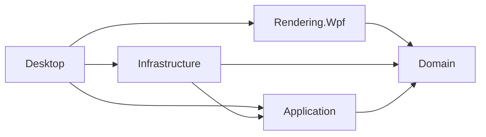

# 10kV 配电工作票附图软件技术实现方案

> 文档状态：第一版技术实现建议<br>
> 编制日期：2026-08-10<br>
> 目标平台：Windows 桌面<br>
> 输入依据：`README.md`、`docs/requirements.md`、`docs/architecture.md`、`docs/equipment-model.md`、`docs/ring-cabinet-design.md`、`docs/drawing-rule.md`

## 1. 文档目标与当前约束

本文把现有业务与架构设计落实为可执行的 Windows 桌面技术路线，定义第一版的技术栈、项目边界、代码目录、对象映射、绘图内核、工程文件、JPG 导出、打印方案和 MVP 开发顺序。

当前文档状态如下：

- `README.md` 为空。
- `docs/requirements.md` 已形成第一阶段 MVP 正式范围基线。
- `docs/equipment-model.md` 已形成设备、架空系统、工作范围和工作地线的模型基线。
- `docs/architecture.md` 已定义模块化单体、设备—端子—连接模型、状态与表现分离、规则校验和本地工程文件方向。
- `docs/ring-cabinet-design.md` 已定义普通负荷开关型、一二次融合型、PT、DTU、间隔、端子及设备独立状态。
- `docs/drawing-rule.md` 已整理配电工作票和现场勘察附图的颜色、标注、接地、工作范围和图元规则。

本文以 `docs/requirements.md` 已确认的 MVP 范围及现有配电专业模型、规则为边界。未被需求基线明确列为 MVP 必须实现的能力，均作为后续候选或待确认项，不作为第一阶段交付承诺。操作系统版本、安装方式、纸张、导出分辨率等技术建议，仍应在 MVP 开始前通过目标单位的实际电脑、打印机和真实脱敏图纸验证。

### 1.1 已确认的 MVP 范围

| 类别 | 第一阶段必须实现 |
| --- | --- |
| 设备 | 普通环网柜、一二次融合环网柜、电缆、水泥杆、架空线路、柱上设备 |
| 操作 | 拖放、移动、属性编辑、状态修改 |
| 安全表达 | 人工定义工作范围、人工添加和编号工作地线 |
| 输出 | 保存并重新打开工程、JPG 导出、Windows 打印 |

第一阶段明确不实现 CAD DWG 兼容、自动计算潮流、电气仿真、自动停电分析、自动生成工作地线、数据库、云同步和多用户。PT 只能作为一二次融合环网柜内部特殊间隔；DTU 是固定跟随 PT 的独立布局柜体。两者属于环网柜组合结构，不是设备库中的独立设备类别。

## 2. Windows 桌面技术路线结论

### 2.1 推荐方案

第一版推荐采用：

| 技术项 | 选择 |
| --- | --- |
| 运行平台 | Windows 11 x64；如必须支持特定 Windows 10 企业/IoT 版本，另做现场确认 |
| 运行时 | .NET 10 LTS，保持安装最新受支持补丁 |
| UI 框架 | WPF |
| 编程语言 | C# |
| UI 模式 | MVVM，画布交互通过应用命令进入领域模型 |
| 应用结构 | 多项目的模块化单体，不拆服务 |
| 绘图内核 | WPF 保留模式矢量绘制，核心使用 `DrawingVisual`、`DrawingGroup`、`StreamGeometry` |
| 数据序列化 | `System.Text.Json`，领域对象与持久化 DTO 分离 |
| 工程文件 | 自定义 `.kvdrawing` 压缩容器，内含版本化 JSON 和预览图 |
| JPG 导出 | 同一离屏矢量渲染管线输出 `RenderTargetBitmap`，再由 `JpegBitmapEncoder` 编码 |
| 打印 | WPF `PrintDialog` + `DocumentPaginator`/固定页面，保持矢量打印 |
| 部署 | 第一阶段 x64 self-contained 发布；正式分发方式根据单位策略选择 MSIX 或 MSI |

截至 2026-08-10，.NET 10 是处于活动支持期的 LTS 版本，官方支持期至 2028-11-14。第一版不建议新建在 .NET Framework 4.8/4.8.1 上；现代 .NET 能获得更新的语言、运行时、部署和维护能力。

### 2.2 对 `docs/architecture.md` 技术候选的收敛

`docs/architecture.md` 已把第一版平台收敛为 Windows + WPF；本方案进一步确定以下实现边界：

- 第一版不使用 Electron、Tauri 或嵌入式浏览器作为应用壳。
- 第一版运行时主渲染使用 WPF 原生矢量对象，不依赖浏览器 SVG DOM。
- SVG 可作为图元整理或交换的源格式候选，但不是第一版画布中的事实源，也不直接序列化为工程模型。
- 领域、规则、应用命令和工程文件不得依赖 WPF 类型；若未来出现浏览器硬性需求，可以重用这些层并替换表现层。

这不是改变“语义模型是唯一事实源”的架构原则，而是针对 Windows-only 条件确定具体表现技术。

## 3. .NET/WPF 适用性分析

### 3.1 适合本项目的原因

| 项目需求 | WPF 适配情况 |
| --- | --- |
| Windows 离线桌面 | WPF 原生运行于 Windows，适合内网或无网环境 |
| 单线图矢量绘制 | WPF 是分辨率无关的矢量渲染框架，支持几何、文字、变换和硬件加速 |
| 图元状态切换 | 可通过图元定义和状态变体重绘，不需要位图替换 |
| 缩放和平移 | 可使用统一坐标变换，不改变模型坐标 |
| 打印 | WPF 提供 Windows 打印对话框、分页器和 XPS 打印路径 |
| JPG 输出 | WPF 可将同一 Visual 离屏渲染为位图并使用 JPEG 编码器 |
| 中文标签和排版 | WPF 具有成熟的文字布局、字体和 DPI 支持 |
| MVVM 与属性编辑 | 数据绑定、命令、模板和样式适合设备属性面板 |
| 本地文件 | .NET 文件、压缩、JSON、校验和原子替换能力完整 |
| 长期维护 | .NET 10 为 LTS；C# 和 WPF 生态成熟 |

WPF 官方文档说明其使用分辨率无关的矢量渲染，并提供数据绑定、布局、2D 图形、文档、文字等桌面能力；这些能力与本项目的单线图编辑和打印需求直接匹配。

### 3.2 主要限制

1. **仅支持 Windows。** 如果后续必须直接运行在浏览器、macOS 或 Linux，WPF 表现层不能复用。
2. **WPF 不原生提供完整 SVG 编辑器。** 需要使用 WPF Geometry/Drawing 表达运行时图元，或者增加受控的 SVG 转换步骤。
3. **大型可视树需要控制。** 若把每条线、每个端子都建成完整 `FrameworkElement`，会增加布局和事件开销。
4. **打印仍需实机验证。** 不同打印机的可打印区域、驱动和颜色表现可能不同。
5. **高 DPI 离屏导出会占用内存。** A3、300 DPI 输出必须避免同时保留多份全尺寸位图。
6. **UI 自动化测试成本较高。** 领域、规则和渲染必须与窗口解耦，才能把多数测试下沉到非 UI 层。

### 3.3 与其他路线的比较

| 路线 | 优点 | 对第一版的不利点 | 结论 |
| --- | --- | --- | --- |
| .NET 10 + WPF | Windows 原生、矢量绘图和打印成熟、离线部署直接 | Windows-only；需自建专业画布 | 推荐 |
| WinUI 3 | Windows 新式 UI | 本项目更看重成熟画布、文档和打印链路；迁移收益有限 | 第一版不选 |
| Electron + React | Web 技术成熟、未来可跨平台 | 安装体积大；Windows 打印和字体一致性需额外处理 | 平台扩展时再评估 |
| Tauri + Web UI | 壳体较轻、可跨平台 | Rust + Web 双技术栈；打印和 WebView 差异增加风险 | 第一版不选 |
| WinForms | 简单、Windows 集成成熟 | 矢量场景、缩放、样式和 MVVM 支持弱于 WPF | 不选 |
| Avalonia | C# 跨平台 | 当前无跨平台需求；打印和 Windows 原生集成需额外验证 | 第一版不选 |

### 3.4 结论和适用前提

.NET/WPF 适合作为第一版实现方案，并建议正式采用，前提是：

- 第一版产品确认只面向 Windows 桌面。
- 项目接受 WPF 原生矢量作为运行时图元技术。
- 在正式开发初期先完成一次 JPG 和目标打印机的技术验证。
- 领域层、应用层和文件合同不引用 WPF 类型，避免把平台选择扩散到全部代码。

如果“浏览器内嵌”在 MVP 中变成硬性要求，应暂停 WPF UI 实现并重新评估 Web 技术路线，而不是同时维护两套画布。

## 4. 项目代码目录结构设计

### 4.1 解决方案目录

以下是未来实施时建议创建的目录；本阶段不实际创建这些项目和代码文件。

```text
10kV-Distribution-Drawing/
├─ src/
│  ├─ DistributionDrawing.Domain/
│  │  ├─ Documents/
│  │  ├─ Devices/
│  │  ├─ Topology/
│  │  ├─ RingCabinets/
│  │  ├─ Layout/
│  │  └─ Validation/
│  ├─ DistributionDrawing.Application/
│  │  ├─ Commands/
│  │  ├─ Queries/
│  │  ├─ Editing/
│  │  ├─ UndoRedo/
│  │  ├─ Rules/
│  │  └─ Contracts/
│  ├─ DistributionDrawing.Rendering.Wpf/
│  │  ├─ Canvas/
│  │  ├─ Scene/
│  │  ├─ Symbols/
│  │  ├─ Connections/
│  │  ├─ Text/
│  │  ├─ Export/
│  │  └─ Printing/
│  ├─ DistributionDrawing.Infrastructure/
│  │  ├─ Persistence/
│  │  ├─ Serialization/
│  │  ├─ Migrations/
│  │  ├─ Recovery/
│  │  └─ FileSystem/
│  └─ DistributionDrawing.Desktop/
│     ├─ Views/
│     ├─ ViewModels/
│     ├─ Dialogs/
│     ├─ Commands/
│     ├─ Resources/
│     └─ Composition/
├─ assets/
│  ├─ symbols/
│  └─ templates/
├─ tests/
│  ├─ DistributionDrawing.Domain.Tests/
│  ├─ DistributionDrawing.Application.Tests/
│  ├─ DistributionDrawing.Rendering.Tests/
│  └─ DistributionDrawing.Infrastructure.Tests/
└─ docs/
```

### 4.2 项目职责

| 项目 | 职责 | 禁止依赖 |
| --- | --- | --- |
| Domain | 设备、端子、连接、环网柜、状态、布局和不变量 | WPF、文件系统、JSON、窗口 |
| Application | 创建/编辑/删除/连接等用例、撤销重做、规则调度、接口合同 | 具体 WPF 控件、具体文件实现 |
| Rendering.Wpf | 场景生成、图元、画布、命中测试、JPG、打印页面 | 直接修改领域对象、直接保存文件 |
| Infrastructure | 工程文件、JSON DTO、迁移、备份、自动恢复 | WPF View/ViewModel |
| Desktop | 窗口、视图、ViewModel、对话框和依赖组合 | 直接实现领域规则和文件格式 |

### 4.3 项目依赖方向



`Domain` 没有反向依赖。`Desktop` 只在组合入口选择文件存储、渲染和打印实现。

### 4.4 目录粒度原则

- 不为每个设备类型创建独立项目。
- 不在 MVP 中引入插件系统或微服务。
- 一个目录对应一个稳定业务职责，不按“Utils”“Helpers”堆放无归属代码。
- 图元资源与设备实例分离；资源定义放在 `assets/symbols` 或渲染项目资源中，工程文件只保存引用和版本。
- 测试目录与生产边界对应，避免只做 UI 端到端测试。

## 5. 设备模型到代码对象的映射

### 5.1 四层对象分离

同一业务对象在实现中分为四种表现，不能使用一个 WPF 控件贯穿全部层：

| 层次 | 对象作用 | 示例 |
| --- | --- | --- |
| 领域对象 | 保存业务语义和不变量 | `Device`、`Terminal`、`Connection`、`RingCabinet` |
| 持久化 DTO | 定义版本化文件合同 | 设备 DTO、端子 DTO、连接 DTO、布局 DTO |
| ViewModel | 支持选择、属性编辑和命令状态 | 设备属性 ViewModel、文档 ViewModel |
| 渲染对象 | 屏幕、导出和打印的临时矢量对象 | SceneElement、SymbolVisual、ConnectionVisual |

映射顺序为：

```text
工程文件 DTO ⇄ 领域对象 → ViewModel / 渲染场景
```

领域对象不得保存 `Brush`、`Geometry`、`DrawingVisual`、`Point`、`Transform` 等 WPF 类型。渲染对象不得作为工程文件序列化。

### 5.2 核心对象映射表

| 设计概念 | 建议代码对象 | 关键职责 |
| --- | --- | --- |
| 图纸文档 | `DrawingDocument` | 持有元数据、设备、拓扑、安全措施、布局和规则版本 |
| 设备 | `Device` | 设备类型、标识、名称、电压、状态和端子 |
| 开关设备 | `SwitchDevice` | 独立拉开/合入等操作状态和内部导通定义 |
| 端子 | `Terminal` | 端子角色、电压、所属设备和连接约束 |
| 电气节点 | `ElectricalNode` | 表示母线节点、回路节点、中间节点和大地节点 |
| 连接 | `Connection` | 引用两端端子或节点，不保存屏幕线条对象 |
| 电缆 | `Connection` + `Cable` 类型 | 保存电缆连接语义、两端端子和可编辑标注属性 |
| 架空线路 | `Connection` + `OverheadLine` 类型 | 保存架空连接语义、两端引用和可编辑线路属性 |
| 水泥杆 | `Pole` | 保存杆号、杆型、位置、连接端子和附属关系 |
| 杆塔附属关系 | `PoleAttachment` | 关联 Pole、附属 Device 和相对布局 |
| 柱上设备 | `SwitchDevice` + `PoleAttachment` | 保存设备类型、端子、独立开关状态及安装杆塔 |
| 电缆终端 | `CableTermination` + `PoleAttachment` | 以电缆侧和架空侧端子连接两个系统 |
| 连接路线 | `ConnectionRoute` | 保存连接线的人工折点和路由模式 |
| 工作地线 | `GroundingPoint` | 人工关联端子，保存位置、编号和备注 |
| 工作范围 | `WorkScope` | 保存两个 BoundaryPoint、说明及关联 GroundingPoint |
| 标注 | `Annotation` | 文字、引线和非导电说明 |
| 环网柜组合 | `RingCabinet` | 柜型、普通间隔、主母线和结构约束 |
| 普通间隔 | `RingCabinetInterval` | 设备组合、主母线引用、对外回路端子和间隔顺序 |
| PT 间隔 | `PTInterval` | 一二次融合柜内部特殊间隔，包含隔离刀闸、PT 和接地刀闸 |
| DTU 柜 | `DTUCabinet` | 随 PT 同侧布局，无端子、节点或电气状态 |
| 布局 | `DiagramLayout` | 页面、元素位置、尺寸、层级、标签锚点和路线 |

### 5.3 继承与组合

第一版采用“浅层继承 + 组合”方式：

- `Device` 提供所有设备共有的标识、类型、名称、电压和端子集合。
- 开关操作位置使用独立的状态值对象或能力接口，不为“断路器拉开”“断路器合入”建立两个类。
- 设备内部导通关系由设备定义和当前操作状态共同产生。
- 环网柜、普通间隔、PTInterval 和 DTUCabinet 使用明确组合对象，因为它们具有结构不变量。
- 图元外形不通过设备子类实现，而由 `SymbolDefinition` 根据设备类型和状态选择。

这样可避免为每种设备和每个状态建立大量类，同时保留环网柜结构的类型安全。

### 5.4 标识和值对象

- 文档、设备、端子、连接、间隔、安全措施使用不同的强类型标识；底层可使用 GUID。
- 文件中使用稳定、非本地化的字符串编码，界面再映射为中文显示名称。
- 电压等级、设备类型、操作状态和电气状态分别建模，不使用一个通用字符串状态；工作角色和生命周期状态不进入当前 MVP。
- 页面和布局坐标以毫米为持久化单位；渲染时转换为 WPF DIP，换算关系为 1 英寸 = 25.4 毫米 = 96 DIP。
- 元素尺寸和连接折点均保存为与屏幕 DPI 无关的逻辑值；当前 MVP 不提供设备旋转。

### 5.5 环网柜对象映射

普通负荷开关型实例化时：

- 根据 3/4/5/6 间隔数量创建对应 `RingCabinetInterval`。
- 每个间隔创建一台负荷开关和一台接地刀闸。
- 每台开关独立持有操作状态。
- 每个间隔创建回路节点和对外端子，所有间隔连接同一主母线节点。

一二次融合型实例化时：

- 根据 4/6 间隔数量创建对应普通间隔。
- 每个间隔创建隔离刀闸、断路器、接地刀闸及中间节点。
- 三台设备状态独立，不能以一个间隔状态覆盖。

PT、DTU 按环网柜组合对象映射，不作为设备库中的独立类别：

- 一二次融合柜必须包含且只能包含一个 `PTInterval`，位于普通间隔组左侧或右侧，固定包含隔离刀闸、PT 和接地刀闸。
- PTInterval 内两台开关分别保存操作状态，PT 本体不保存操作状态。
- PT 存在时创建一个关联 `DTUCabinet`；DTU 不具有端子、节点或电气状态，其 Position 由 PTPosition 派生。
- 左侧固定为 `DTU | PT | 普通间隔`，右侧固定为 `普通间隔 | PT | DTU`，不得独立移动 DTU 到另一侧。

### 5.6 领域对象与 DTO 映射

领域对象不直接序列化，原因包括：

- 领域构造过程需要执行不变量，反序列化不能绕过校验。
- 代码重命名不应自动改变工程文件格式。
- 旧文件迁移应作用于明确版本的 DTO，而不是猜测领域类结构。
- WPF 或运行时缓存不能意外写入文件。

加载流程：读取容器 → 校验 manifest 和 JSON → 按版本迁移 DTO → DTO 映射到领域对象 → 执行完整结构/拓扑校验 → 创建画布场景。

保存流程：领域对象和布局 → 当前版本 DTO → 校验 DTO → 确定性 JSON → 写入临时容器 → 重新校验 → 原子替换正式文件。

## 6. 画布、图元与连接关系实现方案

### 6.1 画布总体方案

第一版不采用“一个图形原语一个 WPF 控件”的方式。建议实现一个自定义 `DiagramSurface`，内部维护轻量级 `DrawingVisual` 场景：

- 一个业务设备、连接或标注可对应一个轻量级 Visual，便于局部重绘和命中测试。
- 图元内部的线、圆、路径使用 `DrawingGroup`、`GeometryDrawing` 和 `StreamGeometry`，不展开成大量 Shape 控件。
- 选择框、端子热点、拖动预览等交互内容放在独立覆盖层。
- 屏幕显示、JPG 导出和打印共享同一个场景生成器，只更换输出目标和页面变换。

Microsoft 的 WPF 性能建议指出，`Drawing` 比完整 `Shape/FrameworkElement` 更轻量，`StreamGeometry` 和 `DrawingVisual` 适合大量二维图形；这与配电单线图场景相符。

### 6.2 坐标系统

采用三层坐标：

| 坐标 | 单位 | 用途 |
| --- | --- | --- |
| 文档坐标 | 毫米 | 工程文件、页面、设备位置、连接折点 |
| WPF 场景坐标 | DIP | 从毫米统一换算后的渲染坐标 |
| 屏幕坐标 | 物理像素 | 鼠标命中、缩放后容差，不写入工程文件 |

缩放和平移只修改视图变换，不回写设备位置。拖动设备时先把鼠标位置从屏幕坐标逆变换到文档坐标，再提交移动命令。

### 6.3 场景分层

建议固定渲染顺序：

1. 页面背景、页边界和可选网格。
2. 环网柜等容器。
3. 母线、线路、电缆和普通连接。
4. 设备图元。
5. 名称、编号、电压等级和线路名称等文字。
6. 选择框、端子热点、吸附提示和拖动预览。

交互覆盖层不进入 JPG 或打印输出。

### 6.4 图元定义

每个 `SymbolDefinition` 包含：

- 稳定图元编码和版本。
- 适用设备类型。
- 归一化边界框。
- WPF 矢量几何。
- 端子锚点和端子角色。
- 文字锚点。
- 各操作状态对应的几何变体。
- 颜色角色，不直接写死红色、黑色或蓝色。

颜色角色由渲染主题解析：

- 带电导电部分映射为红色。
- 停电导电部分映射为项目选择的黑色或蓝色。
- 文字和接地点映射为黑色或蓝色。

具体 RGB 色值不属于 V7 规范，应在打印验收后形成项目级视觉参数，不能写成专业规范结论。

### 6.5 状态图元选择

场景生成器根据设备类型和操作状态选择图元变体：

- 拉开/合入分别选择对应开关图元。
- 环网柜接地刀闸按产品模型的拉开/合入状态选择变体。
- 柱上断路器、柱上负荷开关、柱上隔离开关和跌落式熔断器按拉开/合入状态选择变体。

PTInterval 内的隔离刀闸和接地刀闸使用各自的拉开/合入图元；PT 本体无操作状态。DTU 只绘制柜体框和名称。三工位设备、运行/检修位置和生命周期图元不进入本次 MVP。

操作状态决定几何变体，电气状态决定颜色；两项不得相互覆盖。

### 6.6 连接模型

连接的事实源是端子引用：

- 每条普通连接至少包含起点端子、终点端子和连接类型。
- 一对多连接通过显式电气节点或母线对象实现，不通过多条线视觉相交实现。
- 分支点需要显式 `ElectricalNode`；没有节点的线条交叉不导通。
- 连接路线只保存折点，不保存 WPF Polyline 或 Geometry。
- 移动图元只更新端子锚点和路线首尾段，不改变起止端子引用。
- 只有“连接”“重新连接”“断开”应用命令可以改变拓扑。

### 6.7 端子吸附和命中测试

- 端子在普通状态下可隐藏，在连接或选中时显示热点。
- 吸附距离以屏幕像素定义，再换算为当前缩放下的文档距离，确保不同缩放级别手感一致。
- 连接前检查端子占用、允许连接类型和电压兼容性。
- 命中测试返回领域对象标识，不把 Visual 实例交给业务命令。
- Visual 与对象标识的映射只存在于渲染层，场景重建后可重新生成。

### 6.8 连接线路由

MVP 只实现正交连接：

- 新连接先生成直线、L 形或 Z 形基础路线。
- 用户可插入、移动和删除折点。
- 路线不自动跨越复杂障碍，也不进行全图最优布局。
- 移动设备时保留中间人工折点，仅调整首尾锚点附近线段。
- 线条相交不自动创建连接；需要连接时必须显式放置节点或连接到端子。

复杂避障和全自动排版不进入第一阶段。

### 6.9 架空系统与安全对象

- `Pole` 是架空系统基础对象，当前 `PoleType` 固定为水泥杆。
- 柱上开关和 `CableTermination` 必须通过 `PoleAttachment` 安装到 Pole，不允许作为悬空设备保存。
- CableTermination 的电缆侧端子只接 Cable，架空侧端子只接 OverheadLine。
- OverheadLine 保存线路型号、可选长度和有序 SupportPoleIds。
- `IsContinued` 为 true 时，渲染线路继续符号和文字；`ContinuationState` 由用户选择 Energized 或 Unknown，不做自动推导。
- WorkScope 由两个 BoundaryPoint 生成边界标记和说明，不通过画布矩形反向生成模型。
- GroundingPoint 由用户选定 Terminal 后创建；画布、JPG 和打印共享同一工作地线图元与编号显示规则。
- 修改 WorkScope、OperationState 或 ElectricalState 均不得自动创建、删除或移动 GroundingPoint。

### 6.10 编辑命令与撤销重做

所有改变文档的操作通过应用命令执行，例如：

- 创建设备或组合模板。
- 移动、重排普通间隔、切换 PT 左右位置并联动 DTU。
- 修改属性或单台开关状态。
- 创建、重连或删除连接。
- 人工添加工作地线、定义工作范围或添加适用标注。
- 删除设备并处理关联连接。

每个成功命令产生可撤销记录。鼠标移动等临时预览不进入领域模型；拖动结束时合并为一次移动命令，避免撤销栈被大量中间坐标污染。

## 7. 工程文件保存方案

### 7.1 文件形式

推荐扩展名：`.kvdrawing`。

文件使用 ZIP 容器，第一版包含：

```text
manifest.json
document.json
preview.jpg
```

- `manifest.json`：容器版本、文档标识、应用版本、创建/修改时间、图元库版本、JSON 摘要。
- `document.json`：全部可编辑语义、拓扑、状态、页面和布局数据。
- `preview.jpg`：文件选择和最近文档预览，不作为可编辑数据源。

MVP 不支持用户自定义图元，因此不在工程文件内嵌任意脚本、XAML 或外部资源。后续若允许自定义资源，必须先设计安全白名单和版本策略。

### 7.2 `document.json` 内容

建议包含：

- 文件格式版本。
- 文档类型、标题、工作票号等元数据。
- 页面尺寸、方向和边距，单位为毫米。
- 设备、端子、电气节点、连接。
- Pole、PoleAttachment 和 CableTermination。
- 设备独立操作状态和人工设置的电气状态。
- 环网柜组合及普通间隔。
- 一二次融合柜的 PTInterval、PTPosition 和关联 DTUCabinet。
- WorkScope、BoundaryPoint 和 GroundingPoint。
- 当前 MVP 设备所需的文字标注。
- 元素位置、尺寸、层级、标签锚点和连接折点。
- 绘图规则和图元库版本。

V1 文件 DTO 只包含实际进入 MVP 的模型字段。PT/DTU 组合关系、工作范围和工作地线已经进入需求基线，应保存完整语义；不得为其他未来能力预设空字段。

不得保存：

- WPF Visual、Geometry、Brush、Transform 等运行时对象。
- 当前窗口大小、缩放比例、鼠标位置和选择框。
- 可从模型重新计算的场景缓存和普通规则结果。
- JPG 像素作为可编辑图纸内容。

### 7.3 版本和迁移

- `formatVersion` 使用整数递增，不使用应用版本代替文件版本。
- 每次破坏性格式变化提供顺序迁移器，例如 V1 → V2 → V3。
- 迁移先作用于 DTO，再映射到当前领域对象。
- 新版保存前保留旧文件备份；迁移失败时不得覆盖原文件。
- 未知的未来主版本应拒绝打开并给出明确提示，不能以默认值静默丢字段。

### 7.4 保存可靠性

正式保存采用：

1. 在目标文件同目录写入唯一临时文件。
2. 完成 ZIP、JSON 和摘要写入并关闭文件句柄。
3. 重新打开临时文件，校验容器条目、JSON、摘要和领域不变量。
4. 首次保存时原子移动到目标路径；覆盖保存时使用替换并保留一个备份版本。
5. 成功后清理临时文件。

不得直接在原文件上边写边覆盖，以免断电或应用崩溃造成唯一副本损坏。

### 7.5 自动恢复

- 文档发生修改后按时间间隔和重要命令节点写入恢复文件。
- 恢复文件放在用户本地应用数据目录，不覆盖正式工程文件。
- 正常关闭且正式保存成功后清理对应恢复文件。
- 启动时发现比正式文件更新的恢复文件，应让用户选择恢复、忽略或另存。
- 恢复文件采用相同格式和校验逻辑，不能维护第二套序列化结构。

## 8. JPG 导出方案

### 8.1 导出原则

- JPG 必须由当前领域模型重新生成离屏场景，不能截取屏幕。
- 导出不受当前窗口大小、缩放比例、平移位置、选中状态和端子热点影响。
- JPG 没有透明通道，背景固定为白色。
- 设备图元、连接和文字与打印使用同一场景生成器。
- 导出前执行与正式打印相同的完整规则检查。

### 8.2 WPF 实现路径

建议流程：

1. 按页面毫米尺寸创建离屏场景。
2. 将页面尺寸和目标 DPI 换算为像素尺寸。
3. 使用 `DrawingVisual` 绘制白色背景和完整图纸。
4. 使用 `RenderTargetBitmap` 把 Visual 渲染为位图。
5. 使用 `JpegBitmapEncoder` 编码并写入临时文件。
6. 成功编码后原子移动到用户目标路径。

Microsoft 官方 API 将 `RenderTargetBitmap` 定义为把 Visual 转为位图，`JpegBitmapEncoder` 用于 JPEG 编码，能够覆盖此实现链路。

### 8.3 第一版输出参数

建议第一版默认：

| 参数 | 默认值 |
| --- | --- |
| 导出范围 | 完整页面 |
| 分辨率 | 300 DPI |
| 背景 | 白色 |
| JPEG 质量 | 95 |
| 色彩 | 彩色 |
| 多页命名 | 文件名后追加页码 |

这些是技术默认值，不是配电规范值。应使用 A4/A3 真实案例检查文件大小、文字清晰度和红色警示效果后再冻结。

像素尺寸按 `毫米 ÷ 25.4 × DPI` 计算。渲染过程中一次只处理一页；编码完成后释放位图和场景，避免 A3 高 DPI 多页同时占用大量内存。

### 8.4 导出验收

- JPG 边界与页面预览一致，无裁切、额外滚动区域或选择框。
- 设备状态图元正确，带电红色、停电黑色或蓝色、文字和接地点颜色符合绘图规则。
- 中文名称、电压等级、地线编号在 100% 查看时清晰。
- 同一工程文件重复导出时，除元数据外视觉结果稳定。
- 导出失败时不留下零字节正式文件，也不覆盖原有正常 JPG。

## 9. 打印方案

### 9.1 打印原则

- 打印直接使用矢量页面，不先转成 JPG 再打印。
- 打印预览、正式打印和 JPG 导出共享同一场景生成器。
- 纸张、方向、边距和缩放是页面设置，不写入设备业务状态。
- 打印前执行完整规则检查，并清除交互覆盖层。

### 9.2 WPF 打印链路

建议使用：

- `PrintDialog`：选择打印机、份数和页面范围。
- `PrintCapabilities`/可打印区域：确认目标打印机支持的纸张和边界。
- `DocumentPaginator` 或固定页面集合：为每一页提供稳定的矢量 `DocumentPage`。
- `PrintDialog.PrintDocument`：把分页器提交到 Windows 打印队列。

WPF 官方打印体系原生支持 XPS 打印路径，并可在需要时由系统转换到 GDI 打印路径。该方案比打印屏幕截图更适合保持图元和文字清晰度。

### 9.3 页面和缩放

- 第一版支持 A4、A3，横向和纵向；最终范围以需求确认结果为准。
- 页面尺寸以毫米保存，打印时换算为 DIP。
- 获取打印机可打印区域后，默认等比例缩放到可打印范围内，不拉伸、不裁切。
- 用户选择 100% 实际尺寸时，如内容超出可打印区域必须明确提示。
- 纸张或方向与工程设置不一致时，在提交打印前显示差异。

### 9.4 打印预览

- 使用与 `DocumentPaginator` 相同的页面对象生成预览，避免预览和打印两套实现。
- 预览显示纸张边界、有效内容和页数，不显示编辑网格、选择框和端子热点。
- 打印设置变化后重新分页，不能只在预览图上缩放旧页面。

### 9.5 实机测试矩阵

至少验证：

- A4 横向、A4 纵向、A3 横向。
- 彩色打印机和彩色转灰度场景。
- 100% 与适合页面两种缩放。
- 长名称、最小字号、细线、虚线、红色带电部分、黑色/蓝色停电部分。
- 打印机不可用、取消打印、驱动返回无效可打印区域等异常路径。

Windows 自带“Microsoft Print to PDF”可作为一种打印机参与测试，但第一版不因此实现独立 PDF 导出功能。

## 10. 第一阶段 MVP 开发顺序

### 当前里程碑状态

当前阶段：**M1.2-D 环网柜 Domain 第一阶段已完成。**

已完成：

- WPF 五项目工程骨架。
- `DrawingVisual` 基础渲染。
- 毫米文档坐标体系。
- Windows 环境启动验证。
- 普通负荷开关型环网柜。
- 一二次融合间隔。
- 混合环网柜。
- 上刀上接地、上刀下接地、下刀下接地三种接地结构。
- 一二次融合间隔状态评估。
- 隔离刀闸与接地刀闸互斥联锁校验。
- 环网柜 Domain 测试。

当前未实现：

- `PTInterval`。
- `DTUCabinet`。
- 图元渲染。
- 架空线路。
- 杆塔附属设备。
- 工作范围。
- 工作地线。

下一阶段：**M1 后续领域模型实现。**

以下顺序保留为第一阶段实施基线。

### M0：WPF 项目骨架和技术验证门（约 1 周）

工作内容：

- 确认目标 Windows 版本、x64 环境、安装权限和打印机型号。
- 确认 A4/A3、方向、停电使用黑色或蓝色、六类 MVP 设备的权威图元和验收图纸。
- 按第 4 节创建最小 WPF 解决方案和项目依赖骨架，不实现完整业务功能。
- 用最小 WPF 原型验证一个配电图元、一段连接、中文标签的缩放、300 DPI JPG 和实机打印。
- 确认 WPF 原生矢量图元的制作流程。

退出条件：项目依赖方向符合设计，目标电脑可运行，JPG 清晰，目标打印机不裁切，红色/黑色或蓝色可辨认。若失败，先调整路线，不进入正式领域和画布开发。

### M1：领域模型与文件合同（约 1～2 周）

工作内容：

- 在 M0 骨架上固化项目依赖边界。
- 实现文档、Device、端子、电气节点、连接、状态、工作范围、工作地线和布局值对象。
- 实现两类环网柜、PT/DTU 组合、电缆、Pole、PoleAttachment、CableTermination、架空线路和柱上设备的模型映射及结构不变量。
- 建立应用命令和撤销/重做合同。

退出条件：不依赖 WPF 即可构造和校验两类环网柜、PT/DTU 固定关系、“环网柜—电缆—电缆终端杆—架空线路—柱上设备”拓扑、线路延续、WorkScope 和 GroundingPoint，并验证状态独立且不自动生成安全措施。

### M2：图元库和离屏渲染内核（约 1～2 周）

工作内容：

- 将两类环网柜、PTInterval、DTUCabinet、电缆、电缆终端、水泥杆、架空线路、线路继续符号、柱上设备和工作地线的权威图元整理为 WPF 矢量定义。
- 实现场景生成器、颜色角色、状态变体、文字排版和页面坐标换算。
- 先完成离屏渲染和渲染快照测试，再接入交互画布。

退出条件：给定包含全部六类 MVP 设备的固定领域模型可生成稳定页面，图元状态和颜色符合设计，渲染不依赖窗口。

### M3：基础画布与编辑命令（约 2 周）

工作内容：

- 实现设备库拖放、缩放、平移、选择、框选、移动和属性编辑。
- 实现端子显示、吸附、正交连接和折点编辑。
- 实现 WorkScope 两端边界选择和 GroundingPoint 人工添加、编号与关联。
- 实现创建、删除、移动、改状态和连接的撤销重做。

退出条件：能从空白页面拖放并编辑一个“环网柜—电缆—水泥杆—架空线路—柱上设备”单线图；移动设备时连接显示同步更新，线条相交不会误连。

### M4：MVP 设备专项编辑（约 1～2 周）

工作内容：

- 实现普通负荷开关型 3/4/5/6 间隔模板。
- 实现一二次融合型 4/6 间隔模板。
- 实现一二次融合柜 PT 左右位置选择，以及 DTU 自动跟随的固定布局。
- 实现环网柜内单台开关状态独立修改。
- 实现电缆和架空线路的端子连接、折点及标注属性编辑。
- 实现架空线路型号、可选长度、延续标识和人工延续状态编辑。
- 实现水泥杆的杆号、位置属性、PoleAttachment 和 CableTermination 转换关系。
- 实现柱上断路器、柱上负荷开关、柱上隔离开关、跌落式熔断器的适用属性和状态编辑。

退出条件：两类环网柜的必需间隔和独立状态通过验证，PT/DTU 固定关系正确，架空线路及杆塔附属关系可编辑，六类 MVP 设备均可拖放、移动、编辑属性，并在适用时修改状态。

### M5：工程文件、备份和恢复（约 1 周）

工作内容：

- 实现当前版本 DTO、JSON、`.kvdrawing` 容器和摘要。
- 实现保存、打开、另存、临时文件、备份和自动恢复。
- 建立第一版迁移框架，即使当前只有 V1。

退出条件：包含全部六类 MVP 设备、PT/DTU 组合、杆塔附属关系、线路延续、WorkScope 和 GroundingPoint 的图纸保存后重新打开，领域语义、连接、状态和布局完全一致；中断保存不破坏原文件。

### M6：状态显示和基础绘图规则（约 1 周）

工作内容：

- 实现两类环网柜内部设备及柱上开关设备的拉开、合入图元变体。
- 根据人工设置的电气状态显示带电红色、停电黑色或蓝色，并正确显示文字标注。
- 显示线路继续符号、WorkScope 边界和人工 GroundingPoint；工作票显示地线编号，勘察图隐藏具体编号。
- 保证画布、JPG 和打印中的设备状态、颜色和标注一致。
- 不实现自动潮流、状态推导或电气仿真；显示结果仅来源于保存的人工编辑数据。

退出条件：全部 MVP 有状态设备的状态组合均可正确显示和保存，屏幕、JPG、打印输出一致。

### M7：JPG、打印和交付闭环（约 1 周）

工作内容：

- 实现 300 DPI JPG、原子输出和多页命名。
- 实现打印设置、预览、分页和实机打印。
- 保证屏幕、JPG 和打印使用同一场景生成器。

退出条件：JPG 和纸质输出通过 A4/A3 测试，无裁切、重叠、状态错误和颜色错误。

### M8：试点验收与加固（约 1～2 周）

工作内容：

- 使用普通环网柜场景和一二次融合环网柜场景两类脱敏案例；每类均包含电缆、水泥杆、电缆终端、架空线路和柱上设备。
- 修复数据丢失、打印偏差、图元误选、连接误判和高 DPI 问题。
- 固化图元版本、文件 V1、已知限制和用户说明。

退出条件：两类金标准场景覆盖全部六类设备和四项编辑操作，并通过专业人员复核；连续编辑、保存、恢复、JPG 和打印闭环稳定。

## 11. 测试和质量门

### 11.1 自动测试

- 领域测试：六类 MVP 设备构造、设备状态独立、端子连接、PT/DTU 固定关系、PoleAttachment、CableTermination、线路延续、WorkScope 和 GroundingPoint 不变量。
- 命令测试：执行、撤销、重做后模型一致。
- 文件测试：往返序列化、损坏检测、未知版本、迁移、原子保存和恢复。
- 渲染测试：固定模型生成固定尺寸输出，关键图元做视觉快照比较。
- 显示规则测试：状态图元变体、带电/停电颜色和文字标注至少有代表性样例。
- 导出测试：像素尺寸、白色背景、文件完整性和失败不覆盖。

### 11.2 人工质量门

- 配电专业人员确认图元与标准票一致。
- 配电专业人员确认开关状态、带电/停电颜色和文字标注表达。
- 在目标 Windows 缩放比例下检查画布和属性面板。
- 在目标打印机上检查 A4/A3 实物。
- 模拟异常退出并验证恢复文件。

### 11.3 性能基线

M0 使用真实案例确定性能目标。第一版至少应以典型工作票附图为基准验证：

- 缩放、平移和拖动无明显阻塞。
- 修改单台设备只局部更新相关场景。
- 保存、打开和 300 DPI JPG 导出有明确进度或等待反馈。
- 大图导出不同时持有多个整页位图。

在出现真实性能数据前，不引入 Canvas/WebGL、第三方图形引擎或复杂空间索引；先使用轻量 DrawingVisual、几何缓存和局部更新解决。

## 12. 第一版明确不做

### 12.1 已确认的 MVP 排除项

- 不实现 CAD DWG 导入、导出或兼容转换。
- 不自动计算潮流。
- 不实现电气仿真。
- 不实现自动停电分析。
- 不根据工作范围或拓扑自动生成工作地线及其他安全措施。
- 不引入数据库。
- 不实现云同步。
- 不实现多用户协作。

这些排除项不得成为 MVP 里程碑的隐含前置条件，也不为其建立未使用的业务模块。状态、工作范围和工作地线由用户手工设置，工程数据保存在本地工程文件中。

### 12.2 技术实现边界

- 不实现浏览器版本或跨平台 UI。
- 不把 SVG DOM 作为运行时领域模型。
- 不把 JPG 当作可编辑工程文件。
- 不实现复杂自动布线、全图自动布局或图像识别。
- 不直接实现独立 PDF 导出；可通过 Windows 打印机路径验证 PDF 打印。
- 不允许工程文件加载任意 XAML、脚本或未知插件。

## 13. 开发前待确认事项

1. 目标单位使用的 Windows 版本和系统架构。
2. 是否允许 self-contained 应用，以及正式安装采用 MSIX 还是 MSI。
3. 是否必须支持无管理员权限安装和完全离线升级。
4. A4/A3、横纵方向、页边距和打印机型号。
5. 停电部分默认使用黑色还是蓝色。
6. JPG 是否固定 300 DPI，是否需要用户选择质量或分辨率。
7. 工程文件扩展名 `.kvdrawing` 是否接受。
8. 六类 MVP 设备的权威矢量源、字体和最终审核人。
9. 第一版是否只要求工作票附图，还是同时要求现场勘察附图完整能力。
10. 真实脱敏金标准图纸和对应正确设备状态、连接及文字标注。

## 14. 官方技术依据

- [.NET 官方支持策略](https://dotnet.microsoft.com/en-us/platform/support/policy)：.NET 10 为活动支持期 LTS，支持至 2028-11-14。
- [WPF 概述](https://learn.microsoft.com/en-us/dotnet/desktop/wpf/overview/)：WPF 的 Windows-only、分辨率无关矢量渲染、数据绑定、2D 图形、文档和文字能力。
- [WPF 二维图形性能建议](https://learn.microsoft.com/en-us/dotnet/desktop/wpf/advanced/optimizing-performance-2d-graphics-and-imaging)：Drawing、StreamGeometry 和 DrawingVisual 的适用性。
- [WPF 打印概述](https://learn.microsoft.com/en-us/dotnet/desktop/wpf/documents/printing-overview)：PrintDialog、PrintTicket、PrintCapabilities 和 XPS 打印路径。
- [RenderTargetBitmap API](https://learn.microsoft.com/en-us/dotnet/api/system.windows.media.imaging.rendertargetbitmap?view=windowsdesktop-10.0)：把 WPF Visual 渲染为位图。
- [JpegBitmapEncoder API](https://learn.microsoft.com/en-us/dotnet/api/system.windows.media.imaging.jpegbitmapencoder?view=windowsdesktop-10.0)：JPEG 编码器。
- [.NET 10 支持的操作系统](https://github.com/dotnet/core/blob/main/release-notes/10.0/supported-os.md)：用于最终确认目标 Windows 版本是否处于官方支持范围。
