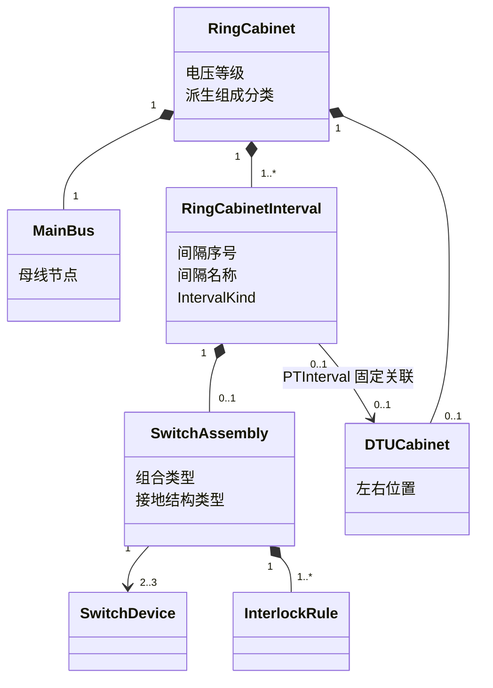
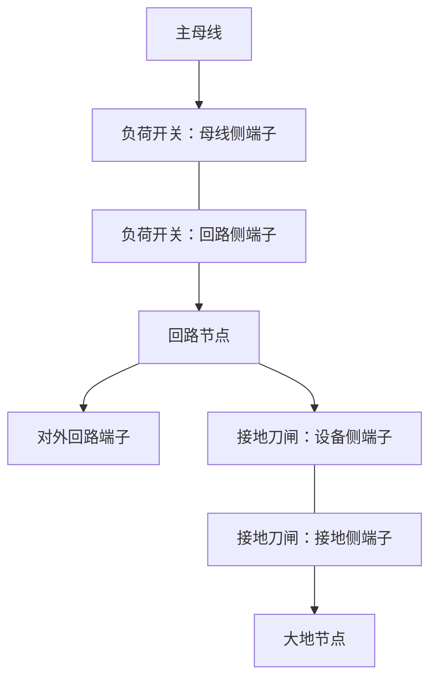
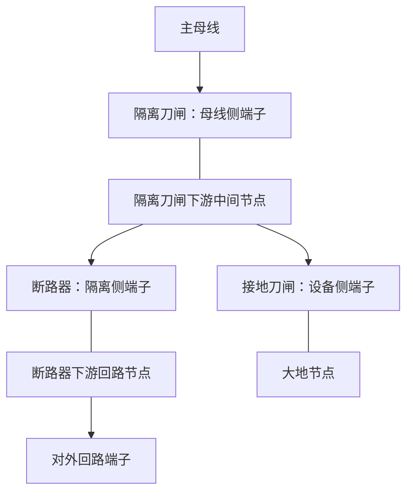

# 10kV 配电环网柜模型设计

> 文档状态：M1.2-C2-2 接地结构模型设计修订<br>
> 编制日期：2026-08-11<br>
> 依据：`docs/architecture.md`、配电专业附图规范、本阶段明确的环网柜产品需求

## 1. 目的与范围

本文定义 10kV 配电附图编辑器中的环网柜领域模型，覆盖：

- 仅含普通负荷开关间隔的环网柜。
- 仅含一二次融合断路器间隔的环网柜。
- 同时包含负荷开关间隔和一二次融合断路器间隔的混合型环网柜。
- PT 间隔：作为柜内特殊间隔，位于普通电气间隔组左侧或右侧。
- DTU 柜：与 PT 固定关联的独立布局柜体，自动跟随 PT 位于同一侧。
- 柜体、间隔、设备、开关组合、联锁规则、端子、连接和状态之间的关系。

本文只定义领域和绘图数据模型，不规定界面交互方式，不涉及代码实现。

## 2. 设计原则

1. **柜体是组合容器，不是间隔类型来源。** 柜内间隔和开关设备保持独立对象；`RingCabinet` 不得依据柜体分类把所有间隔强制为同一种类型。
2. **普通电气间隔数量与 PT 间隔分开计数。** 普通电气间隔数量由间隔配置列表计算；PT 不替换普通电气间隔，也不改变该计数，DTU 不属于环网柜电气间隔。
3. **设备状态独立。** 同一间隔内的负荷开关、隔离刀闸、断路器和接地刀闸分别保存状态；修改一个设备不得隐式修改其他设备。
4. **拓扑与布局分离。** 左右位置、柜宽、图元坐标属于布局；母线、端子和导通关系属于电气拓扑。
5. **开关位置与带电状态分离。** `拉开/合入` 描述设备操作位置；`带电/停电` 描述设备或连接的电气状态，两者不能使用同一字段代替。
6. **可视交叉不等于电气连接。** 只有端子之间建立的连接才构成拓扑关系。
7. **PT 与 DTU 位置联动。** 用户只选择 PT 位于普通间隔组左侧或右侧，DTU 自动置于 PT 外侧，不允许独立设置 DTU 位置。
8. **单设备状态是事实，组合状态是派生结果。** `SwitchState` 只保存单台开关的 `Open/Closed`；间隔运行方式和有效接地结论由开关组合类型、成员状态及联锁规则计算，不重复保存。
9. **联锁不替代独立设备。** `SwitchAssembly` 只表达多个 `SwitchDevice` 的功能组合、机械约束和状态判定，不合并设备标识、端子或操作状态。
10. **间隔配置是结构事实的唯一来源。** 柜体由有序的 `RingCabinetInterval` 组成；每个间隔根据自己的 `IntervalKind` 建立设备、组合、端子和固定拓扑，不从柜体分类反向推断。

## 3. 术语

| 术语 | 定义 |
| --- | --- |
| 环网柜组合 | 一个 RingCabinet、其有序间隔列表，以及存在 PT 时与之固定关联的 DTU 布局对象 |
| 普通电气间隔 | 由自身 IntervalKind 固定内部结构、具有外部回路端子并连接主母线的电气单元 |
| 混合型环网柜 | 同一 RingCabinet 的普通电气间隔列表中同时存在 LoadSwitchInterval 和 IntegratedFeederInterval |
| PT 间隔 | RingCabinet 内部的特殊间隔，包含隔离刀闸、PT 和接地刀闸，不是柜体顶层属性 |
| 主母线 | 将各普通间隔和 PT 间隔连接到同一电气节点的柜内母线 |
| 回路节点 | 普通间隔中开关设备下游与外部电缆/线路端子相连的节点 |
| 大地节点 | 接地刀闸合入时所连接的逻辑接地节点 |
| 操作状态 | 本文限定为开关设备的 `拉开` 或 `合入` |
| 开关组合 | `SwitchAssembly`；由同一功能单元中的多个开关设备及联锁规则组成，不是 Device |
| 联锁规则 | `InterlockRule`；判定互斥、非法组合、命名运行方式和有效接地条件 |
| 运行方式 | `OperationalState`；由组合成员当前状态计算得到，不作为独立事实保存 |
| 电气状态 | 带电、停电等绘图状态，具体显示规则见 `docs/drawing-rule.md` |

## 4. 顶层聚合模型

### 4.1 环网柜组合

每个环网柜组合至少包含以下数据：

| 字段 | 必填 | 说明 |
| --- | --- | --- |
| 组合标识 | 是 | 在一张图内稳定唯一 |
| 柜体名称 | 是 | 图纸上显示的柜体或站点名称 |
| 电压等级 | 是 | 本模型固定为 10kV，仍作为设备语义保存 |
| 间隔配置 | 是 | 按物理顺序保存的 RingCabinetInterval 列表；每项独立指定 IntervalKind |
| 普通电气间隔数量 | 派生 | 由间隔配置中非 PT 间隔数量计算，不独立保存 |
| 主母线 | 是 | 一个共享的柜内电气节点 |
| 间隔列表 | 是 | 同一有序集合包含普通电气间隔和可选 PTInterval |
| 柜体组成分类 | 派生 | 根据普通电气间隔类型计算，不作为创建或校验间隔结构的输入 |
| DTU 柜 | 条件必填 | 存在 PTInterval 时必须有且仅有一个，并自动跟随 PT；不存在 PT 时不得有 |
| 布局信息 | 是 | 柜体位置、尺寸、方向以及特殊柜排列顺序 |

### 4.2 柜体分类与间隔配置

原 `CabinetKind=LoadSwitchType/PrimarySecondaryIntegrated` 隐含“柜型决定全部间隔”的关系，不再作为目标领域模型的结构约束。M1.2-C2 后续实现应逐步停止使用该字段决定间隔类型。

柜体组成可根据普通电气间隔列表派生为 `CabinetCompositionKind`，但该值不得独立保存：

| 派生值 | 判定条件 |
| --- | --- | --- |
| `LoadSwitchOnly` | 所有普通电气间隔均为 LoadSwitchInterval |
| `IntegratedFeederOnly` | 所有普通电气间隔均为 IntegratedFeederInterval |
| `Mixed` | 两种普通电气间隔同时存在 |

若后续确需表达厂家柜体系列、自动化能力或壳体结构，应另设 `CabinetStructureKind`；该字段只能描述柜体能力或模板元数据，不能决定间隔类型、设备数量或 PT 是否存在。本阶段不预设未经设备资料确认的 `CabinetStructureKind` 枚举值。

既有纯类型模板继续保留：纯 LoadSwitch 模板允许 3、4、5、6 个普通电气间隔；纯 IntegratedFeeder 模板允许 4、6 个普通电气间隔。混合柜由模板或显式 `IntervalDefinition` 列表给出，不把“任意 3～6 个任意组合”扩展成未经确认的全局规则。PTInterval 和 DTU 不计入普通电气间隔数量。

### 4.3 组合层次



普通电气间隔必须有一个 SwitchAssembly；PTInterval 的组合规则在其实现阶段单独确认，不得套用现有两种普通间隔组合。具体数量由所选模板或显式间隔配置校验。

### 4.4 混合型环网柜

混合型环网柜不是新的 Device 类型，也不引入新的聚合层。它仍是 `RingCabinet : Device`，区别只在于其有序间隔配置同时包含两种普通电气间隔。

六间隔示例：

```text
RingCabinet
├── 1: LoadSwitchInterval
│   └── SwitchAssembly(LoadSwitchThreePosition)
├── 2: LoadSwitchInterval
│   └── SwitchAssembly(LoadSwitchThreePosition)
├── 3: IntegratedFeederInterval
│   └── SwitchAssembly(IntegratedFeeder)
├── 4: IntegratedFeederInterval
│   └── SwitchAssembly(IntegratedFeeder)
├── 5: LoadSwitchInterval
│   └── SwitchAssembly(LoadSwitchThreePosition)
└── 6: LoadSwitchInterval
    └── SwitchAssembly(LoadSwitchThreePosition)
```

每个间隔独立保持自己的设备成员、SwitchAssembly、内部 ElectricalNode、Terminal 和状态。相邻或同柜的另一种间隔不得改变这些不变量。主母线节点由 RingCabinet 共享，外部线路仍只连接目标普通电气间隔自己的 ExternalTerminal。

### 4.5 创建定义

目标工厂不再以柜体类型生成同质间隔，而是接收受控定义：

```text
CreateRingCabinet(RingCabinetDefinition)

RingCabinetDefinition
├── CabinetId
├── DisplayName
├── TemplateRef（可选）
└── IntervalDefinitions（按物理顺序）
    ├── LoadSwitchIntervalDefinition
    ├── IntegratedFeederIntervalDefinition
    ├── IntegratedFeederIntervalDefinition
    └── LoadSwitchIntervalDefinition
```

每个 `IntervalDefinition` 只能包含创建该类型所需的输入；具体 SwitchDevice、SwitchAssembly、ElectricalNode 和 Terminal 必须由聚合工厂一次性完整生成，外部调用方仍不能自由拼装内部对象。现有纯类型工厂可在迁移期作为预置定义的便捷入口，但不得继续承担柜体结构校验的唯一来源。

## 5. LoadSwitchInterval

### 5.1 间隔组成

每个普通间隔固定包含：

- 1 台负荷开关。
- 1 台接地刀闸。
- 1 个主母线侧内部连接点。
- 1 个回路节点。
- 1 个对外回路端子。
- 1 个逻辑大地节点连接端。
- 1 个由负荷开关和接地刀闸组成的 `SwitchAssembly`。

间隔不得缺少负荷开关或接地刀闸，也不得在 `LoadSwitchInterval` 中以断路器、隔离刀闸替代它们。该约束只由间隔类型决定，与同柜其他间隔的类型无关。

### 5.2 端子定义

| 对象 | 端子 | 连接目标 |
| --- | --- | --- |
| 负荷开关 | 母线侧端子 | 环网柜主母线 |
| 负荷开关 | 回路侧端子 | 本间隔回路节点 |
| 接地刀闸 | 设备侧端子 | 本间隔回路节点 |
| 接地刀闸 | 接地侧端子 | 大地节点 |
| 间隔 | 对外回路端子 | 本间隔回路节点；对外连接电缆或线路 |

### 5.3 电气连接关系



开关拉开或合入不改变上述端子接线，只改变设备内部是否导通：

- 负荷开关合入：母线侧端子与回路侧端子导通。
- 负荷开关拉开：母线侧端子与回路侧端子不导通。
- 接地刀闸合入：设备侧端子与接地侧端子导通。
- 接地刀闸拉开：设备侧端子与接地侧端子不导通。

### 5.4 三工位组合与状态判定

负荷开关和接地刀闸分别具有独立 `SwitchState`，并共同属于一个普通负荷开关型 `SwitchAssembly`。此处“三工位”表示两台独立设备在机械联锁下形成的三个允许稳定组合，不建立单一三值开关设备。

| 组合运行方式 | LoadSwitch | GroundSwitch | 含义 |
| --- | --- | --- | --- |
| `Running` | `Closed` | `Open` | 负荷回路导通 |
| `Disconnected` | `Open` | `Open` | 回路断开且未接地 |
| `Grounded` | `Open` | `Closed` | 回路节点与大地节点导通，线路接地 |
| 非法组合 | `Closed` | `Closed` | 违反机械互斥，必须拒绝进入该稳定状态 |

联锁规则至少包含 `LoadSwitch=Closed` 与 `GroundSwitch=Closed` 互斥。由运行转为接地或由接地转为运行时，合法状态转换必须经过 `Disconnected`；规则校验只约束目标组合，不通过隐式动作替用户改变另一台设备。

模型不得：

- 因负荷开关拉开而自动合入接地刀闸。
- 因接地刀闸合入而自动改变负荷开关状态。
- 用一个可保存的“间隔状态”字段代替两个设备状态。
- 保存独立的 `OperationalState` 并使其可能与两台开关状态不同步。

`Running`、`Disconnected` 和 `Grounded` 均在读取或校验时根据两台开关状态计算。

## 6. IntegratedFeederInterval

### 6.1 间隔组成

每个 `IntegratedFeederInterval` 固定包含：

- 1 台隔离刀闸。
- 1 台断路器。
- 1 台接地刀闸。
- 1 个包含上述三台设备的 `SwitchAssembly`。
- 1 个必填的接地结构类型。
- 按接地结构类型生成的主母线侧、中间、回路和大地节点。
- 1 个对外回路端子。

三台设备仍分别使用 `SwitchDevice` 和独立 `SwitchState`；`SwitchAssembly` 不替代任何一台设备。接地结构类型只允许：

| GroundingStructureKind | 中文名称 | 主回路顺序 | 接地刀闸接入点 |
| --- | --- | --- |
| `UpperIsolationUpperGrounding` | 上刀上接地 | 主母线—隔离刀闸—断路器—电缆 | 隔离刀闸与断路器之间的中间节点 |
| `UpperIsolationLowerGrounding` | 上刀下接地 | 主母线—隔离刀闸—断路器—电缆 | 断路器下游回路节点 |
| `LowerIsolationLowerGrounding` | 下刀下接地 | 主母线—断路器—隔离刀闸—电缆 | 隔离刀闸下游回路节点 |

`GroundingStructureKind` 是单个 `IntegratedFeederInterval` 的必填拓扑事实，不属于 `RingCabinet`，也不在 `SwitchAssembly` 中重复保存。创建间隔时必须明确选择；间隔工厂根据它同时选择固定端子—节点拓扑和规则集。只更换显示图元、只更换规则集或只修改枚举值而不重建匹配拓扑均属于非法模型。

`SwitchAssembly` 保存成员开关引用和与结构匹配的 `RuleSetRef`，评估时以所属间隔的 `GroundingStructureKind` 作为结构上下文。聚合校验必须保证 IntervalKind、GroundingStructureKind、内部拓扑和 RuleSetRef 四者一致。

以下所有状态表的组合顺序统一为 `IsolationSwitch / CircuitBreaker / GroundSwitch`。

### 6.2 上刀上接地

上刀上接地为主流结构。固定端子—节点拓扑为：



| ElectricalNode | 必须连接的端子 |
| --- | --- |
| MainBusNode | IsolationSwitch 母线侧端子 |
| IntermediateNode | IsolationSwitch 下游端子、CircuitBreaker 上游端子、GroundSwitch 设备侧端子 |
| CircuitNode | CircuitBreaker 下游端子、ExternalTerminal |
| EarthNode | GroundSwitch 接地侧端子 |

| 状态组合 | IsValid | OperationalState | IsEffectivelyGrounded | 说明 |
| --- | --- | --- | --- | --- |
| Open / Open / Open | true | `ColdStandby` | false | 三台开关均断开 |
| Open / Open / Closed | true | `Unclassified` | false | 接地刀闸位于断路器上游，断路器断开使外部回路未形成有效接地 |
| Open / Closed / Open | true | `Unclassified` | false | 尚无已确认运行方式映射 |
| Open / Closed / Closed | true | `Maintenance` | true | 经合入断路器对外部回路形成有效接地 |
| Closed / Open / Open | true | `HotStandby` | false | 断路器合入即可送电 |
| Closed / Open / Closed | false | `Unclassified` | false | 隔离刀闸与接地刀闸同时合入，违反互斥规则 |
| Closed / Closed / Open | true | `Running` | false | 主回路导通 |
| Closed / Closed / Closed | false | `Unclassified` | false | 隔离刀闸与接地刀闸同时合入，违反互斥规则 |

有效接地条件严格为：`IsValid && IsolationSwitch=Open && CircuitBreaker=Closed && GroundSwitch=Closed`。

### 6.3 上刀下接地

```text
主母线—隔离刀闸—中间节点—断路器—回路节点—对外端子/电缆
                                            └—接地刀闸—大地节点
```

| ElectricalNode | 必须连接的端子 |
| --- | --- |
| MainBusNode | IsolationSwitch 母线侧端子 |
| IntermediateNode | IsolationSwitch 下游端子、CircuitBreaker 上游端子 |
| CircuitNode | CircuitBreaker 下游端子、GroundSwitch 设备侧端子、ExternalTerminal |
| EarthNode | GroundSwitch 接地侧端子 |

| 状态组合 | IsValid | OperationalState | IsEffectivelyGrounded | 说明 |
| --- | --- | --- | --- | --- |
| Open / Open / Open | true | `ColdStandby` | false | 三台开关均断开 |
| Open / Open / Closed | true | `Grounded` | true | 下游接地，不要求断路器合入 |
| Open / Closed / Open | true | `Unclassified` | false | 尚无已确认运行方式映射 |
| Open / Closed / Closed | true | `Unclassified` | true | 外部回路存在直接接地路径，但该组合尚无已确认运行方式名称 |
| Closed / Open / Open | true | `HotStandby` | false | 断路器合入即可送电 |
| Closed / Open / Closed | false | `Unclassified` | false | 隔离刀闸与接地刀闸同时合入，违反互斥规则 |
| Closed / Closed / Open | true | `Running` | false | 主回路导通 |
| Closed / Closed / Closed | false | `Unclassified` | false | 隔离刀闸与接地刀闸同时合入，违反互斥规则 |

有效接地条件为：`IsValid && IsolationSwitch=Open && GroundSwitch=Closed`；CircuitBreaker 状态不参与该结构的有效接地判断。

### 6.4 下刀下接地

```text
主母线—断路器—中间节点—隔离刀闸—回路节点—对外端子/电缆
                                            └—接地刀闸—大地节点
```

| ElectricalNode | 必须连接的端子 |
| --- | --- |
| MainBusNode | CircuitBreaker 母线侧端子 |
| IntermediateNode | CircuitBreaker 下游端子、IsolationSwitch 上游端子 |
| CircuitNode | IsolationSwitch 下游端子、GroundSwitch 设备侧端子、ExternalTerminal |
| EarthNode | GroundSwitch 接地侧端子 |

| 状态组合 | IsValid | OperationalState | IsEffectivelyGrounded | 说明 |
| --- | --- | --- | --- | --- |
| Open / Open / Open | true | `Unclassified` | false | 尚未确认该结构的冷备用命名映射 |
| Open / Open / Closed | true | `Grounded` | true | 下游接地，不要求断路器合入 |
| Open / Closed / Open | true | `Unclassified` | false | 尚无已确认运行方式映射 |
| Open / Closed / Closed | true | `Unclassified` | true | 外部回路存在直接接地路径，但该组合尚无已确认运行方式名称 |
| Closed / Open / Open | true | `Unclassified` | false | 尚未确认该结构的热备用命名映射 |
| Closed / Open / Closed | false | `Unclassified` | false | 隔离刀闸与接地刀闸同时合入，违反互斥规则 |
| Closed / Closed / Open | true | `Unclassified` | false | 主回路物理导通，但 `Running` 命名映射仍待设备资料确认 |
| Closed / Closed / Closed | false | `Unclassified` | false | 隔离刀闸与接地刀闸同时合入，违反互斥规则 |

该结构与上刀下接地均不需要通过合入断路器实现电缆接地，但主回路设备顺序不同，必须建立不同节点关系。有效接地条件为：`IsValid && IsolationSwitch=Open && GroundSwitch=Closed`；CircuitBreaker 状态不参与有效接地判断。除 `Open/Open/Closed → Grounded` 外，尚未由设备资料确认的运行方式名称保持 `Unclassified`。

### 6.5 状态独立性与组合判定

隔离刀闸、断路器和接地刀闸必须各自保存 `Open/Closed`。模型不得把三台设备压缩成单一三工位 Device，也不得保存一个间隔级状态覆盖三台设备。

三种结构当前共同确认的硬联锁只有：`IsolationSwitch=Closed` 与 `GroundSwitch=Closed` 互斥。不得自行增加“断路器与接地刀闸互斥”、动作先后顺序或自动联动规则；取得厂家闭锁资料后再版本化补充。

当前规则集内容明确为：

| RuleType | 适用结构 | 条件或来源 | 结果 |
| --- | --- | --- | --- |
| `MutualExclusion` | 三种结构 | IsolationSwitch=Closed 且 GroundSwitch=Closed | IsValid=false，记录统一互斥规则标识 |
| `InvalidCombination` | 暂无新增 | 尚无其他已确认厂家闭锁组合 | 不创建推测规则 |
| `OperationalStateMapping` | 分结构 | 严格匹配第 6.2～6.4 节完整状态表 | 命中已确认名称；否则 Unclassified |
| `EffectiveGrounding` | 上刀上接地 | IsValid 且 Open/Closed/Closed | true |
| `EffectiveGrounding` | 两种下接地 | IsValid 且 IsolationSwitch=Open、GroundSwitch=Closed，CircuitBreaker 任意 | true |

RuleSetRef 必须按三种 GroundingStructureKind 分别版本化；三个规则集可以引用同一条互斥规则定义，但不能通过一个“通用融合柜规则集”掩盖不同拓扑、状态映射和有效接地条件。

`SwitchAssembly` 根据三台成员当前状态、所属间隔的 `GroundingStructureKind` 和关联的 `InterlockRule` 实时计算：组合是否合法、`OperationalState`、是否形成有效电缆接地及违反的规则。评估顺序固定为：

1. 读取三台成员的当前 SwitchState，不修改任何成员。
2. 匹配 MutualExclusion 和已确认 InvalidCombination。
3. 存在硬联锁违规时返回 `IsValid=false`、`OperationalState=Unclassified`、`IsEffectivelyGrounded=false` 和违规规则标识。
4. 无违规时按“结构类型 + 完整状态组合”匹配 OperationalStateMapping；未命中返回 `Unclassified`。
5. 无违规时按该结构的固定接地路径计算 IsEffectivelyGrounded；该结果可以为 true 而 OperationalState 仍为 Unclassified。

`IsValid=true` 只表示没有违反当前已确认的硬联锁，不等于该组合已获得运行方式名称或已由厂家确认推荐使用。`OperationalState`、`IsEffectivelyGrounded` 和违规结果均不进入工程事实数据，不得保存、反写 SwitchState 或用于自动推导真实现场停电状态。

单台开关状态改变时，其他设备状态保持原值；若目标组合违反硬联锁，状态变更应被拒绝，而不是自动操作其他开关。

## 7. PTInterval

### 7.1 定位和存在性

PT 不是独立柜体，也不是 `RingCabinet` 的独立结构属性。它以 `IntervalKind=PTInterval` 作为环网柜有序间隔列表中的特殊成员存在。

- PT 是否存在由柜体模板或显式间隔配置决定，不由其他普通间隔是否为 IntegratedFeederInterval 推导。
- 同一 RingCabinet 最多包含 1 个 PTInterval；存在时用户必须选择其位于普通电气间隔组左侧或右侧。
- PTInterval 不计入普通电气间隔数量，也不改变普通电气间隔序号。
- 本次修订只确定其归属和计数方式，不实现 PT 内部对象。

### 7.2 PTInterval 结构边界

后续实现的 `PTInterval` 固定包含：

- 1 台隔离刀闸，独立保存 `Open` 或 `Closed`。
- 1 台 PT，不保存操作状态。
- 1 台接地刀闸，独立保存 `Open` 或 `Closed`。
- 必需的内部端子和节点。

典型一次关系为：

```text
主母线—隔离刀闸—PT—接地刀闸—大地节点
```

隔离刀闸和接地刀闸的状态互相独立，修改其中一台不得隐式改变另一台。PT 不产生普通间隔的对外回路端子，也不改变普通间隔的编号或外部连接。

### 7.3 PT 位置

`PTPosition` 只允许 `Left` 或 `Right`，表示 PT 间隔位于普通间隔组哪一侧。位置只改变组合布局，不改变 PT 与本柜主母线的拓扑关系。

## 8. DTUCabinet

### 8.1 对象范围

DTU 是独立绘制的布局柜体，但不是一次电气设备，也不是环网柜内部间隔。它只保存：

| 字段 | 说明 |
| --- | --- |
| Position | 由 PTPosition 派生，不允许用户独立编辑 |
| Size | 柜体框尺寸 |
| Label | 显示名称 |

DTU 不具有 `Terminal`、`ElectricalNode`、操作状态或电气状态，不参与一次拓扑。

### 8.2 与 PT 的固定关联

- 存在 PTInterval 时必须关联一个 DTU；不存在 PTInterval 时不得单独创建 DTU。
- 用户只能选择 PT 位置，`DTUPosition = PTPosition`。
- DTU 始终位于 PT 外侧。
- PT 在左侧时，布局为 `DTU | PT | 普通间隔`。
- PT 在右侧时，布局为 `普通间隔 | PT | DTU`。
- 调整 PT 位置时，DTU 自动跟随；不得提供独立移动到另一侧的业务属性。

## 9. 间隔模型

### 9.1 统一间隔字段

| 字段 | 必填 | 说明 |
| --- | --- | --- |
| 间隔标识 | 是 | 在环网柜组合内唯一 |
| 间隔序号 | 是 | 在柜内有序间隔列表中的稳定顺序；普通电气间隔显示序号可排除 PT 后连续计算 |
| 间隔名称 | 是 | 图纸显示名称或调度名称 |
| 间隔类型 | 是 | `LoadSwitchInterval`、`IntegratedFeederInterval` 或 `PTInterval` |
| 设备列表 | 是 | 由本间隔 IntervalKind 固定生成，不允许由柜体分类覆盖 |
| 开关组合 | 条件必填 | 两种普通电气间隔各有一个 SwitchAssembly；PTInterval 的组合规则留待 PT 实现阶段确认 |
| 接地结构类型 | 条件必填 | IntegratedFeederInterval 必填；LoadSwitchInterval 不适用；PTInterval 另行定义 |
| 主母线连接引用 | 是 | 指向环网柜主母线 |
| 对外回路端子 | 条件必填 | 两种普通电气间隔各有一个；PTInterval 不产生普通回路对外端子 |
| 回路名称 | 否 | 有线路名称时用于图纸标注 |
| 布局信息 | 是 | 间隔宽度、位置和标签锚点 |

`IntervalKind` 分类建议如下：

| IntervalKind | 用途 | SwitchAssembly |
| --- | --- | --- |
| `LoadSwitchInterval` | 普通负荷开关间隔 | `LoadSwitchThreePosition` |
| `IntegratedFeederInterval` | 含隔离刀闸、断路器和接地刀闸的一二次融合馈线间隔 | `IntegratedFeeder` |
| `PTInterval` | 柜内 PT 特殊间隔 | 留待 PT 实现阶段确认，不复用前两种组合 |

`IntegratedFeederInterval` 替代当前容易被理解为“任意断路器间隔”的 `CircuitBreakerInterval`。`OtherSpecialInterval` 只作为未来可能的扩展方向，本次不加入当前枚举，也不定义其设备或拓扑。

### 9.2 间隔顺序

- RingCabinet 的统一间隔列表按从左到右物理顺序保存，PTInterval 也是该列表成员。
- 普通电气间隔的业务序号排除 PTInterval 后从 1 连续计算；不得因为 PT 的存在改变其稳定对象标识。
- PT 与 DTU 的顺序固定，不能由用户调整；DTU 始终在 PT 外侧。
- 调整间隔顺序时，只改变布局顺序和显示序号，不自动重接对外线路。

## 10. 开关设备模型

### 10.1 通用字段

每台负荷开关、隔离刀闸、断路器和接地刀闸至少包含：

| 字段 | 说明 |
| --- | --- |
| 设备标识 | 在图纸内稳定唯一 |
| 设备类型 | 负荷开关、隔离刀闸、断路器或接地刀闸 |
| 所属间隔 | 指向唯一普通间隔 |
| 设备名称/调度编号 | 按配电附图要求用于标注 |
| 操作状态 | `拉开` 或 `合入` |
| 第一端子 | 引用本设备对应的上游或设备侧端子 |
| 第二端子 | 引用本设备对应的下游或接地侧端子 |
| 图元定义引用 | 指向统一配电专业图元及其状态变体 |

### 10.2 状态数据结构

状态按“设备标识 → 操作状态”保存，不在间隔或柜体上保存能够覆盖设备的共享开关状态。

| 数据项 | 允许值 | 规则 |
| --- | --- | --- |
| 负荷开关操作状态 | 拉开、合入 | 每台独立必填 |
| 隔离刀闸操作状态 | 拉开、合入 | 每台独立必填 |
| 断路器操作状态 | 拉开、合入 | 每台独立必填 |
| 接地刀闸操作状态 | 拉开、合入 | 每台独立必填 |
| PT 操作状态 | 不适用 | 不创建该数据项 |
| DTU 操作状态 | 不适用 | 不创建该数据项 |

开关状态的最小更新单位是一台设备。一次状态更新只包含：目标设备标识、更新后的操作状态；间隔、柜体和其他设备不随之自动改变。

### 10.3 操作状态与电气状态

| 概念 | 归属 | 用途 |
| --- | --- | --- |
| 操作状态 | 单台开关设备 | 选择拉开或合入图元，决定设备内部端子是否导通 |
| 电气状态 | 设备、母线、连接或回路节点 | 选择带电或停电颜色 |

设备操作状态不能直接等同于电气状态。例如设备拉开并不自动说明其两侧均停电；两侧应根据各自连接关系或明确标记确定电气状态。

### 10.4 SwitchAssembly

`SwitchAssembly` 是间隔内部的功能组合对象，不是 `Device`，也不拥有替代成员设备的操作状态。

| 字段 | 必填 | 说明 |
| --- | --- | --- |
| AssemblyId | 是 | 工程内稳定唯一 |
| ParentIntervalId | 是 | 所属普通间隔；组合不能脱离间隔存在 |
| AssemblyType | 是 | `LoadSwitchThreePosition` 或 `IntegratedFeeder` |
| MemberSwitchIds | 是 | 按明确角色引用 2 或 3 台 `SwitchDevice` |
| RuleSetRef | 是 | 指向与 AssemblyType 及所属间隔结构匹配的版本化固定规则集 |
| InterlockRules | 是 | 由组合类型和接地结构确定的受限规则集合 |

普通负荷开关组合的成员角色固定为 `LoadSwitch`、`GroundSwitch`；一二次融合组合固定为 `IsolationSwitch`、`CircuitBreaker`、`GroundSwitch`。成员设备仍独立拥有 DeviceId、Terminal 和 SwitchState，组合不得复制这些状态。IntegratedFeeder 的 `GroundingStructureKind` 只从 ParentIntervalId 指向的 IntegratedFeederInterval 读取，SwitchAssembly 不保存第二份结构类型。

### 10.5 InterlockRule

`InterlockRule` 描述开关角色之间的受限组合规则，至少支持：

- `MutualExclusion`：指定设备不能同时 `Closed`。
- `InvalidCombination`：明确状态组合非法，状态变更必须拒绝。
- `OperationalStateMapping`：把已确认组合映射为派生 `OperationalState`。
- `EffectiveGrounding`：按接地结构判断外部回路端子是否通过当前导通路径连接大地节点。

MVP 规则使用按开关角色定义的固定条件表，不引入可执行脚本或任意表达式。规则属于组合模板；工程实例由间隔保存接地结构，由 SwitchAssembly 保存组合类型、成员引用和必要的规则集版本引用，不保存每次计算结果。

### 10.6 OperationalState

`OperationalState` 是只读派生值，当前设计使用：

- `Running`
- `Disconnected`
- `ColdStandby`
- `HotStandby`
- `Maintenance`
- `Grounded`
- `Unclassified`

不同 `AssemblyType` 只使用其中适用的值。`Maintenance` 表示上刀上接地的已确认检修组合，同时其有效接地判定为 true；`Grounded` 表示下接地结构的已确认有效接地组合。`Unclassified` 表示尚无已确认运行方式映射，不等同于非法；是否合法必须由 `InterlockRule` 单独给出。

组合计算结果建议同时返回 `IsValid`、`OperationalState`、`IsEffectivelyGrounded` 和违反的规则标识。任何结果都不得反写 `SwitchState`、`ElectricalState` 或自动推导真实现场停电状态。

## 11. 布局与绘制约束

1. 所有柜内间隔采用从左到右的线性排列；两种普通电气间隔和 PTInterval 共享本柜主母线图形。
2. 每个间隔具有独立分隔区域；混合柜允许不同 IntervalKind 使用各自受控宽度，不要求因同柜而使用同一种内部布局。
3. PTInterval 位于普通电气间隔组最左侧或最右侧，是统一间隔列表中的特殊成员。
4. DTU 使用独立柜体框，与 PT 同侧且始终位于 PT 外侧。
5. 用户只编辑 PTPosition；DTUPosition 始终等于 PTPosition，不改变主母线和普通间隔拓扑。
6. 负荷开关、隔离刀闸、断路器、接地刀闸和 PT 使用统一配电专业图元；DTU 只绘制柜体框和名称。
7. 开关状态改变时只替换对应设备的状态图元，不重排间隔、不移动其他设备。
8. 带电、停电、文字和接地线颜色遵循 `docs/drawing-rule.md`，本模型不保存任意自定义颜色作为设备状态。

## 12. 模型校验规则

### 12.1 结构校验

- RingCabinet 必须具有一个按物理顺序保存的间隔配置；不得根据 CabinetKind 把全部间隔强制成同一类型。
- 纯 LoadSwitch 模板的普通电气间隔数量必须是 3、4、5 或 6；纯 IntegratedFeeder 模板必须是 4 或 6；混合模板按其已确认定义校验。
- 普通电气间隔序号必须排除 PTInterval 后从 1 开始连续且唯一；所有间隔对象标识必须唯一。
- 每个间隔的固定设备数量和类型必须与自己的 IntervalKind 一致。
- 每个开关设备必须有唯一标识、两个有效端子和独立操作状态。
- 每个 LoadSwitchInterval 和 IntegratedFeederInterval 必须有且只有一个 `SwitchAssembly`，其成员集合必须与本间隔固定开关集合完全一致。
- LoadSwitchInterval 必须绑定 `LoadSwitchThreePosition`；IntegratedFeederInterval 必须保存明确的 `GroundingStructureKind`，并绑定 `IntegratedFeeder` 及与该结构匹配的 RuleSetRef。SwitchAssembly 不得重复保存 GroundingStructureKind。
- 同一 RingCabinet 最多包含一个 PTInterval；存在 PTInterval 时必须关联一个 DTU，不存在 PTInterval 时不得包含 DTU。
- DTU 不得脱离 PT 单独存在，其 Position 必须与 PTPosition 相同。
- DTU 不得具有电气端子、开关状态或拓扑连接。

### 12.2 拓扑校验

- 所有柜内电气间隔必须连接同一主母线对象，但各间隔内部节点和端子只归属于本间隔。
- 每个 LoadSwitchInterval 和 IntegratedFeederInterval 只能有一个对外回路端子；PTInterval 不产生该端子。
- LoadSwitchInterval 的回路节点必须同时连接负荷开关回路侧、接地刀闸设备侧和对外回路端子。
- 上刀上接地的接地刀闸设备侧必须连接隔离刀闸与断路器之间的中间节点。
- 上刀下接地的接地刀闸设备侧必须连接断路器下游回路节点。
- 下刀下接地必须按“断路器—隔离刀闸—回路节点”的次序连接，接地刀闸设备侧连接隔离刀闸下游回路节点。
- PT 存在时，其隔离刀闸母线侧必须连接本组合的主母线，PT 和接地刀闸内部关系必须符合第 7 节。
- 画布线段相交但端子未连接时，不得视为电气连接。

### 12.3 状态校验

- 负荷开关、隔离刀闸、断路器和接地刀闸的操作状态必须是拉开或合入。
- 一个设备不得同时保存多个操作状态。
- 修改某台设备状态后，同间隔其他设备状态必须保持原值。
- 普通负荷开关与接地刀闸不得同时合入。
- IntegratedFeederInterval 的隔离刀闸与接地刀闸不得同时合入；当前不增加其他未经确认的硬联锁。
- 上刀上接地只有在隔离刀闸拉开、断路器合入、接地刀闸合入时才判定外部电缆有效接地。
- 上刀下接地和下刀下接地在组合合法、隔离刀闸拉开且接地刀闸合入时判定有效接地，断路器状态不参与判断。
- 命中硬联锁违规时 OperationalState 必须为 Unclassified，IsEffectivelyGrounded 必须为 false。
- 未命中已确认状态映射的合法组合必须返回 Unclassified，不得自动套用另一种接地结构的名称。
- `OperationalState`、有效接地结果和联锁违规结果必须实时计算，不得作为独立事实保存。
- PT 本体和 DTU 不得出现拉开、合入或电气状态；PT 间隔内的隔离刀闸和接地刀闸必须分别保存操作状态。

## 13. 验收示例

| 场景 | 预期模型结果 |
| --- | --- |
| 创建 3 间隔普通负荷开关型 | 生成 1 条主母线、3 个普通间隔、3 台负荷开关、3 台接地刀闸、3 个对外回路端子 |
| 创建 6 间隔普通负荷开关型 | 生成 6 组相互独立的负荷开关和接地刀闸状态 |
| 普通负荷开关与接地刀闸同时合入 | 联锁规则拒绝该目标组合，不自动拉开任一设备 |
| 创建 4 间隔一二次融合型 | 生成 4 台隔离刀闸、4 台断路器、4 台接地刀闸及 4 个对外回路端子 |
| 创建 6 间隔混合柜：L、L、I、I、L、L | 生成 4 个 LoadSwitchInterval 和 2 个 IntegratedFeederInterval；各自绑定正确 SwitchAssembly 并共享同一主母线 |
| 修改混合柜某个 IntegratedFeederInterval 状态 | 只校验该间隔的 IntegratedFeeder 规则，不改变同柜 LoadSwitchInterval 的设备或状态 |
| 上刀上接地进入检修 | 隔离刀闸拉开、断路器合入、接地刀闸合入，派生 Maintenance 且有效接地 |
| 上刀下接地进入接地 | 隔离刀闸拉开、断路器拉开、接地刀闸合入，派生 Grounded 且有效接地 |
| 上刀上接地 Open/Open/Closed | 组合不违反当前硬联锁，但 OperationalState=Unclassified 且 IsEffectivelyGrounded=false |
| 上刀下接地 Open/Closed/Closed | OperationalState=Unclassified，但因接地刀闸直接连接回路节点，IsEffectivelyGrounded=true |
| 下刀下接地 Closed/Closed/Open | 主回路物理导通，但在资料确认前 OperationalState=Unclassified |
| 切换接地结构类型 | 重新建立与结构匹配的固定节点关系；不得只修改显示标签 |
| 单独拉开某间隔断路器 | 只改变目标断路器状态及内部导通，隔离刀闸和接地刀闸状态不变 |
| 添加左侧 PT 间隔 | 普通间隔数量不变；布局为 `DTU - PT - 普通间隔`，PT 连接主母线 |
| 添加右侧 PT 间隔 | 普通间隔数量不变；布局为 `普通间隔 - PT - DTU`，PT 连接主母线 |
| 切换 PT 至另一侧 | DTU 自动跟随到同侧外侧，普通间隔和电气连接保持不变 |
| 尝试单独创建或移动 DTU | 模型拒绝；DTU 只能通过 PT 的存在和位置派生 |

## 14. 后续代码实现调整点

后续实现本设计时必须以单个 `IntegratedFeederInterval` 为作用边界：

1. 新增 `GroundingStructureKind` 枚举，并把必填属性放在 IntegratedFeederInterval；RingCabinet、SwitchAssembly 均不保存副本。
2. `RingCabinetIntervalDefinition.CreateIntegratedFeeder` 必须接收 GroundingStructureKind；统一工厂按结构调用三个受控拓扑构建分支，不再生成未绑定节点的融合间隔。
3. IntegratedFeeder 的 SwitchAssembly 工厂根据所属间隔结构选择版本化 RuleSetRef 和固定 InterlockRule，不允许外部传入任意规则表达式。
4. SwitchAssembly 的评估方法需要接收或读取所属间隔结构上下文，并按第 6.5 节顺序返回 IsValid、OperationalState、IsEffectivelyGrounded 和 ViolatedRuleCodes。
5. RingCabinet 聚合校验继续按 IntervalKind 逐间隔分派；IntegratedFeederInterval 还必须校验 GroundingStructureKind、RuleSetRef 和实际端子—节点拓扑一致。
6. 三种结构的状态测试必须覆盖各自 8 个完整组合，特别覆盖上刀上接地 `Open/Open/Closed=false`、两种下接地结构 `Open/Closed/Closed=true 且 Unclassified`、以及两种互斥非法组合。
7. 修改某个融合间隔的结构时必须重新生成该间隔内部拓扑；不得影响同柜其他间隔的对象标识、设备状态或连接关系。若 ExternalTerminalId 需要保持稳定，重建流程必须显式保留该标识。
8. 本设计不授权顺带实现 PTInterval、DTUCabinet、UI、Rendering、保存格式或其他 M1 后续功能。
