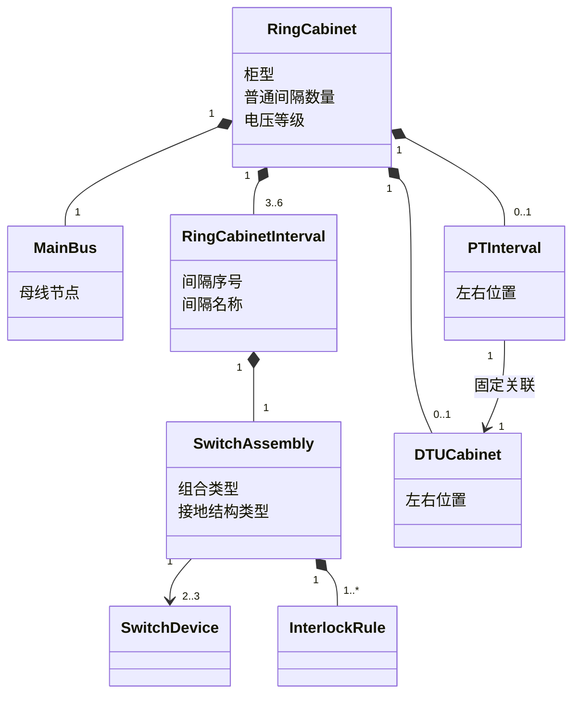
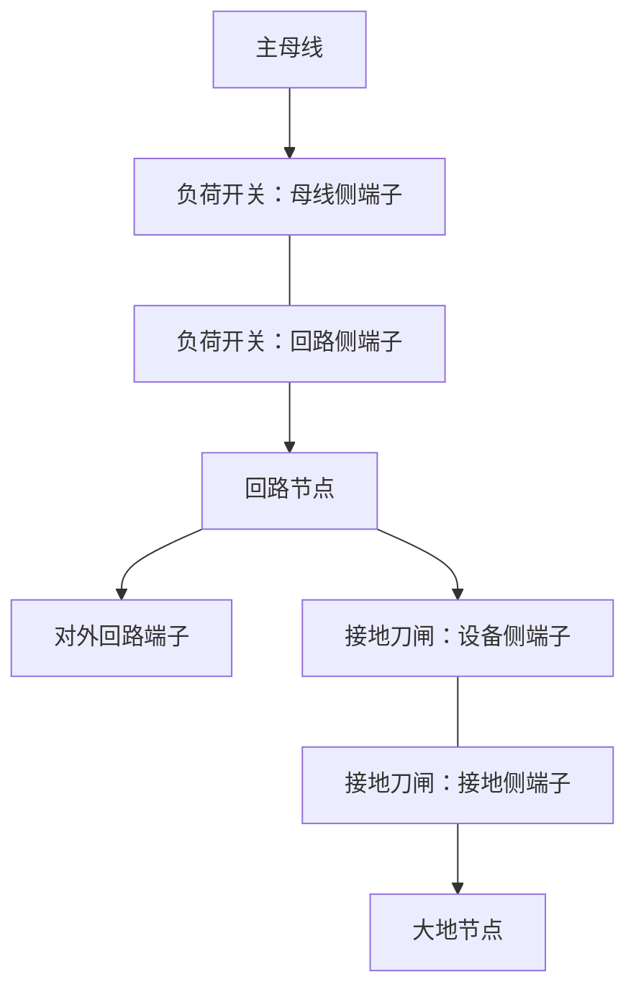
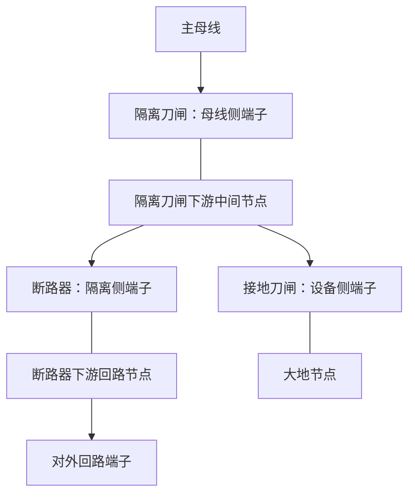

# 10kV 配电环网柜模型设计

> 文档状态：设计基线<br>
> 编制日期：2026-08-10<br>
> 依据：`docs/architecture.md`、配电专业附图规范、本阶段明确的环网柜产品需求

## 1. 目的与范围

本文定义 10kV 配电附图编辑器中的环网柜领域模型，覆盖：

- 普通负荷开关型环网柜：3、4、5、6 个普通间隔。
- 一二次融合环网柜：4、6 个普通间隔。
- 一二次融合环网柜 PT 间隔：作为柜内特殊间隔，位于普通间隔组左侧或右侧。
- DTU 柜：与 PT 固定关联的独立布局柜体，自动跟随 PT 位于同一侧。
- 柜体、间隔、设备、开关组合、联锁规则、端子、连接和状态之间的关系。

本文只定义领域和绘图数据模型，不规定界面交互方式，不涉及代码实现。

## 2. 设计原则

1. **柜体是组合容器，不是单张图片。** 柜内间隔和开关设备保持独立对象，能够单独设置状态和参与端子连接。
2. **普通间隔数量与 PT 间隔分开计数。** 3/4/5/6 或 4/6 指普通电气间隔数量；PT 不替换普通间隔，也不改变该计数，DTU 不属于环网柜电气间隔。
3. **设备状态独立。** 同一间隔内的负荷开关、隔离刀闸、断路器和接地刀闸分别保存状态；修改一个设备不得隐式修改其他设备。
4. **拓扑与布局分离。** 左右位置、柜宽、图元坐标属于布局；母线、端子和导通关系属于电气拓扑。
5. **开关位置与带电状态分离。** `拉开/合入` 描述设备操作位置；`带电/停电` 描述设备或连接的电气状态，两者不能使用同一字段代替。
6. **可视交叉不等于电气连接。** 只有端子之间建立的连接才构成拓扑关系。
7. **PT 与 DTU 位置联动。** 用户只选择 PT 位于普通间隔组左侧或右侧，DTU 自动置于 PT 外侧，不允许独立设置 DTU 位置。
8. **单设备状态是事实，组合状态是派生结果。** `SwitchState` 只保存单台开关的 `Open/Closed`；间隔运行方式和有效接地结论由开关组合类型、成员状态及联锁规则计算，不重复保存。
9. **联锁不替代独立设备。** `SwitchAssembly` 只表达多个 `SwitchDevice` 的功能组合、机械约束和状态判定，不合并设备标识、端子或操作状态。

## 3. 术语

| 术语 | 定义 |
| --- | --- |
| 环网柜组合 | 一组普通间隔；一二次融合柜另包含必需的 PT 间隔及其关联 DTU |
| 普通间隔 | 按柜型固定包含一组开关设备、一个外部回路端子并连接主母线的电气单元 |
| PT 间隔 | 一二次融合环网柜内部的特殊间隔，包含隔离刀闸、PT 和接地刀闸 |
| 主母线 | 将各普通间隔和 PT 间隔连接到同一电气节点的柜内母线 |
| 回路节点 | 普通间隔中开关设备下游与外部电缆/线路端子相连的节点 |
| 大地节点 | 接地刀闸合入时所连接的逻辑接地节点 |
| 操作状态 | 本文限定为开关设备的 `拉开` 或 `合入` |
| 开关组合 | `SwitchAssembly`；由同一功能单元中的多个开关设备及联锁规则组成，不是 Device |
| 联锁规则 | `InterlockRule`；判定互斥、非法组合、命名运行方式和有效接地条件 |
| 运行方式 | `OperationalState`；由组合成员当前状态计算得到，不作为独立事实保存 |
| 电气状态 | 带电、停电等绘图状态，具体显示规则见 `docs/drawing-rule.md` |

## 4. 顶层聚合模型

### 4.1 环网柜组合

每个环网柜组合至少包含以下数据：

| 字段 | 必填 | 说明 |
| --- | --- | --- |
| 组合标识 | 是 | 在一张图内稳定唯一 |
| 柜体名称 | 是 | 图纸上显示的柜体或站点名称 |
| 柜型 | 是 | 普通负荷开关型或一二次融合型 |
| 电压等级 | 是 | 本模型固定为 10kV，仍作为设备语义保存 |
| 普通间隔数量 | 是 | 由柜型限定允许值 |
| 主母线 | 是 | 一个共享的柜内电气节点 |
| 普通间隔列表 | 是 | 按从左到右的顺序保存 |
| PT 间隔 | 条件必填 | 一二次融合柜必须有且仅有一个；普通负荷开关型不得有；指定左侧或右侧 |
| DTU 柜 | 条件必填 | 一二次融合柜必须有且仅有一个，并自动跟随 PT；普通负荷开关型不得有 |
| 布局信息 | 是 | 柜体位置、尺寸、方向以及特殊柜排列顺序 |

### 4.2 柜型约束

| 柜型 | 普通间隔允许数量 | 每个普通间隔的固定设备 |
| --- | --- | --- |
| 普通负荷开关型 | 3、4、5、6 | 负荷开关 1 台、接地刀闸 1 台 |
| 一二次融合型 | 4、6 | 隔离刀闸 1 台、断路器 1 台、接地刀闸 1 台 |

普通间隔数量不允许取上述集合以外的值。PT 间隔和 DTU 不计入普通间隔数量；普通负荷开关型不得包含 PT 或 DTU。

### 4.3 组合层次



图中的 `3..6` 仅表达组合关系；具体允许数量仍以柜型约束表为准。

## 5. 普通负荷开关型环网柜

### 5.1 间隔组成

每个普通间隔固定包含：

- 1 台负荷开关。
- 1 台接地刀闸。
- 1 个主母线侧内部连接点。
- 1 个回路节点。
- 1 个对外回路端子。
- 1 个逻辑大地节点连接端。
- 1 个由负荷开关和接地刀闸组成的 `SwitchAssembly`。

间隔不得缺少负荷开关或接地刀闸，也不得在此柜型的普通间隔中以断路器、隔离刀闸替代它们。

### 5.2 端子定义

| 对象 | 端子 | 连接目标 |
| --- | --- | --- |
| 负荷开关 | 母线侧端子 | 环网柜主母线 |
| 负荷开关 | 回路侧端子 | 本间隔回路节点 |
| 接地刀闸 | 设备侧端子 | 本间隔回路节点 |
| 接地刀闸 | 接地侧端子 | 大地节点 |
| 间隔 | 对外回路端子 | 本间隔回路节点；对外连接电缆或线路 |

### 5.3 电气连接关系



开关拉开或合入不改变上述端子接线，只改变设备内部是否导通：

- 负荷开关合入：母线侧端子与回路侧端子导通。
- 负荷开关拉开：母线侧端子与回路侧端子不导通。
- 接地刀闸合入：设备侧端子与接地侧端子导通。
- 接地刀闸拉开：设备侧端子与接地侧端子不导通。

### 5.4 三工位组合与状态判定

负荷开关和接地刀闸分别具有独立 `SwitchState`，并共同属于一个普通负荷开关型 `SwitchAssembly`。此处“三工位”表示两台独立设备在机械联锁下形成的三个允许稳定组合，不建立单一三值开关设备。

| 组合运行方式 | LoadSwitch | GroundSwitch | 含义 |
| --- | --- | --- | --- |
| `Running` | `Closed` | `Open` | 负荷回路导通 |
| `Disconnected` | `Open` | `Open` | 回路断开且未接地 |
| `Grounded` | `Open` | `Closed` | 回路节点与大地节点导通，线路接地 |
| 非法组合 | `Closed` | `Closed` | 违反机械互斥，必须拒绝进入该稳定状态 |

联锁规则至少包含 `LoadSwitch=Closed` 与 `GroundSwitch=Closed` 互斥。由运行转为接地或由接地转为运行时，合法状态转换必须经过 `Disconnected`；规则校验只约束目标组合，不通过隐式动作替用户改变另一台设备。

模型不得：

- 因负荷开关拉开而自动合入接地刀闸。
- 因接地刀闸合入而自动改变负荷开关状态。
- 用一个可保存的“间隔状态”字段代替两个设备状态。
- 保存独立的 `OperationalState` 并使其可能与两台开关状态不同步。

`Running`、`Disconnected` 和 `Grounded` 均在读取或校验时根据两台开关状态计算。

## 6. 一二次融合环网柜

### 6.1 间隔组成

每个普通间隔固定包含：

- 1 台隔离刀闸。
- 1 台断路器。
- 1 台接地刀闸。
- 1 个包含上述三台设备的 `SwitchAssembly`。
- 1 个必填的接地结构类型。
- 按接地结构类型生成的主母线侧、中间、回路和大地节点。
- 1 个对外回路端子。

三台设备仍分别使用 `SwitchDevice` 和独立 `SwitchState`；`SwitchAssembly` 不替代任何一台设备。接地结构类型只允许：

| GroundingStructureKind | 中文名称 | 主回路顺序 | 接地刀闸接入点 |
| --- | --- | --- |
| `UpperIsolationUpperGrounding` | 上刀上接地 | 主母线—隔离刀闸—断路器—电缆 | 隔离刀闸与断路器之间的中间节点 |
| `UpperIsolationLowerGrounding` | 上刀下接地 | 主母线—隔离刀闸—断路器—电缆 | 断路器下游回路节点 |
| `LowerIsolationLowerGrounding` | 下刀下接地 | 主母线—断路器—隔离刀闸—电缆 | 隔离刀闸下游回路节点 |

接地结构类型是拓扑事实，创建间隔时必须明确选择；不得只更换显示图元而沿用另一种结构的节点关系。

### 6.2 上刀上接地

上刀上接地为主流结构。固定拓扑为：



| OperationalState | IsolationSwitch | CircuitBreaker | GroundSwitch | 含义 |
| --- | --- | --- | --- | --- |
| `ColdStandby` | `Open` | `Open` | `Open` | 隔离、断路器和接地均断开 |
| `HotStandby` | `Closed` | `Open` | `Open` | 断路器合闸即可送电 |
| `Running` | `Closed` | `Closed` | `Open` | 主回路导通 |
| `Maintenance` | `Open` | `Closed` | `Closed` | 接地刀闸经合入的断路器对下方电缆形成有效接地 |

上刀上接地至少满足：隔离刀闸与接地刀闸不得同时合入；只有隔离刀闸拉开、接地刀闸合入且断路器合入时，才判定下方电缆 `Grounded=true`。接地刀闸合入而断路器拉开时，不得误判为有效电缆接地。

### 6.3 上刀下接地

```text
主母线—隔离刀闸—中间节点—断路器—回路节点—对外端子/电缆
                                            └—接地刀闸—大地节点
```

接地刀闸位于断路器下游。隔离刀闸拉开、断路器拉开、接地刀闸合入时，派生 `OperationalState=Grounded`，并判定电缆有效接地，不要求断路器合入。`ColdStandby`、`HotStandby` 和 `Running` 的已确认组合与上刀上接地相同。隔离刀闸与接地刀闸同时合入属于禁止组合；其他未列组合只判定为 `Unclassified`，在没有设备厂家联锁依据前不得自行扩展为合法运行方式。

### 6.4 下刀下接地

```text
主母线—断路器—中间节点—隔离刀闸—回路节点—对外端子/电缆
                                            └—接地刀闸—大地节点
```

该结构与上刀下接地均不需要通过合入断路器实现电缆接地，但断路器与隔离刀闸在主回路中的先后顺序不同，必须保存为不同 `GroundingStructureKind`，并生成不同的内部节点—端子关系。断路器拉开、隔离刀闸拉开、接地刀闸合入时，派生 `OperationalState=Grounded`。

不得把下刀下接地按上刀上接地规则处理，也不得为了复用图形而要求检修接地时合入断路器。尚未由设备资料确认的其他机械动作顺序保持 `Unclassified`，不在本设计中自行认定。

### 6.5 状态独立性与组合判定

隔离刀闸、断路器和接地刀闸必须各自保存 `Open/Closed`。模型不得把三台设备压缩成单一三工位 Device，也不得保存一个间隔级状态覆盖三台设备。

`SwitchAssembly` 根据三台成员当前状态、`GroundingStructureKind` 和关联的 `InterlockRule` 实时计算：组合是否合法、`OperationalState`、是否形成有效电缆接地及违反的规则。上述结果均不进入工程事实数据。

单台开关状态改变时，其他设备状态保持原值；若目标组合违反硬联锁，状态变更应被拒绝，而不是自动操作其他开关。

## 7. PT 间隔

### 7.1 定位和存在性

PT 不是独立柜体，只能作为一二次融合环网柜内部的特殊间隔。每个一二次融合环网柜必须包含且只能包含 1 个 PT 间隔；普通负荷开关型环网柜不得包含 PT 间隔。

- 创建一二次融合环网柜时，用户必须选择 PT 位于普通间隔组左侧或右侧。
- PT 间隔不计入 4/6 个普通间隔数量。

### 7.2 PTInterval 结构

`PTInterval` 固定包含：

- 1 台隔离刀闸，独立保存 `Open` 或 `Closed`。
- 1 台 PT，不保存操作状态。
- 1 台接地刀闸，独立保存 `Open` 或 `Closed`。
- 必需的内部端子和节点。

典型一次关系为：

```text
主母线—隔离刀闸—PT—接地刀闸—大地节点
```

隔离刀闸和接地刀闸的状态互相独立，修改其中一台不得隐式改变另一台。PT 不产生普通间隔的对外回路端子，也不改变普通间隔的编号或外部连接。

### 7.3 PT 位置

`PTPosition` 只允许 `Left` 或 `Right`，表示 PT 间隔位于普通间隔组哪一侧。位置只改变组合布局，不改变 PT 与本柜主母线的拓扑关系。

## 8. DTU 柜

### 8.1 对象范围

DTU 是独立绘制的布局柜体，但不是一次电气设备，也不是环网柜内部间隔。它只保存：

| 字段 | 说明 |
| --- | --- |
| Position | 由 PTPosition 派生，不允许用户独立编辑 |
| Size | 柜体框尺寸 |
| Label | 显示名称 |

DTU 不具有 `Terminal`、`ElectricalNode`、操作状态或电气状态，不参与一次拓扑。

### 8.2 与 PT 的固定关联

- 一二次融合柜的 PT 必须关联一个 DTU；普通负荷开关型不得单独创建 DTU。
- 用户只能选择 PT 位置，`DTUPosition = PTPosition`。
- DTU 始终位于 PT 外侧。
- PT 在左侧时，布局为 `DTU | PT | 普通间隔`。
- PT 在右侧时，布局为 `普通间隔 | PT | DTU`。
- 调整 PT 位置时，DTU 自动跟随；不得提供独立移动到另一侧的业务属性。

## 9. 间隔模型

### 9.1 普通间隔字段

| 字段 | 必填 | 说明 |
| --- | --- | --- |
| 间隔标识 | 是 | 在环网柜组合内唯一 |
| 间隔序号 | 是 | 从左到右连续编号 1 至 N |
| 间隔名称 | 是 | 图纸显示名称或调度名称 |
| 间隔类型 | 是 | `LoadSwitchInterval`（普通负荷开关间隔）或 `CircuitBreakerInterval`（断路器间隔） |
| 设备列表 | 是 | 由柜型固定生成，不允许缺项 |
| 开关组合 | 是 | 一个 `SwitchAssembly`，引用本间隔全部开关并绑定联锁规则 |
| 接地结构类型 | 条件必填 | 一二次融合普通间隔必填；普通负荷开关间隔不适用 |
| 主母线连接引用 | 是 | 指向环网柜主母线 |
| 对外回路端子 | 是 | 供电缆或线路连接 |
| 回路名称 | 否 | 有线路名称时用于图纸标注 |
| 布局信息 | 是 | 间隔宽度、位置和标签锚点 |

### 9.2 间隔顺序

- 普通间隔列表按从左到右顺序保存。
- 间隔序号必须连续，不因 PT 间隔插入而改变。
- PT 与 DTU 的顺序固定，不能由用户调整；DTU 始终在 PT 外侧。
- 调整普通间隔顺序时，只改变布局顺序和显示序号，不自动重接对外线路。

## 10. 开关设备模型

### 10.1 通用字段

每台负荷开关、隔离刀闸、断路器和接地刀闸至少包含：

| 字段 | 说明 |
| --- | --- |
| 设备标识 | 在图纸内稳定唯一 |
| 设备类型 | 负荷开关、隔离刀闸、断路器或接地刀闸 |
| 所属间隔 | 指向唯一普通间隔 |
| 设备名称/调度编号 | 按配电附图要求用于标注 |
| 操作状态 | `拉开` 或 `合入` |
| 第一端子 | 引用本设备对应的上游或设备侧端子 |
| 第二端子 | 引用本设备对应的下游或接地侧端子 |
| 图元定义引用 | 指向统一配电专业图元及其状态变体 |

### 10.2 状态数据结构

状态按“设备标识 → 操作状态”保存，不在间隔或柜体上保存能够覆盖设备的共享开关状态。

| 数据项 | 允许值 | 规则 |
| --- | --- | --- |
| 负荷开关操作状态 | 拉开、合入 | 每台独立必填 |
| 隔离刀闸操作状态 | 拉开、合入 | 每台独立必填 |
| 断路器操作状态 | 拉开、合入 | 每台独立必填 |
| 接地刀闸操作状态 | 拉开、合入 | 每台独立必填 |
| PT 操作状态 | 不适用 | 不创建该数据项 |
| DTU 操作状态 | 不适用 | 不创建该数据项 |

开关状态的最小更新单位是一台设备。一次状态更新只包含：目标设备标识、更新后的操作状态；间隔、柜体和其他设备不随之自动改变。

### 10.3 操作状态与电气状态

| 概念 | 归属 | 用途 |
| --- | --- | --- |
| 操作状态 | 单台开关设备 | 选择拉开或合入图元，决定设备内部端子是否导通 |
| 电气状态 | 设备、母线、连接或回路节点 | 选择带电或停电颜色 |

设备操作状态不能直接等同于电气状态。例如设备拉开并不自动说明其两侧均停电；两侧应根据各自连接关系或明确标记确定电气状态。

### 10.4 SwitchAssembly

`SwitchAssembly` 是间隔内部的功能组合对象，不是 `Device`，也不拥有替代成员设备的操作状态。

| 字段 | 必填 | 说明 |
| --- | --- | --- |
| AssemblyId | 是 | 工程内稳定唯一 |
| ParentIntervalId | 是 | 所属普通间隔；组合不能脱离间隔存在 |
| AssemblyType | 是 | `LoadSwitchThreePosition` 或 `IntegratedFeeder` |
| MemberSwitchIds | 是 | 按明确角色引用 2 或 3 台 `SwitchDevice` |
| GroundingStructureKind | 条件必填 | 仅 `IntegratedFeeder` 必填 |
| InterlockRules | 是 | 由组合类型和接地结构确定的受限规则集合 |

普通负荷开关组合的成员角色固定为 `LoadSwitch`、`GroundSwitch`；一二次融合组合固定为 `IsolationSwitch`、`CircuitBreaker`、`GroundSwitch`。成员设备仍独立拥有 DeviceId、Terminal 和 SwitchState，组合不得复制这些状态。

### 10.5 InterlockRule

`InterlockRule` 描述开关角色之间的受限组合规则，至少支持：

- `MutualExclusion`：指定设备不能同时 `Closed`。
- `InvalidCombination`：明确状态组合非法，状态变更必须拒绝。
- `OperationalStateMapping`：把已确认组合映射为派生 `OperationalState`。
- `EffectiveGrounding`：按接地结构判断外部回路端子是否通过当前导通路径连接大地节点。

MVP 规则使用按开关角色定义的固定条件表，不引入可执行脚本或任意表达式。规则属于组合模板；工程实例保存组合类型、成员引用、接地结构和必要的规则集版本引用，不保存每次计算结果。

### 10.6 OperationalState

`OperationalState` 是只读派生值，当前设计使用：

- `Running`
- `Disconnected`
- `ColdStandby`
- `HotStandby`
- `Maintenance`
- `Grounded`
- `Unclassified`

不同 `AssemblyType` 只使用其中适用的值。`Maintenance` 表示上刀上接地的已确认检修组合，同时其有效接地判定为 true；`Grounded` 表示下接地结构的已确认有效接地组合。`Unclassified` 表示尚无已确认运行方式映射，不等同于非法；是否合法必须由 `InterlockRule` 单独给出。

组合计算结果建议同时返回 `IsValid`、`OperationalState`、`IsEffectivelyGrounded` 和违反的规则标识。任何结果都不得反写 `SwitchState`、`ElectricalState` 或自动推导真实现场停电状态。

## 11. 布局与绘制约束

1. 普通间隔采用从左到右的线性排列，并共享同一主母线图形。
2. 每个普通间隔具有独立分隔区域，柜型相同时间隔宽度保持一致。
3. PT 只能是一二次融合柜内部特殊间隔，并位于普通间隔组最左侧或最右侧。
4. DTU 使用独立柜体框，与 PT 同侧且始终位于 PT 外侧。
5. 用户只编辑 PTPosition；DTUPosition 始终等于 PTPosition，不改变主母线和普通间隔拓扑。
6. 负荷开关、隔离刀闸、断路器、接地刀闸和 PT 使用统一配电专业图元；DTU 只绘制柜体框和名称。
7. 开关状态改变时只替换对应设备的状态图元，不重排间隔、不移动其他设备。
8. 带电、停电、文字和接地线颜色遵循 `docs/drawing-rule.md`，本模型不保存任意自定义颜色作为设备状态。

## 12. 模型校验规则

### 12.1 结构校验

- 普通负荷开关型的普通间隔数量必须是 3、4、5 或 6。
- 一二次融合型的普通间隔数量必须是 4 或 6。
- 普通间隔序号必须从 1 开始连续且唯一。
- 柜型和普通间隔类型必须一致。
- 每个普通间隔的固定设备数量和类型必须完整。
- 每个开关设备必须有唯一标识、两个有效端子和独立操作状态。
- 每个普通间隔必须有且只有一个 `SwitchAssembly`，其成员集合必须与本间隔固定开关集合完全一致。
- 普通负荷开关组合必须绑定 `LoadSwitchThreePosition` 规则；一二次融合组合必须绑定 `IntegratedFeeder` 规则和一个明确的 `GroundingStructureKind`。
- 一二次融合柜必须包含且只能包含一个 PT，并关联一个 DTU；普通负荷开关型不得包含二者。
- DTU 不得脱离 PT 单独存在，其 Position 必须与 PTPosition 相同。
- DTU 不得具有电气端子、开关状态或拓扑连接。

### 12.2 拓扑校验

- 所有普通间隔必须连接同一主母线对象。
- 每个普通间隔只能有一个对外回路端子。
- 普通负荷开关型的回路节点必须同时连接负荷开关回路侧、接地刀闸设备侧和对外回路端子。
- 上刀上接地的接地刀闸设备侧必须连接隔离刀闸与断路器之间的中间节点。
- 上刀下接地的接地刀闸设备侧必须连接断路器下游回路节点。
- 下刀下接地必须按“断路器—隔离刀闸—回路节点”的次序连接，接地刀闸设备侧连接隔离刀闸下游回路节点。
- PT 存在时，其隔离刀闸母线侧必须连接本组合的主母线，PT 和接地刀闸内部关系必须符合第 7 节。
- 画布线段相交但端子未连接时，不得视为电气连接。

### 12.3 状态校验

- 负荷开关、隔离刀闸、断路器和接地刀闸的操作状态必须是拉开或合入。
- 一个设备不得同时保存多个操作状态。
- 修改某台设备状态后，同间隔其他设备状态必须保持原值。
- 普通负荷开关与接地刀闸不得同时合入。
- 一二次融合间隔的隔离刀闸与接地刀闸不得同时合入。
- 上刀上接地只有在隔离刀闸拉开、断路器合入、接地刀闸合入时才判定外部电缆有效接地。
- 上刀下接地和下刀下接地不要求断路器合入即可形成已定义的有效接地组合。
- `OperationalState`、有效接地结果和联锁违规结果必须实时计算，不得作为独立事实保存。
- PT 本体和 DTU 不得出现拉开、合入或电气状态；PT 间隔内的隔离刀闸和接地刀闸必须分别保存操作状态。

## 13. 验收示例

| 场景 | 预期模型结果 |
| --- | --- |
| 创建 3 间隔普通负荷开关型 | 生成 1 条主母线、3 个普通间隔、3 台负荷开关、3 台接地刀闸、3 个对外回路端子 |
| 创建 6 间隔普通负荷开关型 | 生成 6 组相互独立的负荷开关和接地刀闸状态 |
| 普通负荷开关与接地刀闸同时合入 | 联锁规则拒绝该目标组合，不自动拉开任一设备 |
| 创建 4 间隔一二次融合型 | 生成 4 台隔离刀闸、4 台断路器、4 台接地刀闸及 4 个对外回路端子 |
| 上刀上接地进入检修 | 隔离刀闸拉开、断路器合入、接地刀闸合入，派生 Maintenance 且有效接地 |
| 上刀下接地进入接地 | 隔离刀闸拉开、断路器拉开、接地刀闸合入，派生 Grounded 且有效接地 |
| 切换接地结构类型 | 重新建立与结构匹配的固定节点关系；不得只修改显示标签 |
| 单独拉开某间隔断路器 | 只改变目标断路器状态及内部导通，隔离刀闸和接地刀闸状态不变 |
| 添加左侧 PT 间隔 | 普通间隔数量不变；布局为 `DTU - PT - 普通间隔`，PT 连接主母线 |
| 添加右侧 PT 间隔 | 普通间隔数量不变；布局为 `普通间隔 - PT - DTU`，PT 连接主母线 |
| 切换 PT 至另一侧 | DTU 自动跟随到同侧外侧，普通间隔和电气连接保持不变 |
| 尝试单独创建或移动 DTU | 模型拒绝；DTU 只能通过 PT 的存在和位置派生 |
