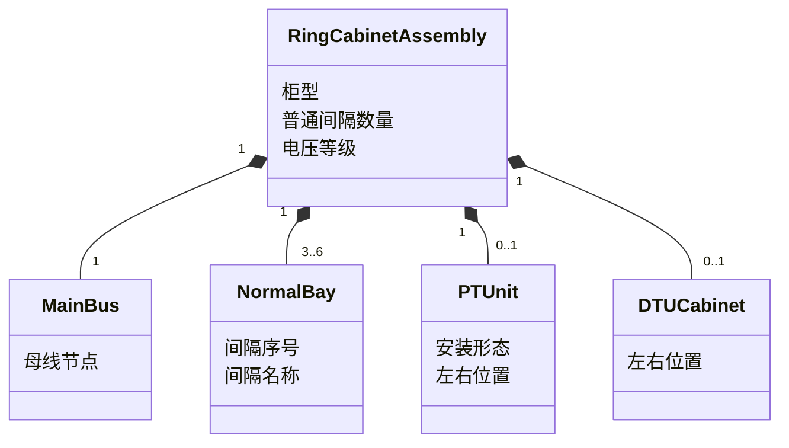
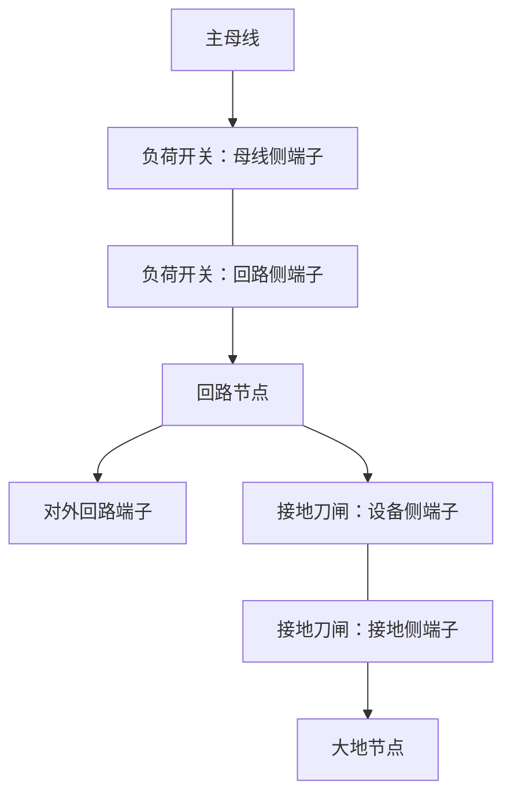
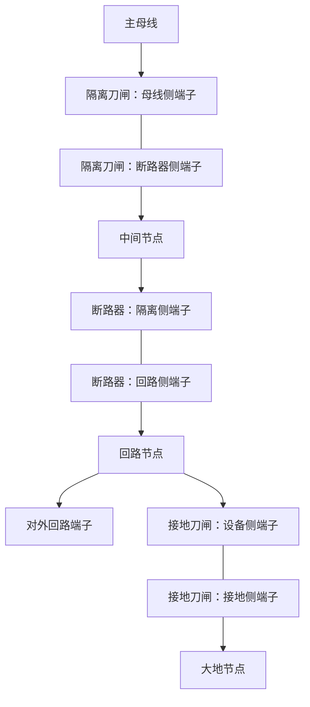

# 10kV 配电环网柜模型设计

> 文档状态：设计基线 
> 编制日期：2026-08-10 
> 依据：`docs/architecture.md`、配电专业附图规范、本阶段明确的环网柜产品需求

## 1. 目的与范围

本文定义 10kV 配电附图编辑器中的环网柜领域模型，覆盖：

- 普通负荷开关型环网柜：3、4、5、6 个普通间隔。
- 一二次融合环网柜：4、6 个普通间隔。
- 可选 PT 柜：作为特殊间隔或独立柜体，位于普通间隔组左侧或右侧。
- DTU 柜：仅作为独立柜体框，位于普通间隔组左侧或右侧。
- 柜体、间隔、设备、端子、连接和开关状态之间的关系。

本文只定义领域和绘图数据模型，不规定界面交互方式，不涉及代码实现。

## 2. 设计原则

1. **柜体是组合容器，不是单张图片。** 柜内间隔和开关设备保持独立对象，能够单独设置状态和参与端子连接。
2. **普通间隔数量与特殊柜分开计数。** 3/4/5/6 或 4/6 指普通电气间隔数量；PT、DTU 不替换普通间隔，也不改变该计数。
3. **设备状态独立。** 同一间隔内的负荷开关、隔离刀闸、断路器和接地刀闸分别保存状态；修改一个设备不得隐式修改其他设备。
4. **拓扑与布局分离。** 左右位置、柜宽、图元坐标属于布局；母线、端子和导通关系属于电气拓扑。
5. **开关位置与带电状态分离。** `拉开/合入` 描述设备操作位置；`带电/停电` 描述设备或连接的电气状态，两者不能使用同一字段代替。
6. **可视交叉不等于电气连接。** 只有端子之间建立的连接才构成拓扑关系。

## 3. 术语

| 术语 | 定义 |
| --- | --- |
| 环网柜组合 | 一组普通间隔，以及可选 PT、DTU 柜的顶层对象 |
| 普通间隔 | 按柜型固定包含一组开关设备、一个外部回路端子并连接主母线的电气单元 |
| 特殊间隔 | 不采用普通间隔设备组合的 PT 单元 |
| 主母线 | 将各普通间隔和 PT 单元连接到同一电气节点的柜内母线 |
| 回路节点 | 普通间隔中开关设备下游与外部电缆/线路端子相连的节点 |
| 大地节点 | 接地刀闸合入时所连接的逻辑接地节点 |
| 操作状态 | 本文限定为开关设备的 `拉开` 或 `合入` |
| 电气状态 | 带电、停电等绘图状态，具体显示规则见 `docs/drawing-rule.md` |

## 4. 顶层聚合模型

### 4.1 环网柜组合

每个环网柜组合至少包含以下数据：

| 字段 | 必填 | 说明 |
| --- | --- | --- |
| 组合标识 | 是 | 在一张图内稳定唯一 |
| 柜体名称 | 是 | 图纸上显示的柜体或站点名称 |
| 柜型 | 是 | 普通负荷开关型或一二次融合型 |
| 电压等级 | 是 | 本模型固定为 10kV，仍作为设备语义保存 |
| 普通间隔数量 | 是 | 由柜型限定允许值 |
| 主母线 | 是 | 一个共享的柜内电气节点 |
| 普通间隔列表 | 是 | 按从左到右的顺序保存 |
| PT 单元 | 否 | 未创建表示不存在；存在时需指定形态与左右位置 |
| DTU 柜 | 否 | 未创建表示不存在；存在时需指定左右位置 |
| 布局信息 | 是 | 柜体位置、尺寸、方向以及特殊柜排列顺序 |

### 4.2 柜型约束

| 柜型 | 普通间隔允许数量 | 每个普通间隔的固定设备 |
| --- | --- | --- |
| 普通负荷开关型 | 3、4、5、6 | 负荷开关 1 台、接地刀闸 1 台 |
| 一二次融合型 | 4、6 | 隔离刀闸 1 台、断路器 1 台、接地刀闸 1 台 |

普通间隔数量不允许取上述集合以外的值。PT 和 DTU 为附加单元，不计入普通间隔数量。

### 4.3 组合层次

图中的 `3..6` 仅表达组合关系；具体允许数量仍以柜型约束表为准。

## 5. 普通负荷开关型环网柜

### 5.1 间隔组成

每个普通间隔固定包含：

- 1 台负荷开关。
- 1 台接地刀闸。
- 1 个主母线侧内部连接点。
- 1 个回路节点。
- 1 个对外回路端子。
- 1 个逻辑大地节点连接端。

间隔不得缺少负荷开关或接地刀闸，也不得在此柜型的普通间隔中以断路器、隔离刀闸替代它们。

### 5.2 端子定义

| 对象 | 端子 | 连接目标 |
| --- | --- | --- |
| 负荷开关 | 母线侧端子 | 环网柜主母线 |
| 负荷开关 | 回路侧端子 | 本间隔回路节点 |
| 接地刀闸 | 设备侧端子 | 本间隔回路节点 |
| 接地刀闸 | 接地侧端子 | 大地节点 |
| 间隔 | 对外回路端子 | 本间隔回路节点；对外连接电缆或线路 |

### 5.3 电气连接关系

开关拉开或合入不改变上述端子接线，只改变设备内部是否导通：

- 负荷开关合入：母线侧端子与回路侧端子导通。
- 负荷开关拉开：母线侧端子与回路侧端子不导通。
- 接地刀闸合入：设备侧端子与接地侧端子导通。
- 接地刀闸拉开：设备侧端子与接地侧端子不导通。

### 5.4 状态独立性

负荷开关和接地刀闸分别具有独立状态字段，允许分别读取和修改。模型不得：

- 因负荷开关拉开而自动合入接地刀闸。
- 因接地刀闸合入而自动改变负荷开关状态。
- 用一个“间隔状态”字段代替两个设备状态。

本文不额外规定两台设备状态组合的联锁规则；如需联锁校验，应由后续经确认的专业规则单独定义，不能通过隐式改写状态实现。

## 6. 一二次融合环网柜

### 6.1 间隔组成

每个普通间隔固定包含：

- 1 台隔离刀闸。
- 1 台断路器。
- 1 台接地刀闸。
- 1 个主母线侧内部连接点。
- 1 个隔离刀闸与断路器之间的中间节点。
- 1 个回路节点。
- 1 个对外回路端子。
- 1 个逻辑大地节点连接端。

### 6.2 端子定义

| 对象 | 端子 | 连接目标 |
| --- | --- | --- |
| 隔离刀闸 | 母线侧端子 | 环网柜主母线 |
| 隔离刀闸 | 断路器侧端子 | 本间隔中间节点 |
| 断路器 | 隔离侧端子 | 本间隔中间节点 |
| 断路器 | 回路侧端子 | 本间隔回路节点 |
| 接地刀闸 | 设备侧端子 | 本间隔回路节点 |
| 接地刀闸 | 接地侧端子 | 大地节点 |
| 间隔 | 对外回路端子 | 本间隔回路节点；对外连接电缆或线路 |

### 6.3 电气连接关系

设备内部导通规则：

- 隔离刀闸合入时两端导通，拉开时两端不导通。
- 断路器合入时两端导通，拉开时两端不导通。
- 接地刀闸合入时连接回路节点与大地节点，拉开时不导通。

### 6.4 状态独立性

隔离刀闸、断路器和接地刀闸必须各自保存 `拉开/合入` 状态。任意一个设备状态变化时，另外两台设备状态保持不变。

模型不得把三台设备压缩成一个三工位设备，也不得通过一个间隔级状态同时控制三台设备。本要求与配电图元表中的“三工位断路器”模型不同；一二次融合普通间隔按三台独立设备建模。

## 7. PT 单元

### 7.1 存在性和位置

每个环网柜组合最多包含 1 个 PT 单元：

- 未创建 PT 单元：表示不存在，不绘制 PT。
- 创建 PT 单元：必须选择左侧或右侧位置。

PT 位置相对于普通间隔组定义，与电气连接点无关。无论画在左侧还是右侧，PT 均连接同一环网柜主母线。

### 7.2 安装形态

PT 支持两种表现形态：

| 形态 | 柜体表现 | 普通间隔计数 |
| --- | --- | --- |
| 特殊间隔 | 与主柜共用外框，具有独立分隔区域 | 不计入 |
| 独立 PT 柜 | 绘制独立柜体框，并与主柜相邻 | 不计入 |

两种形态使用同一个 PT 电气对象，仅布局边界不同。PT 单元至少包含：

- PT 设备对象。
- 1 个母线连接端子。
- PT 图元及名称标注。

规范未为 PT 指定可操作的拉开/合入状态，因此 PT 单元不包含开关操作状态字段。PT 的带电或停电显示由其连接的主母线电气状态决定。

### 7.3 端子连接

PT 母线连接端子直接连接主母线。PT 不产生普通间隔的对外回路端子，也不改变其他间隔的端子编号或连接关系。

## 8. DTU 柜

### 8.1 对象范围

DTU 柜只绘制独立柜体框及名称，不绘制柜内一次设备。它不属于普通间隔，也不计入普通间隔数量。

### 8.2 存在性和位置

- 未创建 DTU 柜对象时不绘制。
- DTU 柜存在时必须位于普通间隔组左侧或右侧。
- DTU 柜始终使用独立柜体框，不提供“特殊间隔”形态。

### 8.3 电气模型约束

DTU 柜：

- 不创建电气端子。
- 不连接主母线、回路节点或大地节点。
- 不保存拉开/合入状态。
- 不参与带电、停电或导通路径计算。
- 仅保存柜体名称和布局信息。

## 9. 间隔模型

### 9.1 普通间隔字段

| 字段 | 必填 | 说明 |
| --- | --- | --- |
| 间隔标识 | 是 | 在环网柜组合内唯一 |
| 间隔序号 | 是 | 从左到右连续编号 1 至 N |
| 间隔名称 | 是 | 图纸显示名称或调度名称 |
| 间隔类型 | 是 | 普通负荷开关间隔或一二次融合普通间隔 |
| 设备列表 | 是 | 由柜型固定生成，不允许缺项 |
| 主母线连接引用 | 是 | 指向环网柜主母线 |
| 对外回路端子 | 是 | 供电缆或线路连接 |
| 回路名称 | 否 | 有线路名称时用于图纸标注 |
| 布局信息 | 是 | 间隔宽度、位置和标签锚点 |

### 9.2 间隔顺序

- 普通间隔列表按从左到右顺序保存。
- 间隔序号必须连续，不因 PT 或 DTU 插入而改变。
- PT 或 DTU 位于同一侧时，使用“距主柜顺序”确定两者的绘制先后；该顺序只影响布局，不影响电气拓扑。
- 调整普通间隔顺序时，只改变布局顺序和显示序号，不自动重接对外线路。

## 10. 开关设备模型

### 10.1 通用字段

每台负荷开关、隔离刀闸、断路器和接地刀闸至少包含：

| 字段 | 说明 |
| --- | --- |
| 设备标识 | 在图纸内稳定唯一 |
| 设备类型 | 负荷开关、隔离刀闸、断路器或接地刀闸 |
| 所属间隔 | 指向唯一普通间隔 |
| 设备名称/调度编号 | 按配电附图要求用于标注 |
| 操作状态 | `拉开` 或 `合入` |
| 第一端子 | 引用本设备对应的上游或设备侧端子 |
| 第二端子 | 引用本设备对应的下游或接地侧端子 |
| 电气状态引用 | 与操作状态分离的带电/停电显示状态 |
| 图元定义引用 | 指向统一配电专业图元及其状态变体 |

### 10.2 状态数据结构

状态按“设备标识 → 操作状态”保存，不在间隔或柜体上保存能够覆盖设备的共享开关状态。

| 数据项 | 允许值 | 规则 |
| --- | --- | --- |
| 负荷开关操作状态 | 拉开、合入 | 每台独立必填 |
| 隔离刀闸操作状态 | 拉开、合入 | 每台独立必填 |
| 断路器操作状态 | 拉开、合入 | 每台独立必填 |
| 接地刀闸操作状态 | 拉开、合入 | 每台独立必填 |
| PT 操作状态 | 不适用 | 不创建该数据项 |
| DTU 操作状态 | 不适用 | 不创建该数据项 |

开关状态的最小更新单位是一台设备。一次状态更新只包含：目标设备标识、更新后的操作状态；间隔、柜体和其他设备不随之自动改变。

### 10.3 操作状态与电气状态

| 概念 | 归属 | 用途 |
| --- | --- | --- |
| 操作状态 | 单台开关设备 | 选择拉开或合入图元，决定设备内部端子是否导通 |
| 电气状态 | 设备、母线、连接或回路节点 | 选择带电或停电颜色 |

设备操作状态不能直接等同于电气状态。例如设备拉开并不自动说明其两侧均停电；两侧应根据各自连接关系或明确标记确定电气状态。

## 11. 布局与绘制约束

1. 普通间隔采用从左到右的线性排列，并共享同一主母线图形。
2. 每个普通间隔具有独立分隔区域，柜型相同时间隔宽度保持一致。
3. PT 特殊间隔或独立 PT 柜只能位于普通间隔组最左侧或最右侧。
4. DTU 柜只能位于普通间隔组最左侧或最右侧，并使用独立柜体框。
5. PT 与 DTU 位于同一侧时，按布局中的“距主柜顺序”排列，不改变主母线和普通间隔拓扑。
6. 负荷开关、隔离刀闸、断路器、接地刀闸和 PT 使用统一配电专业图元；DTU 只绘制柜体框和名称。
7. 开关状态改变时只替换对应设备的状态图元，不重排间隔、不移动其他设备。
8. 带电、停电、文字和接地线颜色遵循 `docs/drawing-rule.md`，本模型不保存任意自定义颜色作为设备状态。

## 12. 模型校验规则

### 12.1 结构校验

- 普通负荷开关型的普通间隔数量必须是 3、4、5 或 6。
- 一二次融合型的普通间隔数量必须是 4 或 6。
- 普通间隔序号必须从 1 开始连续且唯一。
- 柜型和普通间隔类型必须一致。
- 每个普通间隔的固定设备数量和类型必须完整。
- 每个开关设备必须有唯一标识、两个有效端子和独立操作状态。
- PT 和 DTU 各自最多存在一个，存在时左右位置必填。
- DTU 不得具有电气端子、开关状态或拓扑连接。

### 12.2 拓扑校验

- 所有普通间隔必须连接同一主母线对象。
- 每个普通间隔只能有一个对外回路端子。
- 普通负荷开关型的回路节点必须同时连接负荷开关回路侧、接地刀闸设备侧和对外回路端子。
- 一二次融合型的隔离刀闸与断路器必须通过本间隔中间节点连接。
- 一二次融合型的回路节点必须同时连接断路器回路侧、接地刀闸设备侧和对外回路端子。
- PT 存在时，其母线端子必须连接本组合的主母线。
- 画布线段相交但端子未连接时，不得视为电气连接。

### 12.3 状态校验

- 负荷开关、隔离刀闸、断路器和接地刀闸的操作状态必须是拉开或合入。
- 一个设备不得同时保存多个操作状态。
- 修改某台设备状态后，同间隔其他设备状态必须保持原值。
- PT 和 DTU 不得出现拉开、合入或间隔共享状态。

## 13. 验收示例

| 场景 | 预期模型结果 |
| --- | --- |
| 创建 3 间隔普通负荷开关型 | 生成 1 条主母线、3 个普通间隔、3 台负荷开关、3 台接地刀闸、3 个对外回路端子 |
| 创建 6 间隔普通负荷开关型 | 生成 6 组相互独立的负荷开关和接地刀闸状态 |
| 创建 4 间隔一二次融合型 | 生成 4 台隔离刀闸、4 台断路器、4 台接地刀闸及 4 个对外回路端子 |
| 单独拉开某间隔断路器 | 只改变目标断路器状态及内部导通，隔离刀闸和接地刀闸状态不变 |
| 添加左侧 PT 特殊间隔 | 普通间隔数量不变；PT 连接主母线并显示在最左侧 |
| 添加右侧独立 PT 柜 | 普通间隔数量不变；绘制独立 PT 柜框并连接主母线 |
| 添加右侧 DTU 柜 | 绘制独立柜体框和名称，不创建电气端子，不参与状态计算 |
| PT 与 DTU 同在左侧 | 按“距主柜顺序”排列；普通间隔和电气连接保持不变 |
